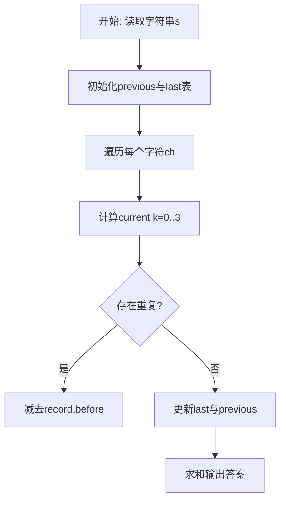
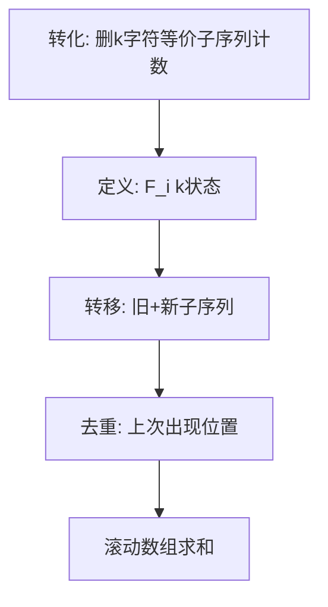

# L3-006 - 迎风一刀斩（30 分）

- **时间限制**: 150 ms
- **内存限制**: 65536 KB
- **代码长度限制**: 16 KB

---

## 题目描述


迎着一面矩形的大旗一刀斩下，如果你的刀够快的话，这笔直一刀可以切出两块多边形的残片。反过来说，如果有人拿着两块残片来吹牛，说这是自己迎风一刀斩落的，你能检查一下这是不是真的吗？

注意摆在你面前的两个多边形可不一定是端端正正摆好的，它们可能被平移、被旋转（逆时针90度、180度、或270度），或者被（镜像）翻面。

这里假设原始大旗的四边都与坐标轴是平行的。

### 输入格式:

输入第一行给出一个正整数$$N$$（$$\le 20$$），随后给出$$N$$对多边形。每个多边形按下列格式给出：

$$k\quad x_1\quad y_1\cdots x_k\quad y_k$$

其中$$k$$（$$2 < k \le 10$$）是多边形顶点个数；$$(x_i, y_i)$$（$$0 \le x_i, y_i \le 10^8$$）是顶点坐标，按照顺时针或逆时针的顺序给出。

注意：题目保证没有多余顶点。即每个多边形的顶点都是不重复的，任意3个相邻顶点不共线。

### 输出格式:

对每一对多边形，输出`YES`或者`NO`。

### 输入样例:
```in
8
3 0 0 1 0 1 1
3 0 0 1 1 0 1
3 0 0 1 0 1 1
3 0 0 1 1 0 2
4 0 4 1 4 1 0 0 0
4 4 0 4 1 0 1 0 0
3 0 0 1 1 0 1
4 2 3 1 4 1 7 2 7
5 10 10 10 12 12 12 14 11 14 10
3 28 35 29 35 29 37
3 7 9 8 11 8 9
5 87 26 92 26 92 23 90 22 87 22
5 0 0 2 0 1 1 1 2 0 2
4 0 0 1 1 2 1 2 0
4 0 0 0 1 1 1 2 0
4 0 0 0 1 1 1 2 0
```

### 输出样例:
```out
YES
NO
YES
YES
YES
YES
NO
YES
```

## 示例

### 示例 1

**输入:**
```
8
3 0 0 1 0 1 1
3 0 0 1 1 0 1
3 0 0 1 0 1 1
3 0 0 1 1 0 2
4 0 4 1 4 1 0 0 0
4 4 0 4 1 0 1 0 0
3 0 0 1 1 0 1
4 2 3 1 4 1 7 2 7
5 10 10 10 12 12 12 14 11 14 10
3 28 35 29 35 29 37
3 7 9 8 11 8 9
5 87 26 92 26 92 23 90 22 87 22
5 0 0 2 0 1 1 1 2 0 2
4 0 0 1 1 2 1 2 0
4 0 0 0 1 1 1 2 0
4 0 0 0 1 1 1 2 0
```

**输出:**
```
YES
NO
YES
YES
YES
YES
NO
YES
```

### 解题思路

本题可归约为在字符串/序列上计数的动态规划问题，状态转移存在重复子结构。L3-006 迎风一刀斩 实现原理：若两块残片来自矩形的一刀切，则存在一对等长边可作为公共切边。结合输入规模与输出要求，需要兼顾正确性与时间复杂度。

算法选用动态规划，定义 `F_i[k]` 为前 i 个字符中长度为 `i-k` 的不同子序列数。追加新字符时，新产生的子序列数为 `F_{i-1}` 的平移，而与上一次出现位置重复的部分需减去 `last[ch]` 保存的历史值，通过 4 长度的滚动数组实现 O(n) 空间与 O(n·K) 时间（K=3），巧妙处理重复计数。

### 代码流程说明

1. 读取字符串 `s`，初始化滚动数组 `previous={1,0,0,0}` 与字符上次状态表 `last`。
2. 遍历 `i=1..#s` 取字符 `ch`，对 `k=0..3` 计算 `value = (k>=1 and previous[k] or 0)+previous[k+1]` 并按 `last[ch]` 去重。
3. 去重时计算 `gap=i-record.pos` 与 `index=k-gap`，若 `index>=0` 则减去 `record.before[index+1]`，得到 `current[k+1]`。
4. 更新 `last[ch]={pos=i, before=copy(previous)}` 并滚动 `previous=current`，最终求和 `previous[1..4]` 输出。

### 代码实现

```lua
-- L3-006 迎风一刀斩
-- 实现原理：若两块残片来自矩形的一刀切，则存在一对等长边可作为公共切边。
-- 枚举边对并将其反向对齐；此时所有顶点的凸包必须恰为矩形，且凸包面积等于
-- 两片面积之和（无重叠、无空洞）。满足任一边对即可判定 YES。

local cases = io.read("*n")
local eps = 1e-7
local function area(p)
    local s = 0
    for i = 1, #p do local q = p[i % #p + 1]; s = s + p[i][1] * q[2] - p[i][2] * q[1] end
    return math.abs(s) / 2
end
local function cross(a, b, c) return (b[1] - a[1]) * (c[2] - a[2]) - (b[2] - a[2]) * (c[1] - a[1]) end
local function hull(points)
    table.sort(points, function(a, b) return a[1] ~= b[1] and a[1] < b[1] or a[2] < b[2] end)
    local h = {}
    for _, p in ipairs(points) do
        while #h >= 2 and cross(h[#h - 1], h[#h], p) <= eps do h[#h] = nil end
        h[#h + 1] = p
    end
    local lower = #h
    for i = #points - 1, 1, -1 do
        local p = points[i]
        while #h > lower and cross(h[#h - 1], h[#h], p) <= eps do h[#h] = nil end
        h[#h + 1] = p
    end
    h[#h] = nil
    return h
end
local function isRectangle(h)
    if #h ~= 4 then return false end
    for i = 1, 4 do
        local a, b, c = h[(i - 2) % 4 + 1], h[i], h[i % 4 + 1]
        local ux, uy, vx, vy = a[1] - b[1], a[2] - b[2], c[1] - b[1], c[2] - b[2]
        if math.abs(ux * vx + uy * vy) > eps then return false end
    end
    return true
end
for _ = 1, cases do
    local function readPoly()
        local k, p = io.read("*n"), {}
        for i = 1, k do p[i] = { io.read("*n"), io.read("*n") } end
        return p
    end
    local a, b = readPoly(), readPoly()
    local possible, total = false, area(a) + area(b)
    for i = 1, #a do for j = 1, #b do
        local a1, a2, b1, b2 = a[i], a[i % #a + 1], b[j], b[j % #b + 1]
        local ax, ay, bx, by = a2[1] - a1[1], a2[2] - a1[2], b1[1] - b2[1], b1[2] - b2[2]
        local la, lb = ax * ax + ay * ay, bx * bx + by * by
        if math.abs(la - lb) < eps and la > eps then
            local pts = {}
            local function transform(p)
                local x, y = p[1] - b2[1], p[2] - b2[2]
                return { a1[1] + (x * ax + y * ay) / la, a1[2] + (x * ay - y * ax) / la }
            end
            for _, p in ipairs(a) do pts[#pts + 1] = { p[1], p[2] } end
            for _, p in ipairs(b) do pts[#pts + 1] = transform(p) end
            local h = hull(pts)
            if isRectangle(h) and math.abs(area(h) - total) < eps then possible = true; break end
        end
    end if possible then break end end
    print(possible and "YES" or "NO")
end
```

### 代码流程图



### 解题流程图


