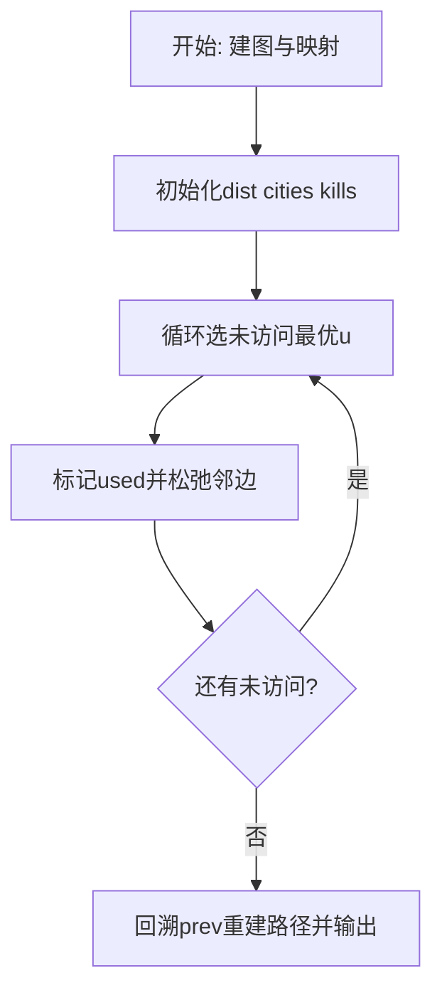
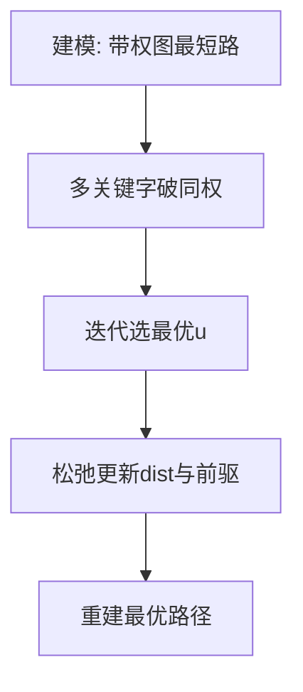

# L3-007 - 天梯地图（30 分）

- **时间限制**: 300 ms
- **内存限制**: 65536 KB
- **代码长度限制**: 16 KB

---

## 题目描述


本题要求你实现一个天梯赛专属在线地图，队员输入自己学校所在地和赛场地点后，该地图应该推荐两条路线：一条是最快到达路线；一条是最短距离的路线。题目保证对任意的查询请求，地图上都至少存在一条可达路线。

### 输入格式:

输入在第一行给出两个正整数`N`（2 $$\le$$ `N` $$\le$$ 500）和`M`，分别为地图中所有标记地点的个数和连接地点的道路条数。随后`M`行，每行按如下格式给出一条道路的信息：

```
V1 V2 one-way length time
```

其中`V1`和`V2`是道路的两个端点的编号（从0到`N`-1）；如果该道路是从`V1`到`V2`的单行线，则`one-way`为1，否则为0；`length`是道路的长度；`time`是通过该路所需要的时间。最后给出一对起点和终点的编号。

### 输出格式:

首先按下列格式输出最快到达的时间`T`和用节点编号表示的路线：

```
Time = T: 起点 => 节点1 => ... => 终点
```

然后在下一行按下列格式输出最短距离`D`和用节点编号表示的路线：

```
Distance = D: 起点 => 节点1 => ... => 终点
```

如果最快到达路线不唯一，则输出几条最快路线中最短的那条，题目保证这条路线是唯一的。而如果最短距离的路线不唯一，则输出途径节点数最少的那条，题目保证这条路线是唯一的。

如果这两条路线是完全一样的，则按下列格式输出：

```
Time = T; Distance = D: 起点 => 节点1 => ... => 终点
```

### 输入样例 1：
```in
10 15
0 1 0 1 1
8 0 0 1 1
4 8 1 1 1
5 4 0 2 3
5 9 1 1 4
0 6 0 1 1
7 3 1 1 2
8 3 1 1 2
2 5 0 2 2
2 1 1 1 1
1 5 0 1 3
1 4 0 1 1
9 7 1 1 3
3 1 0 2 5
6 3 1 2 1
5 3
```

### 输出样例 1：
```out
Time = 6: 5 => 4 => 8 => 3
Distance = 3: 5 => 1 => 3
```

### 输入样例 2：
```in
7 9
0 4 1 1 1
1 6 1 3 1
2 6 1 1 1
2 5 1 2 2
3 0 0 1 1
3 1 1 3 1
3 2 1 2 1
4 5 0 2 2
6 5 1 2 1
3 5
```

### 输出样例 2：
```out
Time = 3; Distance = 4: 3 => 2 => 5
```

## 示例

### 示例 1

**输入:**
```
10 15
0 1 0 1 1
8 0 0 1 1
4 8 1 1 1
5 4 0 2 3
5 9 1 1 4
0 6 0 1 1
7 3 1 1 2
8 3 1 1 2
2 5 0 2 2
2 1 1 1 1
1 5 0 1 3
1 4 0 1 1
9 7 1 1 3
3 1 0 2 5
6 3 1 2 1
5 3
```

**输出:**
```
Time = 6: 5 => 4 => 8 => 3
Distance = 3: 5 => 1 => 3
```

### 示例 2

**输入:**
```
7 9
0 4 1 1 1
1 6 1 3 1
2 6 1 1 1
2 5 1 2 2
3 0 0 1 1
3 1 1 3 1
3 2 1 2 1
4 5 0 2 2
6 5 1 2 1
3 5
```

**输出:**
```
Time = 3; Distance = 4: 3 => 2 => 5
```

### 解题思路

本题是带权图上的最优化路径/选址问题，需要多次求源点到其余点的最短距离。L3-007 天梯地图 实现原理：分别运行两次 Dijkstra。结合输入规模与输出要求，需要兼顾正确性与时间复杂度。

算法选用 Dijkstra 最短路算法，针对不同优化目标定制比较关键字：如按“时间优先、距离次之”或“距离优先、节点数次之”，并在距离相等时引入第二、第三关键字破同权。每次从未访问集合中选出当前最优节点松弛邻边，记录前驱以重建路径，适用于非负权图。

### 代码流程说明

1. 解析顶点数、边数及起点终点映射，建立邻接表 `graph` 并读入带权边与敌人数 `enemy`。
2. 初始化 `dist/cities/kills/prev/used` 数组，起点距离 0、城市数 0，其余为无穷/负无穷。
3. 循环 n 次选未访问且距离最小（同距按城市数、歼敌数破同权）的 `u`，标记已访问后松弛其邻边更新多关键字最优值与前驱。
4. 从 `target` 回溯 `prev` 链重建路径字符串，并输出路径、`cities[target] dist[target] kills[target]` 三元组。

### 代码实现

```lua
-- L3-007 天梯地图
-- 实现原理：分别运行两次 Dijkstra。按时间优化时以“时间、距离”为关键字，
-- 按距离优化时以“距离、经过节点数”为关键字，从而满足两个不同的破同权规则。

local n, m = io.read("*n"), io.read("*n")
local graph = {}
for i = 0, n - 1 do graph[i] = {} end
for _ = 1, m do
    local a, b, one, len, time = io.read("*n"), io.read("*n"), io.read("*n"), io.read("*n"), io.read("*n")
    graph[a][#graph[a] + 1] = { b, len, time }
    if one == 0 then graph[b][#graph[b] + 1] = { a, len, time } end
end
local start, target = io.read("*n"), io.read("*n")
local function shortest(byTime)
    local primary, secondary, nodes, prev, used = {}, {}, {}, {}, {}
    for i = 0, n - 1 do primary[i], secondary[i], nodes[i] = math.huge, math.huge, math.huge end
    primary[start], secondary[start], nodes[start] = 0, 0, 1
    for _ = 1, n do
        local u = nil
        for i = 0, n - 1 do
            if not used[i] and (not u or primary[i] < primary[u]
                or (primary[i] == primary[u] and secondary[i] < secondary[u])) then u = i end
        end
        if not u or primary[u] == math.huge then break end
        used[u] = true
        for _, edge in ipairs(graph[u]) do
            local v, len, time = edge[1], edge[2], edge[3]
            local p, s = byTime and primary[u] + time or primary[u] + len,
                byTime and secondary[u] + len or nodes[u] + 1
            if p < primary[v] or (p == primary[v] and s < secondary[v]) then
                primary[v], secondary[v], prev[v] = p, s, u
                if not byTime then nodes[v] = s end
            end
        end
    end
    local path, x = {}, target
    while x ~= nil do table.insert(path, 1, x); x = prev[x] end
    return primary[target], (byTime and secondary[target] or nil), path
end
local time, timeDistance, timePath = shortest(true)
local distance, _, distancePath = shortest(false)
local function route(path) return table.concat(path, " => ") end
if #timePath == #distancePath then
    local same = true
    for i = 1, #timePath do if timePath[i] ~= distancePath[i] then same = false; break end end
    if same then print("Time = " .. time .. "; Distance = " .. distance .. ": " .. route(timePath)); return end
end
print("Time = " .. time .. ": " .. route(timePath))
print("Distance = " .. distance .. ": " .. route(distancePath))
```

### 代码流程图



### 解题流程图


