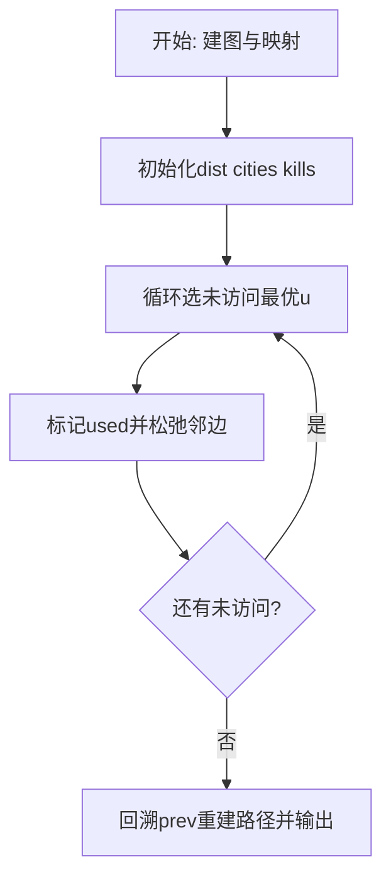
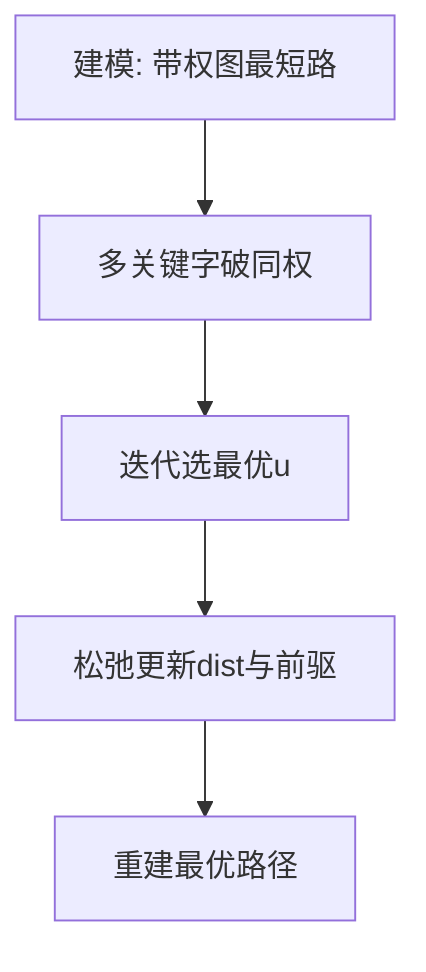

# L3-008 - 喊山（30 分）

- **时间限制**: 150 ms
- **内存限制**: 65536 KB
- **代码长度限制**: 16 KB

---

## 题目描述


喊山，是人双手围在嘴边成喇叭状，对着远方高山发出“喂—喂喂—喂喂喂……”的呼唤。呼唤声通过空气的传递，回荡于深谷之间，传送到人们耳中，发出约定俗成的“讯号”，达到声讯传递交流的目的。原来它是彝族先民用来求援呼救的“讯号”，慢慢地人们在生活实践中发现了它的实用价值，便把它作为一种交流工具世代传袭使用。（图文摘自：http://news.xrxxw.com/newsshow-8018.html）


一个山头呼喊的声音可以被临近的山头同时听到。题目假设每个山头最多有两个能听到它的临近山头。给定任意一个发出原始信号的山头，本题请你找出这个信号最远能传达到的地方。

### 输入格式:

输入第一行给出3个正整数`n`、`m`和`k`，其中`n`（$$\le$$10000）是总的山头数（于是假设每个山头从1到`n`编号）。接下来的`m`行，每行给出2个不超过`n`的正整数，数字间用空格分开，分别代表可以听到彼此的两个山头的编号。这里保证每一对山头只被输入一次，不会有重复的关系输入。最后一行给出`k`（$$\le$$10）个不超过`n`的正整数，数字间用空格分开，代表需要查询的山头的编号。

### 输出格式:

依次对于输入中的每个被查询的山头，在一行中输出其发出的呼喊能够连锁传达到的最远的那个山头。注意：被输出的首先必须是被查询的个山头能连锁传到的。若这样的山头不只一个，则输出编号最小的那个。若此山头的呼喊无法传到任何其他山头，则输出0。

### 输入样例:
```in
7 5 4
1 2
2 3
3 1
4 5
5 6
1 4 5 7
```

### 输出样例:
```out
2
6
4
0
```

## 示例

### 示例 1

**输入:**
```
7 5 4
1 2
2 3
3 1
4 5
5 6
1 4 5 7
```

**输出:**
```
2
6
4
0
```

### 解题思路

本题是带权图上的最优化路径/选址问题，需要多次求源点到其余点的最短距离。L3-008 喊山 实现原理：声音在无权无向图中逐边传递，BFS 的层数就是传播距离。结合输入规模与输出要求，需要兼顾正确性与时间复杂度。

算法选用 Dijkstra 最短路算法，针对不同优化目标定制比较关键字：如按“时间优先、距离次之”或“距离优先、节点数次之”，并在距离相等时引入第二、第三关键字破同权。每次从未访问集合中选出当前最优节点松弛邻边，记录前驱以重建路径，适用于非负权图。

### 代码流程说明

1. 解析顶点数、边数及起点终点映射，建立邻接表 `graph` 并读入带权边与敌人数 `enemy`。
2. 初始化 `dist/cities/kills/prev/used` 数组，起点距离 0、城市数 0，其余为无穷/负无穷。
3. 循环 n 次选未访问且距离最小（同距按城市数、歼敌数破同权）的 `u`，标记已访问后松弛其邻边更新多关键字最优值与前驱。
4. 从 `target` 回溯 `prev` 链重建路径字符串，并输出路径、`cities[target] dist[target] kills[target]` 三元组。

### 代码实现

```lua
-- L3-008 喊山
-- 实现原理：声音在无权无向图中逐边传递，BFS 的层数就是传播距离。
-- 对每个询问选最大层中编号最小的山头；若没有其他可达山头则输出 0。

local n, m, k = io.read("*n"), io.read("*n"), io.read("*n")
local graph = {}
for i = 1, n do graph[i] = {} end
for _ = 1, m do local a, b = io.read("*n"), io.read("*n"); graph[a][#graph[a] + 1] = b; graph[b][#graph[b] + 1] = a end
for _ = 1, k do
    local start = io.read("*n")
    local dist, queue, head = { [start] = 0 }, { start }, 1
    local far, best = 0, 0
    while head <= #queue do
        local x = queue[head]; head = head + 1
        for _, y in ipairs(graph[x]) do
            if dist[y] == nil then
                dist[y] = dist[x] + 1; queue[#queue + 1] = y
                if dist[y] > far or (dist[y] == far and y < best) then far, best = dist[y], y end
            end
        end
    end
    print(best)
end
```

### 代码流程图



### 解题流程图


