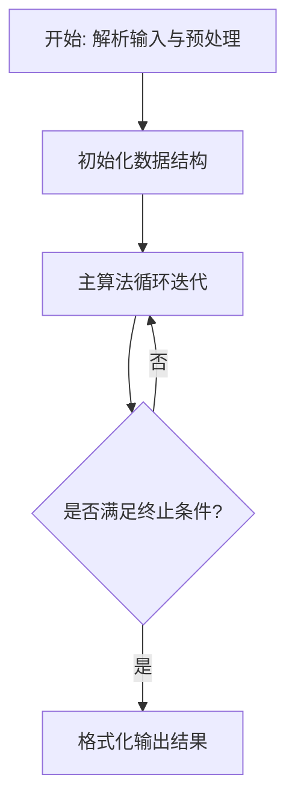
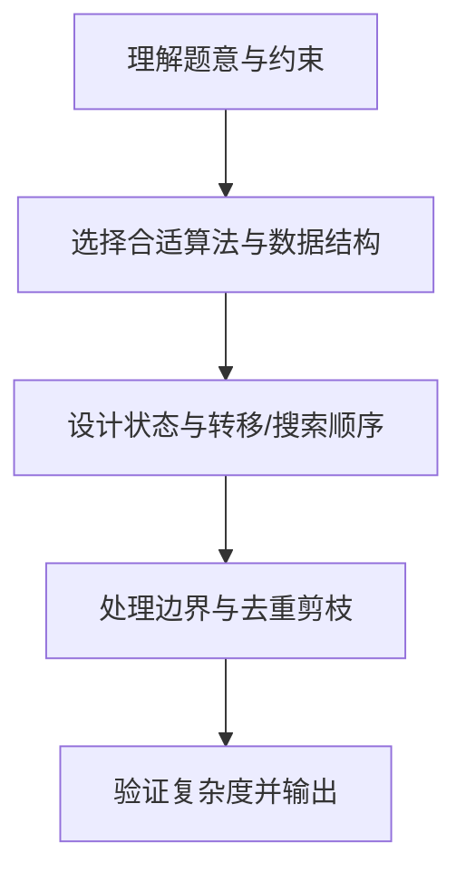

# L3-009 - 长城（30 分）

- **时间限制**: 500 ms
- **内存限制**: 65536 KB
- **代码长度限制**: 16 KB

---

## 题目描述


正如我们所知，中国古代长城的建造是为了抵御外敌入侵。在长城上，建造了许多烽火台。每个烽火台都监视着一个特定的地区范围。一旦某个地区有外敌入侵，值守在对应烽火台上的士兵就会将敌情通报给周围的烽火台，并迅速接力地传递到总部。

现在如图1所示，若水平为南北方向、垂直为海拔高度方向，假设长城就是依次相联的一系列线段，而且在此范围内的任一垂直线与这些线段有且仅有唯一的交点。


**图 1**

进一步地，假设烽火台只能建造在线段的端点处。我们认为烽火台本身是没有高度的，每个烽火台只负责向北方（图1中向左）瞭望，而且一旦有外敌入侵，只要敌人与烽火台之间未被山体遮挡，哨兵就会立即察觉。当然，按照这一军规，对于南侧的敌情各烽火台并不负责任。一旦哨兵发现敌情，他就会立即以狼烟或烽火的形式，向其南方的烽火台传递警报，直到位于最南侧的总部。

以图2中的长城为例，负责守卫的四个烽火台用蓝白圆点示意，最南侧的总部用红色圆点示意。如果红色星形标示的地方出现敌情，将被哨兵们发现并沿红色折线将警报传递到总部。当然，就这个例子而言只需两个烽火台的协作，但其他位置的敌情可能需要更多。

然而反过来，即便这里的4个烽火台全部参与，依然有不能覆盖的（黄色）区域。


**图 2**

另外，为避免歧义，我们在这里约定，与某个烽火台的视线刚好相切的区域都认为可以被该烽火台所监视。以图3中的长城为例，若A、B、C、D点均共线，且在D点设置一处烽火台，则A、B、C以及线段BC上的任何一点都在该烽火台的监视范围之内。


**图 3**

好了，倘若你是秦始皇的太尉，为不致出现更多孟姜女式的悲剧，如何在保证长城安全的前提下，使消耗的民力（建造的烽火台）最少呢？

### 输入格式:

输入在第一行给出一个正整数`N`（3 $\le$ `N` $\le 10^5$），即刻画长城边缘的折线顶点（含起点和终点）数。随后`N`行，每行给出一个顶点的`x`和`y`坐标，其间以空格分隔。注意顶点从南到北依次给出，第一个顶点为总部所在位置。坐标为区间$[-10^9, 10^9)$内的整数，且没有重合点。

### 输出格式:

在一行中输出所需建造烽火台（不含总部）的最少数目。

### 输入样例:
```in
10
67 32
48 -49
32 53
22 -44
19 22
11 40
10 -65
-1 -23
-3 31
-7 59
```

### 输出样例:
```out
2
```

## 示例

### 示例 1

**输入:**
```
10
67 32
48 -49
32 53
22 -44
19 22
11 40
10 -65
-1 -23
-3 31
-7 59
```

**输出:**
```
2
```

### 解题思路

本题的核心在于从给定约束中找出满足条件的最优解或可行性判定。L3-009 长城 实现原理：从南向北扫描折线顶点。结合输入规模与输出要求，需要兼顾正确性与时间复杂度。

实现上直接依据注释原理展开：L3-009 长城 实现原理：从南向北扫描折线顶点。能作为“向北瞭望”边界的烽火台构成一条 可见凸链；新顶点加入时，若中间顶点落在两端连线下方（或共线），它不会提供 新的遮挡边界，可从栈中删除。最终可见链除总部外的顶点数即为建台数。 代码中通过排序、预处理与主循环的配合，将理论转化为可执行的迭代与分支判断，保证逻辑与题目定义的比较规则完全一致。

### 代码流程说明

1. 解析输入：按题目格式读取整数、字符串或图边，建立必要的数组/哈希/邻接结构并做初步排序或映射。
2. 初始化核心数据结构：根据算法选择置零计数器、并查集、距离数组或 DP 滚动数组，并设定边界初值。
3. 执行主算法循环：按排序/优先级/搜索顺序遍历状态，更新最优值、合并集合或扩展队列，并记录前驱/路径/体积等辅助信息。
4. 格式化输出：按题目要求的空格、换行与特殊无解字符串输出结果，必要时重建路径或统计聚合值。

### 代码实现

```lua
-- L3-009 长城
--
-- 实现原理：从南向北扫描折线顶点。能作为“向北瞭望”边界的烽火台构成一条
-- 可见凸链；新顶点加入时，若中间顶点落在两端连线下方（或共线），它不会提供
-- 新的遮挡边界，可从栈中删除。最终可见链除总部外的顶点数即为建台数。

local n=io.read('*n');local p={}
for i=1,n do p[i]={x=io.read('*n'),y=io.read('*n')} end
local st={}
local function cross(a,b,c)
 return (b.x-a.x)*(c.y-a.y)-(b.y-a.y)*(c.x-a.x)
end
for i=1,n do
 while #st>=2 and cross(st[#st-1],st[#st],p[i])<=0 do st[#st]=nil end
 st[#st+1]=p[i]
end
print(math.max(0,#st-1))
```

### 代码流程图



### 解题流程图


