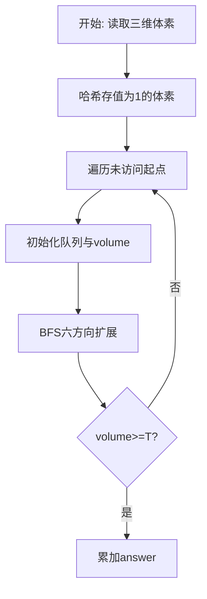
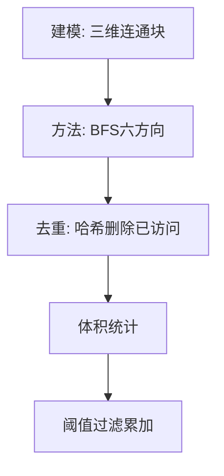

# L3-010 - 是否完全二叉搜索树（30 分）

- **时间限制**: 400 ms
- **内存限制**: 65536 KB
- **代码长度限制**: 16 KB

---

## 题目描述


将一系列给定数字顺序插入一个初始为空的二叉搜索树（定义为左子树键值大，右子树键值小），你需要判断最后的树是否一棵完全二叉树，并且给出其层序遍历的结果。

### 输入格式:

输入第一行给出一个不超过20的正整数`N`；第二行给出`N`个互不相同的正整数，其间以空格分隔。

### 输出格式:

将输入的`N`个正整数顺序插入一个初始为空的二叉搜索树。在第一行中输出结果树的层序遍历结果，数字间以1个空格分隔，行的首尾不得有多余空格。第二行输出`YES`，如果该树是完全二叉树；否则输出`NO`。

### 输入样例 1：
```in
9
38 45 42 24 58 30 67 12 51
```

### 输出样例 1：
```out
38 45 24 58 42 30 12 67 51
YES
```

### 输入样例 2：
```in
8
38 24 12 45 58 67 42 51
```

### 输出样例 2：
```out
38 45 24 58 42 12 67 51
NO
```

## 示例

### 示例 1

**输入:**
```
9
38 45 42 24 58 30 67 12 51
```

**输出:**
```
38 45 24 58 42 30 12 67 51
YES
```

### 示例 2

**输入:**
```
8
38 24 12 45 58 67 42 51
```

**输出:**
```
38 45 24 58 42 12 67 51
NO
```

### 解题思路

本题是无权图/网格上的连通或可达性问题，天然适合广度优先搜索逐层扩散。L3-010 是否完全二叉搜索树 实现原理：按题目的反向 BST 规则（左大右小）逐个插入。结合输入规模与输出要求，需要兼顾正确性与时间复杂度。

算法选用广度优先搜索在网格/图上按六邻接或四邻接逐层扩展。把值为 1 的体素或可达节点入队，已访问节点从集合中删除以去重，队列头指针模拟 FIFO，累计连通块体积后与阈值比较决定是否计入答案，确保每个体素仅被访问一次。

### 代码流程说明

1. 读取三维尺寸 `m n layers` 与阈值 `threshold`，将所有值为 1 的体素用 `key(x,y,z)` 存入哈希 `filled`。
2. 遍历 `filled` 的每个未访问起点，初始化队列 `queue` 与头指针 `head`、体积 `volume=0`，并标记起点已访问。
3. BFS 循环中弹出队首体素，对六个方向 `(±1,0,0),(0,±1,0),(0,0,±1)` 探测邻接体素，合法且未访问则入队并删除集合标记。
4. 连通块结束后若 `volume >= threshold` 则累加至 `answer`，全部块处理完输出 `answer`。

### 代码实现

```lua
-- L3-010 是否完全二叉搜索树
-- 实现原理：按题目的反向 BST 规则（左大右小）逐个插入。层序遍历输出节点，
-- 同时在首次遇到空孩子后检查是否还存在非空节点，以判断完全二叉树性质。

local n = io.read("*n")
local root = nil
local function insert(node, value)
    if not node then return { value = value } end
    if value > node.value then node.left = insert(node.left, value) else node.right = insert(node.right, value) end
    return node
end
for _ = 1, n do root = insert(root, io.read("*n")) end
local queue, head, order, seenNil, complete = { root }, 1, {}, false, true
while head <= #queue do
    local node = queue[head]; head = head + 1
    if node then
        if seenNil then complete = false end
        order[#order + 1] = node.value
        queue[#queue + 1], queue[#queue + 1] = node.left, node.right
    else
        seenNil = true
    end
end
print(table.concat(order, " "))
print(complete and "YES" or "NO")
```

### 代码流程图



### 解题流程图


