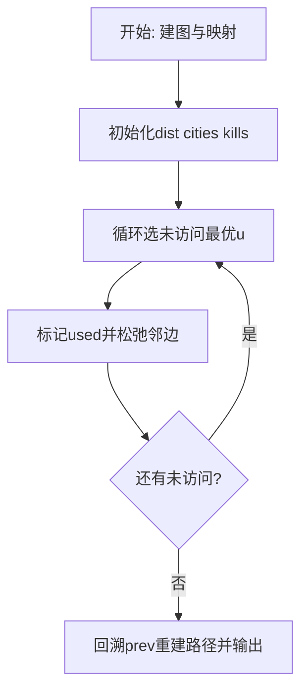
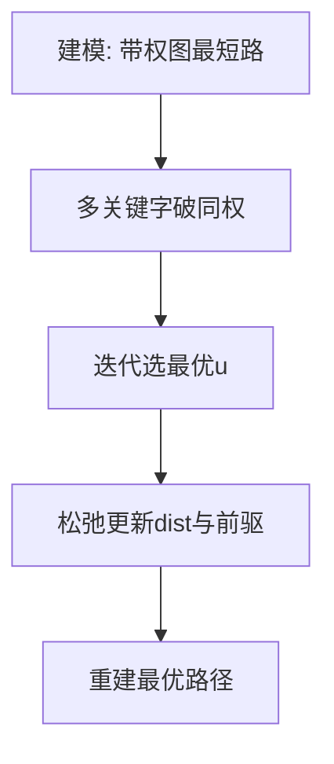

# L3-011 - 直捣黄龙（30 分）

- **时间限制**: 150 ms
- **内存限制**: 65536 KB
- **代码长度限制**: 16 KB

---

## 题目描述


本题是一部战争大片 —— 你需要从己方大本营出发，一路攻城略地杀到敌方大本营。首先时间就是生命，所以你必须选择合适的路径，以最快的速度占领敌方大本营。当这样的路径不唯一时，要求选择可以沿途解放最多城镇的路径。若这样的路径也不唯一，则选择可以有效杀伤最多敌军的路径。

### 输入格式:

输入第一行给出 2 个正整数 N（2 $\le$ N $\le$ 200，城镇总数）和 K（城镇间道路条数），以及己方大本营和敌方大本营的代号。随后 N-1 行，每行给出除了己方大本营外的一个城镇的代号和驻守的敌军数量，其间以空格分隔。再后面有 K 行，每行按格式`城镇1 城镇2 距离`给出两个城镇之间道路的长度。这里设每个城镇（包括双方大本营）的代号是由 3 个大写英文字母组成的字符串。

### 输出格式:

按照题目要求找到最合适的进攻路径（题目保证速度最快、解放最多、杀伤最强的路径是唯一的），并在第一行按照格式`己方大本营->城镇1->...->敌方大本营`输出。第二行顺序输出最快进攻路径的条数、最短进攻距离、歼敌总数，其间以 1 个空格分隔，行首尾不得有多余空格。

### 输入样例:
```in
10 12 PAT DBY
DBY 100
PTA 20
PDS 90
PMS 40
TAP 50
ATP 200
LNN 80
LAO 30
LON 70
PAT PTA 10
PAT PMS 10
PAT ATP 20
PAT LNN 10
LNN LAO 10
LAO LON 10
LON DBY 10
PMS TAP 10
TAP DBY 10
DBY PDS 10
PDS PTA 10
DBY ATP 10
```

### 输出样例:
```out
PAT->PTA->PDS->DBY
3 30 210
```

## 示例

### 示例 1

**输入:**
```
10 12 PAT DBY
DBY 100
PTA 20
PDS 90
PMS 40
TAP 50
ATP 200
LNN 80
LAO 30
LON 70
PAT PTA 10
PAT PMS 10
PAT ATP 20
PAT LNN 10
LNN LAO 10
LAO LON 10
LON DBY 10
PMS TAP 10
TAP DBY 10
DBY PDS 10
PDS PTA 10
DBY ATP 10
```

**输出:**
```
PAT->PTA->PDS->DBY
3 30 210
```

### 解题思路

本题是带权图上的最优化路径/选址问题，需要多次求源点到其余点的最短距离。L3-011 直捣黄龙 实现原理：Dijkstra 以距离为第一关键字。结合输入规模与输出要求，需要兼顾正确性与时间复杂度。

算法选用 Dijkstra 最短路算法，针对不同优化目标定制比较关键字：如按“时间优先、距离次之”或“距离优先、节点数次之”，并在距离相等时引入第二、第三关键字破同权。每次从未访问集合中选出当前最优节点松弛邻边，记录前驱以重建路径，适用于非负权图。

### 代码流程说明

1. 解析顶点数、边数及起点终点映射，建立邻接表 `graph` 并读入带权边与敌人数 `enemy`。
2. 初始化 `dist/cities/kills/prev/used` 数组，起点距离 0、城市数 0，其余为无穷/负无穷。
3. 循环 n 次选未访问且距离最小（同距按城市数、歼敌数破同权）的 `u`，标记已访问后松弛其邻边更新多关键字最优值与前驱。
4. 从 `target` 回溯 `prev` 链重建路径字符串，并输出路径、`cities[target] dist[target] kills[target]` 三元组。

### 代码实现

```lua
-- L3-011 直捣黄龙
-- 实现原理：Dijkstra 以距离为第一关键字；同距离时依次优先经过城市数更多、
-- 歼敌数更多的路径。记录前驱即可重建唯一最优进攻路线。

local n, m, sourceName, targetName = io.read("*n"), io.read("*n"), io.read("*s"), io.read("*s")
local id, names, enemy, nextId = {}, {}, {}, 1
local function getId(name)
    if not id[name] then id[name], names[nextId], nextId = nextId, name, nextId + 1 end
    return id[name]
end
local source, target = getId(sourceName), getId(targetName)
for _ = 1, n - 1 do local name, count = io.read("*s"), io.read("*n"); enemy[getId(name)] = count end
enemy[source] = 0; enemy[target] = enemy[target] or 0
local graph = {}; for i = 1, n do graph[i] = {} end
for _ = 1, m do
    local a, b, d = getId(io.read("*s")), getId(io.read("*s")), io.read("*n")
    graph[a][#graph[a] + 1] = { b, d }; graph[b][#graph[b] + 1] = { a, d }
end
local dist, cities, kills, prev, used = {}, {}, {}, {}, {}
for i = 1, n do dist[i], cities[i], kills[i] = math.huge, -1, -1 end
dist[source], cities[source], kills[source] = 0, 0, 0
for _ = 1, n do
    local u = nil
    for i = 1, n do
        if not used[i] and (not u or dist[i] < dist[u] or (dist[i] == dist[u] and (cities[i] > cities[u]
            or (cities[i] == cities[u] and kills[i] > kills[u])))) then u = i end
    end
    if not u or dist[u] == math.huge then break end
    used[u] = true
    for _, edge in ipairs(graph[u]) do
        local v, d = edge[1], edge[2]
        local nd, nc, nk = dist[u] + d, cities[u] + 1, kills[u] + enemy[v]
        if nd < dist[v] or (nd == dist[v] and (nc > cities[v] or (nc == cities[v] and nk > kills[v]))) then
            dist[v], cities[v], kills[v], prev[v] = nd, nc, nk, u
        end
    end
end
local path, x = {}, target
while x do table.insert(path, 1, names[x]); x = prev[x] end
print(table.concat(path, "->"))
print(cities[target] .. " " .. dist[target] .. " " .. kills[target])
```

### 代码流程图



### 解题流程图


