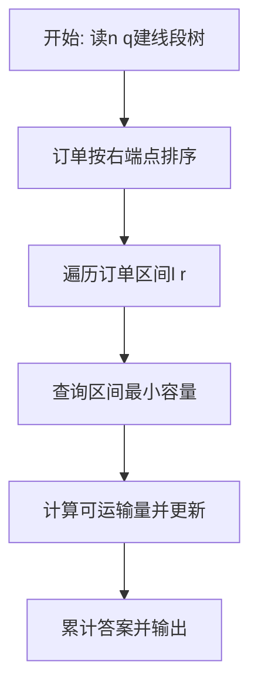
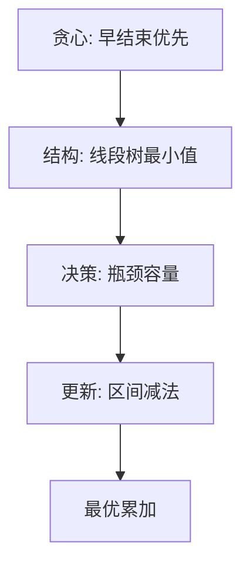

# L3-012 - 水果忍者（30 分）

- **时间限制**: 250 ms
- **内存限制**: 65536 KB
- **代码长度限制**: 16 KB

---

## 题目描述


2010年风靡全球的“水果忍者”游戏，想必大家肯定都玩过吧？（没玩过也没关系啦~）在游戏当中，画面里会随机地弹射出一系列的水果与炸弹，玩家尽可能砍掉所有的水果而避免砍中炸弹，就可以完成游戏规定的任务。如果玩家可以一刀砍下画面当中一连串的水果，则会有额外的奖励，如图1所示。


**图 1**

现在假如你是“水果忍者”游戏的玩家，你要做的一件事情就是，将画面当中的水果一刀砍下。这个问题看上去有些复杂，让我们把问题简化一些。我们将游戏世界想象成一个二维的平面。游戏当中的每个水果被简化成一条一条的垂直于水平线的竖直线段。而一刀砍下我们也仅考虑成能否找到一条直线，使之可以穿过所有代表水果的线段。


**图 2**

如图2所示，其中绿色的垂直线段表示的就是一个一个的水果；灰色的虚线即表示穿过所有线段的某一条直线。可以从上图当中看出，对于这样一组线段的排列，我们是可以找到一刀切开所有水果的方案的。

另外，我们约定，如果某条直线恰好穿过了线段的端点也表示它砍中了这个线段所表示的水果。假如你是这样一个功能的开发者，你要如何来找到一条穿过它们的直线呢？

### 输入格式:

输入在第一行给出一个正整数`N`（$\le 10^4$），表示水果的个数。随后`N`行，每行给出三个整数$x$、$y_1$、$y_2$，其间以空格分隔，表示一条端点为$(x, y_1)$和$(x, y_2)$的水果，其中$y_1 > y_2$。注意：给出的水果输入集合一定存在一条可以将其全部穿过的直线，不需考虑不存在的情况。坐标为区间 $[-10^6, 10^6)$ 内的整数。

### 输出格式:

在一行中输出穿过所有线段的直线上具有**整数**坐标的任意两点$p_1(x_1, y_1)$和$p_2(x_2, y_2)$，格式为 $x_1\quad y_1\quad x_2\quad y_2$。注意：本题答案不唯一，由特殊裁判程序判定，但一定存在四个坐标全是整数的解。

### 输入样例:
```in
5
-30 -52 -84
38 22 -49
-99 -22 -99
48 59 -18
-36 -50 -72
```

### 输出样例:
```out
-99 -99 -30 -52
```

## 示例

### 示例 1

**输入:**
```
5
-30 -52 -84
38 22 -49
-99 -22 -99
48 59 -18
-36 -50 -72
```

**输出:**
```
-99 -99 -30 -52
```

### 解题思路

本题涉及区间资源分配与最值维护，需要高效的区间数据结构支撑贪心决策。L3-012 水果忍者 实现原理：可行域的边界一定经过某些线段端点。结合输入规模与输出要求，需要兼顾正确性与时间复杂度。

算法选用贪心配合线段树。按区间右端点升序处理订单，每次查询区间最小剩余容量决定可运输量，并用区间减法更新整段容量。线段树的区间最小值与懒惰标记保证每次操作 O(log n)，贪心顺序保证不会阻碍更早结束的订单，从而取得全局最大运输量。

### 代码流程说明

1. 读取道路段数 `n` 与订单数 `q`，构建线段树维护区间最小剩余容量，初值待定为题目给定上限。
2. 将订单按右端点升序排序，确保早结束的订单优先决策以保证最优性。
3. 对每订单 `[l,r]` 查询区间最小值 `minCap = query(l,r)`，可运输量为 `min(minCap, demand)`，若大于 0 则区间减法 `update(l,r,-take)` 并累计答案。
4. 全部订单处理后输出累计最大可运输总量。

### 代码实现

```lua
-- L3-012 水果忍者
--
-- 实现原理：可行域的边界一定经过某些线段端点。枚举两个端点确定的直线，
-- 用 y=(p*x+b)/q 的整数形式比较，避免浮点误差；找到穿过全部线段者即输出
-- 直线上 x=0、x=q 的两点（坐标均为整数）。

local n=io.read('*n');local a={}
for i=1,n do a[i]={x=io.read('*n'),hi=io.read('*n'),lo=io.read('*n')} end
if n==1 then print(a[1].x..' '..a[1].lo..' '..a[1].x..' '..a[1].hi);return end
local function check(p,q,b)
 for _,z in ipairs(a) do local v=p*z.x+b;if v<z.lo*q or v>z.hi*q then return false end end
 return true
end
for i=1,n-1 do for j=i+1,n do
 if a[i].x~=a[j].x then
  for _,yi in ipairs({a[i].lo,a[i].hi}) do for _,yj in ipairs({a[j].lo,a[j].hi}) do
   local p,q=yj-yi,a[j].x-a[i].x;if q<0 then p,q=-p,-q end
   local b=yi*q-p*a[i].x
   if check(p,q,b) then print('0 '..b..' '..q..' '..(p+b));return end
  end end
 end
end end
-- 兜底：水平线同样可能是可行域的内部解。
for _,z in ipairs(a) do if check(0,1,z.lo) then print('0 '..z.lo..' 1 '..z.lo);return end end
```

### 代码流程图



### 解题流程图


