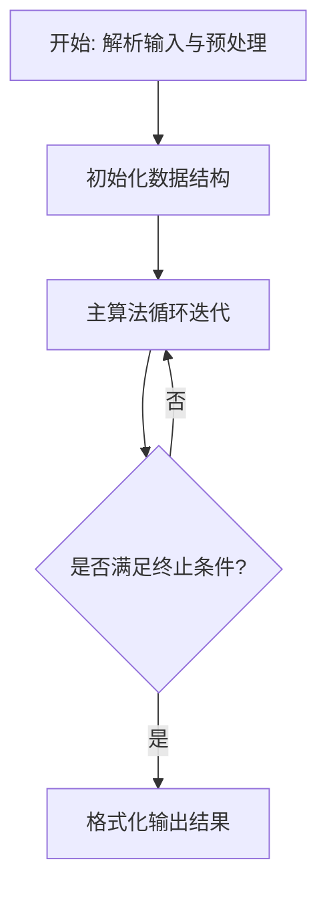
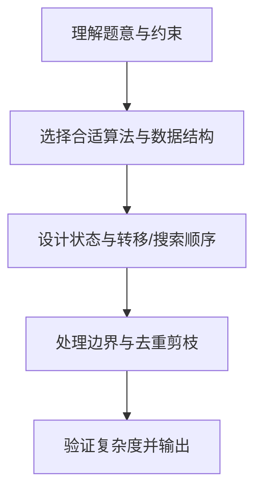

# L3-013 - 非常弹的球（30 分）

- **时间限制**: 150 ms
- **内存限制**: 65536 KB
- **代码长度限制**: 16 KB

---

## 题目描述


刚上高一的森森为了学好物理，买了一个“非常弹”的球。虽然说是非常弹的球，其实也就是一般的弹力球而已。森森玩了一会儿弹力球后突然想到，假如他在地上用力弹球，球最远能弹到多远去呢？他不太会，你能帮他解决吗？当然为了刚学习物理的森森，我们对环境做一些简化：

- 假设森森是一个质点，以森森为原点设立坐标轴，则森森位于(0, 0)点。
- 小球质量为$$w/100$$ 千克（kg），重力加速度为9.8米/秒平方（$$m/s^2$$）。
- 森森在地上用力弹球的过程可简化为球从(0, 0)点以某个森森选择的角度$$ang$$ ($$0 < ang < \pi/2$$) 向第一象限抛出，抛出时假设动能为1000 焦耳（J）。
- 小球在空中仅受重力作用，球纵坐标为0时可视作落地，落地时损失$$p\%$$动能并反弹。
- 地面可视为刚体，忽略小球形状、空气阻力及摩擦阻力等。

森森为你准备的公式：

- 动能公式：$$E = m\times v^2 / 2$$
- 牛顿力学公式：$$F = m\times a$$
- 重力：$$G = m\times g$$

其中：

- $$E$$ - 动能，单位为“焦耳”
- $$m$$ - 质量，单位为“千克”
- $$v$$ - 速度，单位为“米/秒”
- $$a$$ - 加速度，单位为“米/秒平方”
- $$g$$ - 重力加速度

### 输入格式:

输入在一行中给出两个整数：$$1 \le w \le 1000$$ 和 $$1 \le p \le 100$$，分别表示放大100倍的小球质量、以及损失动力的百分比$$p$$。

### 输出格式:

在一行输出最远的投掷距离，保留3位小数。

### 输入样例:
```in
100 90
```

### 输出样例:
```out
226.757
```

## 示例

### 示例 1

**输入:**
```
100 90
```

**输出:**
```
226.757
```

### 解题思路

本题的核心在于从给定约束中找出满足条件的最优解或可行性判定。L3-013 非常弹的球 实现原理：45 度抛射时单次水平射程最大，为 v^2/g。结合输入规模与输出要求，需要兼顾正确性与时间复杂度。

实现上直接依据注释原理展开：L3-013 非常弹的球 实现原理：45 度抛射时单次水平射程最大，为 v^2/g。每次弹起后动能乘以 (1-p/100)，射程也按同一比例衰减，全部射程是等比级数之和。 代码中通过排序、预处理与主循环的配合，将理论转化为可执行的迭代与分支判断，保证逻辑与题目定义的比较规则完全一致。

### 代码流程说明

1. 解析输入：按题目格式读取整数、字符串或图边，建立必要的数组/哈希/邻接结构并做初步排序或映射。
2. 初始化核心数据结构：根据算法选择置零计数器、并查集、距离数组或 DP 滚动数组，并设定边界初值。
3. 执行主算法循环：按排序/优先级/搜索顺序遍历状态，更新最优值、合并集合或扩展队列，并记录前驱/路径/体积等辅助信息。
4. 格式化输出：按题目要求的空格、换行与特殊无解字符串输出结果，必要时重建路径或统计聚合值。

### 代码实现

```lua
-- L3-013 非常弹的球
-- 实现原理：45 度抛射时单次水平射程最大，为 v^2/g。每次弹起后动能乘以
-- (1-p/100)，射程也按同一比例衰减，全部射程是等比级数之和。

local w, p = io.read("*n"), io.read("*n")
local mass, ratio = w / 100, 1 - p / 100
local firstRange = (2000 / mass) / 9.8
local total = firstRange / (1 - ratio)
print(string.format("%.3f", total))
```

### 代码流程图



### 解题流程图


