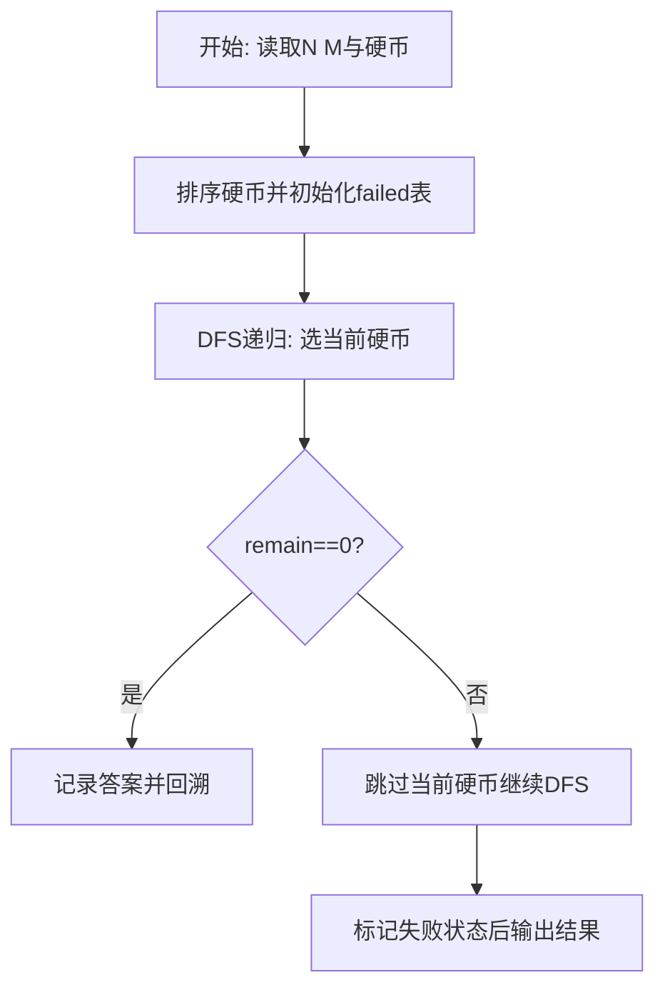
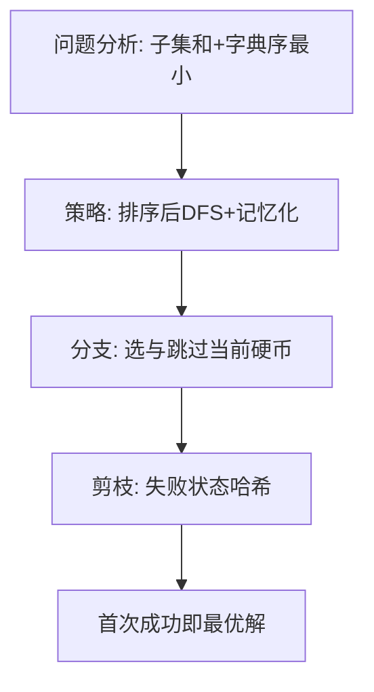

# L3-014 - 周游世界（30 分）

- **时间限制**: 200 ms
- **内存限制**: 65536 KB
- **代码长度限制**: 16 KB

---

## 题目描述


周游世界是件浪漫事，但规划旅行路线就不一定了…… 全世界有成千上万条航线、铁路线、大巴线，令人眼花缭乱。所以旅行社会选择部分运输公司组成联盟，每家公司提供一条线路，然后帮助客户规划由联盟内企业支持的旅行路线。本题就要求你帮旅行社实现一个自动规划路线的程序，使得对任何给定的起点和终点，可以找出最顺畅的路线。所谓“最顺畅”，首先是指中途经停站最少；如果经停站一样多，则取需要换乘线路次数最少的路线。

### 输入格式:

输入在第一行给出一个正整数$N$（$\le 100$），即联盟公司的数量。接下来有$N$行，第$i$行（$i=1, \cdots , N$）描述了第$i$家公司所提供的线路。格式为：

$M$ S[1] S[2] $\cdots$ S[$M$]

其中$M$（$\le 100$）是经停站的数量，S[$i$]（$i=1, \cdots , M$）是经停站的编号（由4位0-9的数字组成）。这里假设每条线路都是简单的一条可以双向运行的链路，并且输入保证是按照正确的经停顺序给出的 —— 也就是说，任意一对相邻的S[$i$]和S[$i+1$]（$i=1, \cdots , M-1$）之间都不存在其他经停站点。我们称相邻站点之间的线路为一个运营区间，每个运营区间只承包给一家公司。环线是有可能存在的，但不会不经停任何中间站点就从出发地回到出发地。当然，不同公司的线路是可能在某些站点有交叉的，这些站点就是客户的换乘点，我们假设任意换乘点涉及的不同公司的线路都不超过5条。

在描述了联盟线路之后，题目将给出一个正整数$K$（$\le 10$），随后$K$行，每行给出一位客户的需求，即始发地的编号和目的地的编号，中间以一空格分隔。

### 输出格式:

处理每一位客户的需求。如果没有现成的线路可以使其到达目的地，就在一行中输出“Sorry, no line is available.”；如果目的地可达，则首先在一行中输出最顺畅路线的经停站数量（始发地和目的地不包括在内），然后按下列格式给出旅行路线：

```
Go by the line of company #X1 from S1 to S2.
Go by the line of company #X2 from S2 to S3.
......
```

其中`Xi`是线路承包公司的编号，`Si`是经停站的编号。但必须只输出始发地、换乘点和目的地，不能输出中间的经停站。题目保证满足要求的路线是唯一的。

### 输入样例:
```in
4
7 1001 3212 1003 1204 1005 1306 7797
9 9988 2333 1204 2006 2005 2004 2003 2302 2001
13 3011 3812 3013 3001 1306 3003 2333 3066 3212 3008 2302 3010 3011
4 6666 8432 4011 1306
4
3011 3013
6666 2001
2004 3001
2222 6666
```

### 输出样例:
```out
2
Go by the line of company #3 from 3011 to 3013.
10
Go by the line of company #4 from 6666 to 1306.
Go by the line of company #3 from 1306 to 2302.
Go by the line of company #2 from 2302 to 2001.
6
Go by the line of company #2 from 2004 to 1204.
Go by the line of company #1 from 1204 to 1306.
Go by the line of company #3 from 1306 to 3001.
Sorry, no line is available.
```

## 示例

### 示例 1

**输入:**
```
4
7 1001 3212 1003 1204 1005 1306 7797
9 9988 2333 1204 2006 2005 2004 2003 2302 2001
13 3011 3812 3013 3001 1306 3003 2333 3066 3212 3008 2302 3010 3011
4 6666 8432 4011 1306
4
3011 3013
6666 2001
2004 3001
2222 6666
```

**输出:**
```
2
Go by the line of company #3 from 3011 to 3013.
10
Go by the line of company #4 from 6666 to 1306.
Go by the line of company #3 from 1306 to 2302.
Go by the line of company #2 from 2302 to 2001.
6
Go by the line of company #2 from 2004 to 1204.
Go by the line of company #1 from 1204 to 1306.
Go by the line of company #3 from 1306 to 3001.
Sorry, no line is available.
```

### 解题思路

本题是带权图上的最优化路径/选址问题，需要多次求源点到其余点的最短距离。L3-014 周游世界 实现原理：状态为“当前站点、当前线路”，用优先队列按经过区间数、换乘数 的字典序求最短路。结合输入规模与输出要求，需要兼顾正确性与时间复杂度。

算法选用深度优先搜索按“选当前元素 / 跳过当前元素”的分支顺序展开，并在状态 `(下标, 剩余量)` 上做记忆化去重以避免重复搜索。由于硬币已按升序排列，首次到达 `remain==0` 的路径即为题目定义的字典序最小解，搜索过程中一旦命中已失败的状态则立即回溯，显著削减无效分支。

### 代码流程说明

1. 解析顶点数、边数及起点终点映射，建立邻接表 `graph` 并读入带权边与敌人数 `enemy`。
2. 初始化 `dist/cities/kills/prev/used` 数组，起点距离 0、城市数 0，其余为无穷/负无穷。
3. 循环 n 次选未访问且距离最小（同距按城市数、歼敌数破同权）的 `u`，标记已访问后松弛其邻边更新多关键字最优值与前驱。
4. 从 `target` 回溯 `prev` 链重建路径字符串，并输出路径、`cities[target] dist[target] kills[target]` 三元组。

### 代码实现

```lua
-- L3-014 周游世界
-- 实现原理：状态为“当前站点、当前线路”，用优先队列按经过区间数、换乘数
-- 的字典序求最短路。回溯边上的线路编号，再在编号变化处分段输出。

local lines = io.read("*n")
local graph = {}
for company = 1, lines do
    local count, stops = io.read("*n"), {}
    for i = 1, count do stops[i] = io.read("*s"); graph[stops[i]] = graph[stops[i]] or {} end
    for i = 1, count - 1 do
        graph[stops[i]][#graph[stops[i]] + 1] = { stops[i + 1], company }
        graph[stops[i + 1]][#graph[stops[i + 1]] + 1] = { stops[i], company }
    end
end
local q = io.read("*n")
for _ = 1, q do
    local source, target = io.read("*s"), io.read("*s")
    if not graph[source] or not graph[target] then print("Sorry, no line is available.") else
        local heap, dist, prev = {}, {}, {}
        local function push(item)
            heap[#heap + 1] = item; local i = #heap
            while i > 1 do local p = math.floor(i / 2); local a, b = heap[i], heap[p]
                if a.hops > b.hops or (a.hops == b.hops and a.trans >= b.trans) then break end
                heap[i], heap[p], i = heap[p], heap[i], p
            end
        end
        local function pop()
            local top, last = heap[1], heap[#heap]; heap[#heap] = nil
            if #heap > 0 then
                heap[1] = last; local i = 1
                while true do local l, r, best = i * 2, i * 2 + 1, i
                    if l <= #heap and (heap[l].hops < heap[best].hops or (heap[l].hops == heap[best].hops and heap[l].trans < heap[best].trans)) then best = l end
                    if r <= #heap and (heap[r].hops < heap[best].hops or (heap[r].hops == heap[best].hops and heap[r].trans < heap[best].trans)) then best = r end
                    if best == i then break end; heap[i], heap[best], i = heap[best], heap[i], best
                end
            end
            return top
        end
        local startKey = source .. "|0"; dist[startKey] = { hops = 0, trans = 0 }; push({ station = source, line = 0, hops = 0, trans = 0, key = startKey })
        local bestKey, bestCost
        while #heap > 0 do
            local cur = pop(); local known = dist[cur.key]
            if known and known.hops == cur.hops and known.trans == cur.trans then
                if cur.station == target then bestKey, bestCost = cur.key, cur; break end
                for _, edge in ipairs(graph[cur.station]) do
                    local ns, line = edge[1], edge[2]
                    local hops, trans = cur.hops + 1, cur.trans + (cur.line ~= 0 and cur.line ~= line and 1 or 0)
                    local key, old = ns .. "|" .. line, dist[ns .. "|" .. line]
                    if not old or hops < old.hops or (hops == old.hops and trans < old.trans) then
                        dist[key] = { hops = hops, trans = trans }
                        prev[key] = { cur.key, cur.station, line }
                        push({ station = ns, line = line, hops = hops, trans = trans, key = key })
                    end
                end
            end
        end
        if not bestKey then print("Sorry, no line is available.") else
            local edges, key = {}, bestKey
            while key ~= startKey do local p = prev[key]; table.insert(edges, 1, { p[2], key:match("^(.-)|"), p[3] }); key = p[1] end
            print(bestCost.hops - 1)
            local beginStation, line = source, edges[1] and edges[1][3]
            for i, edge in ipairs(edges) do
                local nextLine = edges[i + 1] and edges[i + 1][3]
                if nextLine ~= line then print("Go by the line of company #" .. line .. " from " .. beginStation .. " to " .. edge[2] .. "."); beginStation, line = edge[2], nextLine end
            end
        end
    end
end
```

### 代码流程图



### 解题流程图


