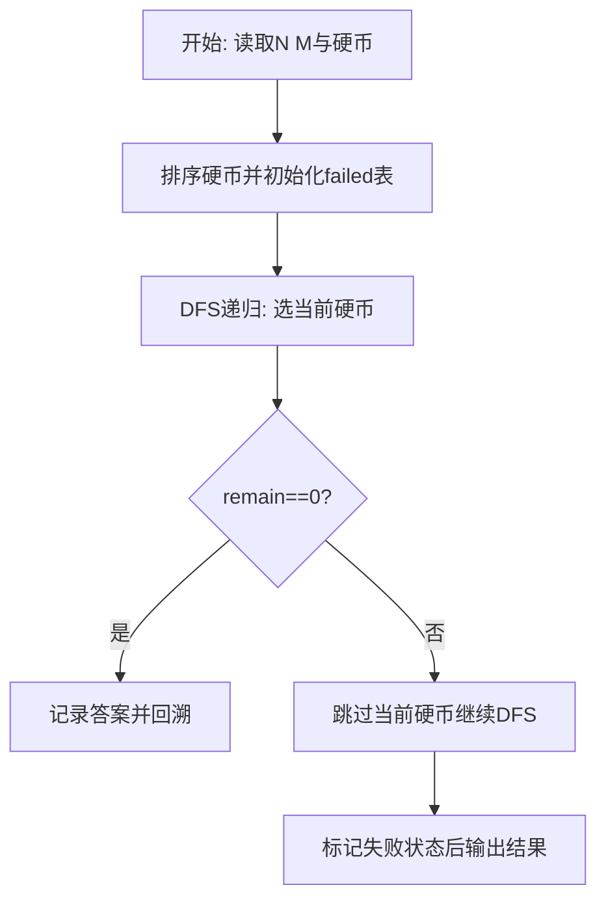
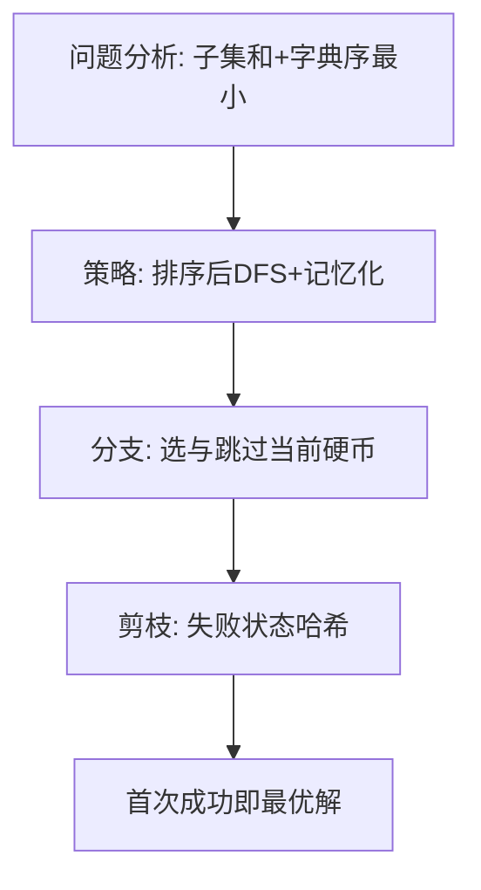

# L3-015 - 球队“食物链”（30 分）

- **时间限制**: 2000 ms
- **内存限制**: 131072 KB
- **代码长度限制**: 16 KB

---

## 题目描述


某国的足球联赛中有$$N$$支参赛球队，编号从1至$$N$$。联赛采用主客场双循环赛制，参赛球队两两之间在双方主场各赛一场。

联赛战罢，结果已经尘埃落定。此时，联赛主席突发奇想，希望从中找出一条包含所有球队的“食物链”，来说明联赛的精彩程度。“食物链”为一个1至$$N$$的排列{ $$T_1$$ $$T_2$$ $$\cdots$$ $$T_N$$ }，满足：球队$$T_1$$战胜过球队$$T_2$$，球队$$T_2$$战胜过球队$$T_3$$，$$\cdots$$，球队$$T_{(N-1)}$$战胜过球队$$T_N$$，球队$$T_N$$战胜过球队$$T_1$$。

现在主席请你从联赛结果中找出“食物链”。若存在多条“食物链”，请找出字典序最小的。

注：排列{ $$a_1$$ $$a_2$$ $$\cdots$$ $$a_N$$}在字典序上小于排列{ $$b_1$$ $$b_2$$ $$\cdots$$ $$b_N$$ }，当且仅当存在整数$$K$$（$$1 \le K \le N$$），满足：$$a_K < b_K$$且对于任意小于$$K$$的正整数$$i$$，$$a_i=b_i$$。

### 输入格式:

输入第一行给出一个整数$$N$$（$$2 \le N \le 20$$），为参赛球队数。随后$$N$$行，每行$$N$$个字符，给出了$$N\times N$$的联赛结果表，其中第$$i$$行第$$j$$列的字符为球队$$i$$在主场对阵球队$$j$$的比赛结果：`W`表示球队$$i$$战胜球队$$j$$，`L`表示球队$$i$$负于球队$$j$$，`D`表示两队打平，`-`表示无效（当$$i=j$$时）。输入中无多余空格。

### 输出格式:

按题目要求找到“食物链”$$T_1$$ $$T_2$$ $$\cdots$$ $$T_N$$，将这$$N$$个数依次输出在一行上，数字间以1个空格分隔，行的首尾不得有多余空格。若不存在“食物链”，输出“No Solution”。

### 输入样例 1：
```in
5
-LWDW
W-LDW
WW-LW
DWW-W
DDLW-
```

### 输出样例 1：
```out
1 3 5 4 2
```

### 输入样例 2：
```in
5
-WDDW
D-DWL
DD-DW
DDW-D
DDDD-
```

### 输出样例 2：
```out
No Solution
```

## 示例

### 示例 1

**输入:**
```
5
-LWDW
W-LDW
WW-LW
DWW-W
DDLW-
```

**输出:**
```
1 3 5 4 2
```

### 示例 2

**输入:**
```
5
-WDDW
D-DWL
DD-DW
DDW-D
DDDD-
```

**输出:**
```
No Solution
```

### 解题思路

本题需在指数级搜索空间中找到满足约束且字典序最小的解，适合深度优先搜索配合剪枝。L3-015 球队“食物链” 实现原理：若两队的任一主客场结果表明 i 战胜 j，则建立有向边 i->j。结合输入规模与输出要求，需要兼顾正确性与时间复杂度。

算法选用深度优先搜索按“选当前元素 / 跳过当前元素”的分支顺序展开，并在状态 `(下标, 剩余量)` 上做记忆化去重以避免重复搜索。由于硬币已按升序排列，首次到达 `remain==0` 的路径即为题目定义的字典序最小解，搜索过程中一旦命中已失败的状态则立即回溯，显著削减无效分支。

### 代码流程说明

1. 读取 N 与目标 M，过滤大于 M 的硬币后存入 `coins` 并升序 `table.sort`，准备记忆表 `failed` 与答案 `answer`。
2. 定义递归 `dfs(i, remain, chosen)`：若 `remain==0` 则深拷贝当前选择为答案并返回真；若越界或 `remain<0` 返回假。
3. 用 `key=i:remain` 查 `failed` 剪枝，先尝试选 `coins[i]` 递归，再回溯跳过该硬币再次递归，失败则标记 `failed[key]=true`。
4. 从 `dfs(1,target,{})` 启动，成功则 `table.concat(answer," ")` 输出否则输出 `No Solution`。

### 代码实现

```lua
-- L3-015 球队“食物链”
-- 实现原理：若两队的任一主客场结果表明 i 战胜 j，则建立有向边 i->j。
-- 从 1 开始按编号递增 DFS 搜索哈密顿回路，首次完整回路即为字典序最小解。

local n = tonumber(io.read("*l"))
local result = {}
for i = 1, n do result[i] = io.read("*l") end
local win = {}
for i = 1, n do
    win[i] = {}
    for j = 1, n do win[i][j] = result[i]:sub(j, j) == "W" or result[j]:sub(i, i) == "L" end
end
local used, path, answer = { [1] = true }, { 1 }, nil
local function dfs(x)
    if #path == n then
        if win[x][1] then answer = {}; for i, v in ipairs(path) do answer[i] = v end; return true end
        return false
    end
    for y = 2, n do
        if not used[y] and win[x][y] then
            used[y], path[#path + 1] = true, y
            if dfs(y) then return true end
            path[#path], used[y] = nil, nil
        end
    end
    return false
end
if dfs(1) then print(table.concat(answer, " ")) else print("No Solution") end
```

### 代码流程图



### 解题流程图


