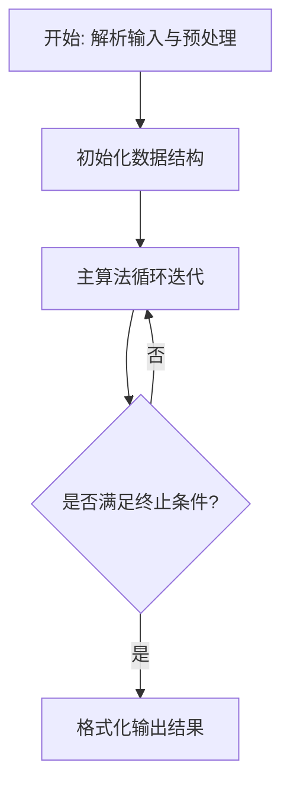
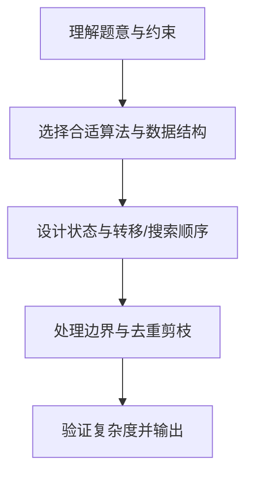

# L3-016 - 二叉搜索树的结构（30 分）

- **时间限制**: 400 ms
- **内存限制**: 65536 KB
- **代码长度限制**: 16 KB

---

## 题目描述


二叉搜索树或者是一棵空树，或者是具有下列性质的二叉树： 若它的左子树不空，则左子树上所有结点的值均小于它的根结点的值；若它的右子树不空，则右子树上所有结点的值均大于它的根结点的值；它的左、右子树也分别为二叉搜索树。（摘自百度百科）

给定一系列互不相等的整数，将它们顺次插入一棵初始为空的二叉搜索树，然后对结果树的结构进行描述。你需要能判断给定的描述是否正确。例如将{ 2 4 1 3 0 }插入后，得到一棵二叉搜索树，则陈述句如“2是树的根”、“1和4是兄弟结点”、“3和0在同一层上”（指自顶向下的深度相同）、“2是4的双亲结点”、“3是4的左孩子”都是正确的；而“4是2的左孩子”、“1和3是兄弟结点”都是不正确的。

### 输入格式:

输入在第一行给出一个正整数$N$（$\le 100$），随后一行给出$N$个互不相同的整数，数字间以空格分隔，要求将之顺次插入一棵初始为空的二叉搜索树。之后给出一个正整数$M$（$\le 100$），随后$M$行，每行给出一句待判断的陈述句。陈述句有以下6种：

- `A is the root`，即"`A`是树的根"；
- `A and B are siblings`，即"`A`和`B`是兄弟结点"；
- `A is the parent of B`，即"`A`是`B`的双亲结点"；
- `A is the left child of B`，即"`A`是`B`的左孩子"；
- `A is the right child of B`，即"`A`是`B`的右孩子"；
- `A and B are on the same level`，即"`A`和`B`在同一层上"。

题目保证所有给定的整数都在整型范围内。

### 输出格式:

对每句陈述，如果正确则输出`Yes`，否则输出`No`，每句占一行。

### 输入样例:
```in
5
2 4 1 3 0
8
2 is the root
1 and 4 are siblings
3 and 0 are on the same level
2 is the parent of 4
3 is the left child of 4
1 is the right child of 2
4 and 0 are on the same level
100 is the right child of 3
```

### 输出样例:
```out
Yes
Yes
Yes
Yes
Yes
No
No
No
```

## 示例

### 示例 1

**输入:**
```
5
2 4 1 3 0
8
2 is the root
1 and 4 are siblings
3 and 0 are on the same level
2 is the parent of 4
3 is the left child of 4
1 is the right child of 2
4 and 0 are on the same level
100 is the right child of 3
```

**输出:**
```
Yes
Yes
Yes
Yes
Yes
No
No
No
```

### 解题思路

本题的核心在于从给定约束中找出满足条件的最优解或可行性判定。L3-016 二叉搜索树的结构 实现原理：插入时记录每个值的父节点、左右孩子和深度。结合输入规模与输出要求，需要兼顾正确性与时间复杂度。

实现上直接依据注释原理展开：L3-016 二叉搜索树的结构 实现原理：插入时记录每个值的父节点、左右孩子和深度。所有英文断言都可 直接转化为这些记录之间的等式关系，因此每条查询可 O(1) 判断。 代码中通过排序、预处理与主循环的配合，将理论转化为可执行的迭代与分支判断，保证逻辑与题目定义的比较规则完全一致。

### 代码流程说明

1. 解析输入：按题目格式读取整数、字符串或图边，建立必要的数组/哈希/邻接结构并做初步排序或映射。
2. 初始化核心数据结构：根据算法选择置零计数器、并查集、距离数组或 DP 滚动数组，并设定边界初值。
3. 执行主算法循环：按排序/优先级/搜索顺序遍历状态，更新最优值、合并集合或扩展队列，并记录前驱/路径/体积等辅助信息。
4. 格式化输出：按题目要求的空格、换行与特殊无解字符串输出结果，必要时重建路径或统计聚合值。

### 代码实现

```lua
-- L3-016 二叉搜索树的结构
-- 实现原理：插入时记录每个值的父节点、左右孩子和深度。所有英文断言都可
-- 直接转化为这些记录之间的等式关系，因此每条查询可 O(1) 判断。

local n = io.read("*n")
local root, info = nil, {}
for _ = 1, n do
    local value = io.read("*n")
    if not root then root = value; info[value] = { depth = 0 }
    else
        local cur = root
        while true do
            if value < cur then
                if info[cur].left then cur = info[cur].left else info[cur].left = value; info[value] = { parent = cur, depth = info[cur].depth + 1 }; break end
            else
                if info[cur].right then cur = info[cur].right else info[cur].right = value; info[value] = { parent = cur, depth = info[cur].depth + 1 }; break end
            end
        end
    end
end
io.read("*l")
local q = tonumber(io.read("*l"))
for _ = 1, q do
    local s = io.read("*l")
    local a, b = s:match("^(-?%d+) and (-?%d+) are siblings$")
    local ok
    if a then a, b = tonumber(a), tonumber(b); ok = info[a] and info[b] and info[a].parent and info[a].parent == info[b].parent
    else
        a = s:match("^(-?%d+) is the root$")
        if a then ok = tonumber(a) == root else
            a, b = s:match("^(-?%d+) is the parent of (-?%d+)$")
            if a then a, b = tonumber(a), tonumber(b); ok = info[b] and info[b].parent == a else
                a, b = s:match("^(-?%d+) is the left child of (-?%d+)$")
                if a then a, b = tonumber(a), tonumber(b); ok = info[b] and info[b].left == a else
                    a, b = s:match("^(-?%d+) is the right child of (-?%d+)$")
                    if a then a, b = tonumber(a), tonumber(b); ok = info[b] and info[b].right == a else
                        a, b = s:match("^(-?%d+) and (-?%d+) are on the same level$")
                        a, b = tonumber(a), tonumber(b); ok = info[a] and info[b] and info[a].depth == info[b].depth
                    end
                end
            end
        end
    end
    print(ok and "Yes" or "No")
end
```

### 代码流程图



### 解题流程图


