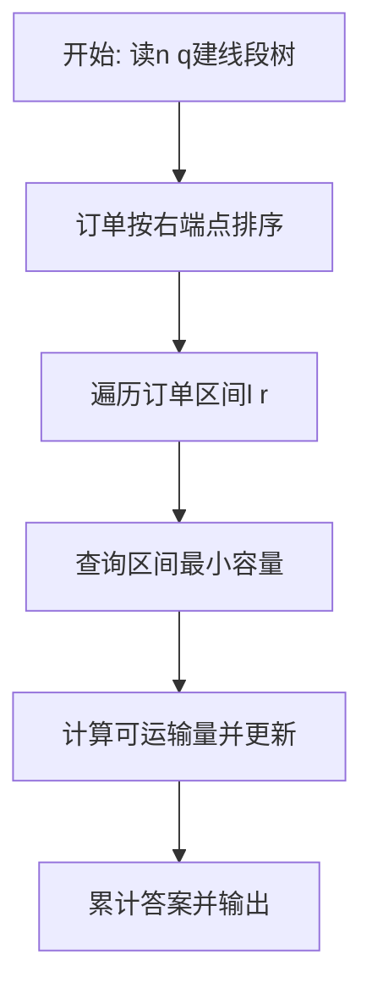
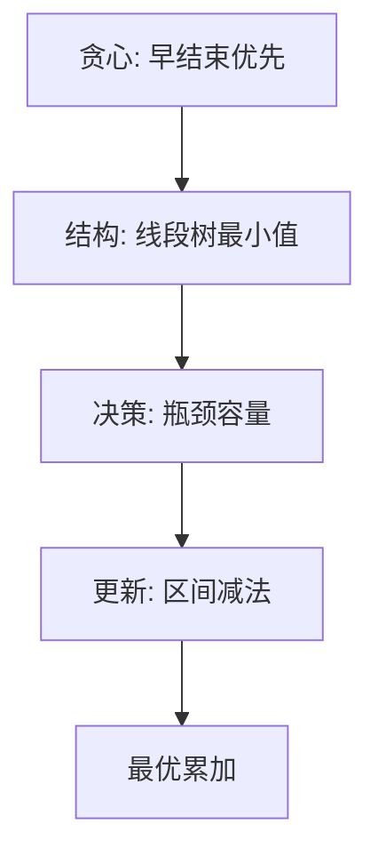

# L3-017 - 森森快递（30 分）

- **时间限制**: 400 ms
- **内存限制**: 65536 KB
- **代码长度限制**: 16 KB

---

## 题目描述


森森开了一家快递公司，叫森森快递。因为公司刚刚开张，所以业务路线很简单，可以认为是一条直线上的$N$个城市，这些城市从左到右依次从0到$(N-1)$编号。由于道路限制，第$i$号城市（$i=0, \cdots , N-2$）与第$(i+1)$号城市中间往返的运输货物重量在同一时刻不能超过$C_i$公斤。

公司开张后很快接到了$Q$张订单，其中$j$张订单描述了某些指定的货物要从$S_j$号城市运输到$T_j$号城市。这里我们简单地假设所有货物都有无限货源，森森会不定时地挑选其中一部分货物进行运输。安全起见，这些货物不会在中途卸货。

为了让公司整体效益更佳，森森想知道如何安排订单的运输，能使得运输的货物重量最大且符合道路的限制？要注意的是，发货时间有可能是任何时刻，所以我们安排订单的时候，必须保证共用同一条道路的所有货车的总重量不超载。例如我们安排1号城市到4号城市以及2号城市到4号城市两张订单的运输，则这两张订单的运输同时受2-3以及3-4两条道路的限制，因为两张订单的货物可能会同时在这些道路上运输。

### 输入格式:

输入在第一行给出两个正整数$N$和$Q$（$2 \le N \le 10^5$, $1 \le Q \le 10^5$），表示总共的城市数以及订单数量。

第二行给出$(N-1)$个数，顺次表示相邻两城市间的道路允许的最大运货重量$C_i$（$i=0, \cdots , N-2$）。题目保证每个$C_i$是不超过$2^{31}$的非负整数。

接下来$Q$行，每行给出一张订单的起始及终止运输城市编号。题目保证所有编号合法，并且不存在起点和终点重合的情况。

### 输出格式:

在一行中输出可运输货物的最大重量。

### 输入样例:
```in
10 6
0 7 8 5 2 3 1 9 10
0 9
1 8
2 7
6 3
4 5
4 2
```

### 输出样例:
```out
7
```

## 示例

### 示例 1

**输入:**
```
10 6
0 7 8 5 2 3 1 9 10
0 9
1 8
2 7
6 3
4 5
4 2
```

**输出:**
```
7
```

### 解题思路

本题涉及区间资源分配与最值维护，需要高效的区间数据结构支撑贪心决策。L3-017 森森快递 实现原理：每张订单占用一段连续道路。结合输入规模与输出要求，需要兼顾正确性与时间复杂度。

算法选用贪心配合线段树。按区间右端点升序处理订单，每次查询区间最小剩余容量决定可运输量，并用区间减法更新整段容量。线段树的区间最小值与懒惰标记保证每次操作 O(log n)，贪心顺序保证不会阻碍更早结束的订单，从而取得全局最大运输量。

### 代码流程说明

1. 读取道路段数 `n` 与订单数 `q`，构建线段树维护区间最小剩余容量，初值待定为题目给定上限。
2. 将订单按右端点升序排序，确保早结束的订单优先决策以保证最优性。
3. 对每订单 `[l,r]` 查询区间最小值 `minCap = query(l,r)`，可运输量为 `min(minCap, demand)`，若大于 0 则区间减法 `update(l,r,-take)` 并累计答案。
4. 全部订单处理后输出累计最大可运输总量。

### 代码实现

```lua
-- L3-017 森森快递
-- 实现原理：每张订单占用一段连续道路。按右端点升序贪心，尽可能运输该订单，
-- 不会妨碍任何更早结束订单；线段树维护区间剩余容量最小值及区间减法。

local n, q = io.read("*n"), io.read("*n")
local cap = {}; for i = 1, n - 1 do cap[i] = io.read("*n") end
local orders = {}
for i = 1, q do
    local a, b = io.read("*n"), io.read("*n")
    orders[i] = { left = math.min(a, b) + 1, right = math.max(a, b), id = i }
end
table.sort(orders, function(a, b) return a.right ~= b.right and a.right < b.right or a.left < b.left end)
local tree, lazy = {}, {}
local function build(node, l, r)
    if l == r then tree[node] = cap[l]; return end
    local mid = math.floor((l + r) / 2); build(node * 2, l, mid); build(node * 2 + 1, mid + 1, r)
    tree[node] = math.min(tree[node * 2], tree[node * 2 + 1])
end
local function push(node)
    if lazy[node] then
        for _, child in ipairs({ node * 2, node * 2 + 1 }) do tree[child] = tree[child] + lazy[node]; lazy[child] = (lazy[child] or 0) + lazy[node] end
        lazy[node] = nil
    end
end
local function query(node, l, r, a, b)
    if a <= l and r <= b then return tree[node] end
    push(node); local mid, ans = math.floor((l + r) / 2), math.huge
    if a <= mid then ans = math.min(ans, query(node * 2, l, mid, a, b)) end
    if b > mid then ans = math.min(ans, query(node * 2 + 1, mid + 1, r, a, b)) end
    return ans
end
local function add(node, l, r, a, b, value)
    if a <= l and r <= b then tree[node] = tree[node] + value; lazy[node] = (lazy[node] or 0) + value; return end
    push(node); local mid = math.floor((l + r) / 2)
    if a <= mid then add(node * 2, l, mid, a, b, value) end
    if b > mid then add(node * 2 + 1, mid + 1, r, a, b, value) end
    tree[node] = math.min(tree[node * 2], tree[node * 2 + 1])
end
build(1, 1, n - 1)
local answer = 0
for _, order in ipairs(orders) do
    local amount = query(1, 1, n - 1, order.left, order.right)
    if amount > 0 then add(1, 1, n - 1, order.left, order.right, -amount); answer = answer + amount end
end
print(answer)
```

### 代码流程图



### 解题流程图


