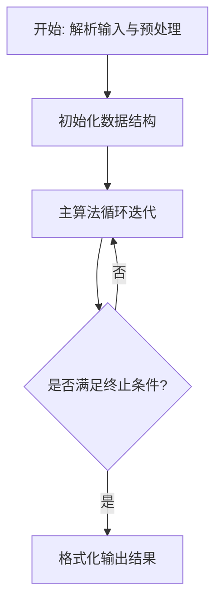
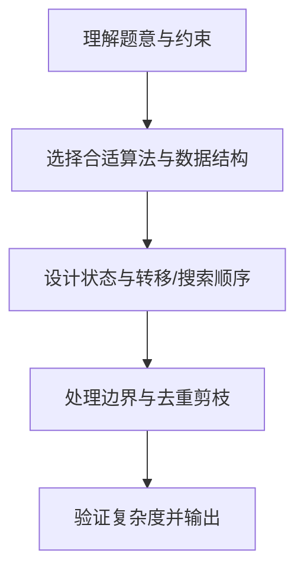

# L3-018 - 森森美图（30 分）

- **时间限制**: 400 ms
- **内存限制**: 65536 KB
- **代码长度限制**: 16 KB

---

## 题目描述


森森最近想让自己的朋友圈熠熠生辉，所以他决定自己写个美化照片的软件，并起名为森森美图。众所周知，在合照中美化自己的面部而不美化合照者的面部是让自己占据朋友圈高点的绝好方法，因此森森美图里当然得有这个功能。 这个功能的第一步是将自己的面部选中。森森首先计算出了一个图像中所有像素点与周围点的相似程度的分数，分数越低表示某个像素点越“像”一个轮廓边缘上的点。 森森认为，任意连续像素点的得分之和越低，表示它们组成的曲线和轮廓边缘的重合程度越高。为了选择出一个完整的面部，森森决定让用户选择面部上的两个像素点A和B，则连接这两个点的直线就将图像分为两部分，然后在这两部分中分别寻找一条从A到B且与轮廓重合程度最高的曲线，就可以拼出用户的面部了。 然而森森计算出来得分矩阵后，突然发现自己不知道怎么找到这两条曲线了，你能帮森森当上朋友圈的小王子吗？

为了解题方便，我们做出以下补充说明：

- 图像的左上角是坐标原点(0,0)，我们假设所有像素按矩阵格式排列，其坐标均为非负整数（即横轴向右为正，纵轴向下为正）。
- 忽略正好位于连接A和B的直线（注意不是线段）上的像素点，即不认为这部分像素点在任何一个划分部分上，因此曲线也不能经过这部分像素点。
- 曲线是八连通的（即任一像素点可与其周围的8个像素连通），但为了计算准确，某像素连接对角相邻的斜向像素时，得分**额外增加**两个像素分数和的$\sqrt{2}$倍减一。例如样例中，经过坐标为(3,1)和(4,2)的两个像素点的曲线，其得分应该是这两个像素点的分数和(2+2)，再加上额外的(2+2)乘以($\sqrt{2}-1$)，即约为5.66。

### 输入格式:

输入在第一行给出两个正整数$N$和$M$（$5 \le N, M \le 100$），表示像素得分矩阵的行数和列数。

接下来$N$行，每行$M$个不大于1000的非负整数，即为像素点的分值。

最后一行给出用户选择的起始和结束像素点的坐标$(X_{start}, Y_{start})$和$(X_{end}, Y_{end})$。4个整数用空格分隔。

### 输出格式:

在一行中输出划分图片后找到的轮廓曲线的得分和，保留小数点后两位。注意起点和终点的得分不要重复计算。

### 输入样例:
```in
6 6
9 0 1 9 9 9
9 9 1 2 2 9
9 9 2 0 2 9
9 9 1 1 2 9
9 9 3 3 1 1
9 9 9 9 9 9
2 1 5 4
```

### 输出样例:
```out
27.04
```

## 示例

### 示例 1

**输入:**
```
6 6
9 0 1 9 9 9
9 9 1 2 2 9
9 9 2 0 2 9
9 9 1 1 2 9
9 9 3 3 1 1
9 9 9 9 9 9
2 1 5 4
```

**输出:**
```
27.04
```

### 解题思路

本题的核心在于从给定约束中找出满足条件的最优解或可行性判定。L3-018 森森美图 实现原理：由 A、B 所在直线把像素分成两个互不相交的区域。结合输入规模与输出要求，需要兼顾正确性与时间复杂度。

实现上直接依据注释原理展开：L3-018 森森美图 实现原理：由 A、B 所在直线把像素分成两个互不相交的区域。对每个区域 分别在八连通网格上求 A 到 B 的最短路，边权为走入新像素的分数；斜走时 再增加两端分数之和乘 (sqrt(2)-1)。两条路径均含 A、B，合并时减去它们。 代码中通过排序、预处理与主循环的配合，将理论转化为可执行的迭代与分支判断，保证逻辑与题目定义的比较规则完全一致。

### 代码流程说明

1. 解析输入：按题目格式读取整数、字符串或图边，建立必要的数组/哈希/邻接结构并做初步排序或映射。
2. 初始化核心数据结构：根据算法选择置零计数器、并查集、距离数组或 DP 滚动数组，并设定边界初值。
3. 执行主算法循环：按排序/优先级/搜索顺序遍历状态，更新最优值、合并集合或扩展队列，并记录前驱/路径/体积等辅助信息。
4. 格式化输出：按题目要求的空格、换行与特殊无解字符串输出结果，必要时重建路径或统计聚合值。

### 代码实现

```lua
-- L3-018 森森美图
--
-- 实现原理：由 A、B 所在直线把像素分成两个互不相交的区域。对每个区域
-- 分别在八连通网格上求 A 到 B 的最短路，边权为走入新像素的分数；斜走时
-- 再增加两端分数之和乘 (sqrt(2)-1)。两条路径均含 A、B，合并时减去它们。

local n, m = io.read("*n", "*n")
local score = {}
for y = 1, n do
    score[y] = {}
    for x = 1, m do score[y][x] = io.read("*n") end
end
local ax, ay, bx, by = io.read("*n", "*n", "*n", "*n")
ax, ay, bx, by = ax + 1, ay + 1, bx + 1, by + 1

local dx = { -1,-1,-1,0,0,1,1,1 }
local dy = { -1,0,1,-1,1,-1,0,1 }
local diagonal_extra = math.sqrt(2) - 1

local function side(x, y)
    return (bx - ax) * (y - ay) - (by - ay) * (x - ax)
end

local function shortest(wanted_side)
    local dist, hx, hy, hd, size = {}, {}, {}, {}, 0
    for y = 1, n do dist[y] = {} end
    local function push(x, y, d)
        size = size + 1
        local i = size
        while i > 1 do
            local p = math.floor(i / 2)
            if hd[p] <= d then break end
            hx[i], hy[i], hd[i] = hx[p], hy[p], hd[p]
            i = p
        end
        hx[i], hy[i], hd[i] = x, y, d
    end
    local function pop()
        local x, y, d = hx[1], hy[1], hd[1]
        local lx, ly, ld = hx[size], hy[size], hd[size]
        size = size - 1
        local i = 1
        while i * 2 <= size do
            local c = i * 2
            if c + 1 <= size and hd[c + 1] < hd[c] then c = c + 1 end
            if hd[c] >= ld then break end
            hx[i], hy[i], hd[i] = hx[c], hy[c], hd[c]
            i = c
        end
        if size >= 1 then hx[i], hy[i], hd[i] = lx, ly, ld end
        return x, y, d
    end

    dist[ay][ax] = score[ay][ax]
    push(ax, ay, score[ay][ax])
    while size > 0 do
        local x, y, d = pop()
        if d == dist[y][x] then
            if x == bx and y == by then return d end
            for k = 1, 8 do
                local nx, ny = x + dx[k], y + dy[k]
                if nx >= 1 and nx <= m and ny >= 1 and ny <= n then
                    local s = side(nx, ny)
                    if (nx == bx and ny == by) or s * wanted_side > 0 then
                        local nd = d + score[ny][nx]
                        if dx[k] ~= 0 and dy[k] ~= 0 then
                            nd = nd + (score[y][x] + score[ny][nx]) * diagonal_extra
                        end
                        if dist[ny][nx] == nil or nd < dist[ny][nx] then
                            dist[ny][nx] = nd
                            push(nx, ny, nd)
                        end
                    end
                end
            end
        end
    end
end

local answer = shortest(1) + shortest(-1) - score[ay][ax] - score[by][bx]
print(string.format("%.2f", answer))
```

### 代码流程图



### 解题流程图


