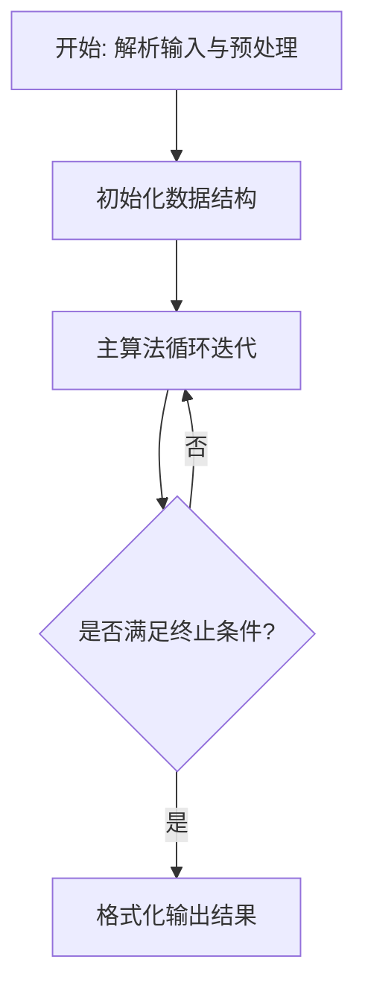
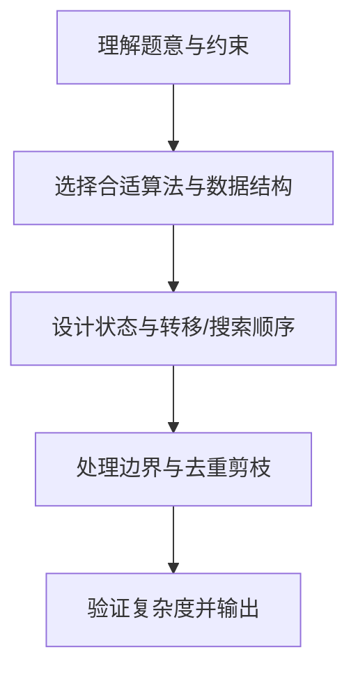

# L3-019 - 代码排版（30 分）

- **时间限制**: 150 ms
- **内存限制**: 65536 KB
- **代码长度限制**: 16 KB

---

## 题目描述


某编程大赛中设计有一个挑战环节，选手可以查看其他选手的代码，发现错误后，提交一组测试数据将对手挑落马下。为了减小被挑战的几率，有些选手会故意将代码写得很难看懂，比如把所有回车去掉，提交所有内容都在一行的程序，令挑战者望而生畏。

为了对付这种选手，现请你编写一个代码排版程序，将写成一行的程序重新排版。当然要写一个完美的排版程序可太难了，这里只简单地要求处理C语言里的for、while、if-else这三种特殊结构，而将其他所有句子都当成顺序执行的语句处理。输出的要求如下：

- 默认程序起始没有缩进；每一级缩进是 2 个空格；
- 每行开头除了规定的缩进空格外，不输出多余的空格；
- 顺序执行的程序体是以分号“;”结尾的，遇到分号就换行；
- 在一对大括号“{”和“}”中的程序体输出时，两端的大括号单独占一行，内部程序体每行加一级缩进，即：

```
{
  程序体
}
```

- for的格式为：

```
for (条件) {
  程序体
}
```

- while的格式为：

```
while (条件) {
  程序体
}
```

- if-else的格式为：

```
if (条件) {
  程序体
}
else {
  程序体
}
```

### 输入格式:

输入在一行中给出不超过 331 个字符的非空字符串，以回车结束。题目保证输入的是一个语法正确、可以正常编译运行的 main 函数模块。

### 输出格式:

按题面要求的格式，输出排版后的程序。

### 输入样例:
```in
int main()  {int n, i;  scanf("%d", &n);if( n>0)n++;else if (n<0) n--; else while(n<10)n++; for(i=0;  i<n; i++ ){ printf("n=%d\n", n);}return  0; }
```

### 输出样例:
```out
int main()
{
  int n, i;
  scanf("%d", &n);
  if ( n>0) {
    n++;
  }
  else {
    if (n<0) {
      n--;
    }
    else {
      while (n<10) {
        n++;
      }
    }
  }
  for (i=0;  i<n; i++ ) {
    printf("n=%d\n", n);
  }
  return  0;
}
```

## 示例

### 示例 1

**输入:**
```
int main()  {int n, i;  scanf("%d", &n);if( n>0)n++;else if (n<0) n--; else while(n<10)n++; for(i=0;  i<n; i++ ){ printf("n=%d\n", n);}return  0; }
```

**输出:**
```
int main()
{
  int n, i;
  scanf("%d", &n);
  if ( n>0) {
    n++;
  }
  else {
    if (n<0) {
      n--;
    }
    else {
      while (n<10) {
        n++;
      }
    }
  }
  for (i=0;  i<n; i++ ) {
    printf("n=%d\n", n);
  }
  return  0;
}
```

### 解题思路

本题的核心在于从给定约束中找出满足条件的最优解或可行性判定。L3-019 代码排版 实现原理：从左到右扫描源程序，分号、花括号是语句边界。结合输入规模与输出要求，需要兼顾正确性与时间复杂度。

实现上直接依据注释原理展开：L3-019 代码排版 实现原理：从左到右扫描源程序，分号、花括号是语句边界。花括号维护缩进层数， 控制关键字前的空白统一为题目要求的写法；字符串内部的标点不参与分隔。 代码中通过排序、预处理与主循环的配合，将理论转化为可执行的迭代与分支判断，保证逻辑与题目定义的比较规则完全一致。

### 代码流程说明

1. 解析输入：按题目格式读取整数、字符串或图边，建立必要的数组/哈希/邻接结构并做初步排序或映射。
2. 初始化核心数据结构：根据算法选择置零计数器、并查集、距离数组或 DP 滚动数组，并设定边界初值。
3. 执行主算法循环：按排序/优先级/搜索顺序遍历状态，更新最优值、合并集合或扩展队列，并记录前驱/路径/体积等辅助信息。
4. 格式化输出：按题目要求的空格、换行与特殊无解字符串输出结果，必要时重建路径或统计聚合值。

### 代码实现

```lua
-- L3-019 代码排版
--
-- 实现原理：从左到右扫描源程序，分号、花括号是语句边界。花括号维护缩进层数，
-- 控制关键字前的空白统一为题目要求的写法；字符串内部的标点不参与分隔。

local s = io.read("*l") or ""
local indent, out = 0, {}
local function trim(x) return (x:gsub("^%s+", ""):gsub("%s+$", "")) end
local function norm(x)
    x = trim(x)
    x = x:gsub("^(if)%s*%(", "%1 (")
    x = x:gsub("^(for)%s*%(", "%1 (")
    x = x:gsub("^(while)%s*%(", "%1 (")
    return x
end
local function put(x)
    x = norm(x)
    if x ~= "" then out[#out + 1] = string.rep("  ", indent) .. x end
end

-- 字符串中的分号和花括号不作为分隔符处理。
local i, buf, quote = 1, "", nil
while i <= #s do
    local ch = s:sub(i, i)
    if quote then
        buf = buf .. ch
        if ch == "\\" then
            i = i + 1
            if i <= #s then buf = buf .. s:sub(i, i) end
        elseif ch == quote then quote = nil end
    elseif ch == '"' or ch == "'" then
        quote, buf = ch, buf .. ch
    elseif ch == "{" then
        local pre = trim(buf); buf = ""
        if pre ~= "" then put(pre) end
        put("{"); indent = indent + 1
    elseif ch == "}" then
        local pre = trim(buf); buf = ""
        if pre ~= "" then put(pre) end
        indent = math.max(0, indent - 1); put("}")
    elseif ch == ";" then
        put(buf .. ";"); buf = ""
    else
        buf = buf .. ch
    end
    i = i + 1
end
put(buf)
print(table.concat(out, "\n"))
```

### 代码流程图



### 解题流程图


