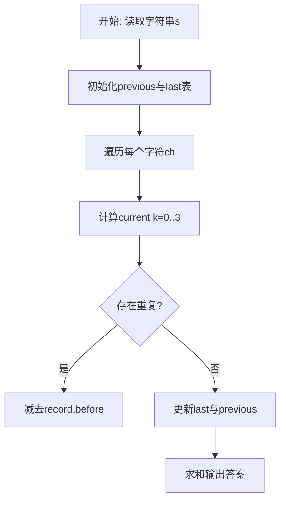
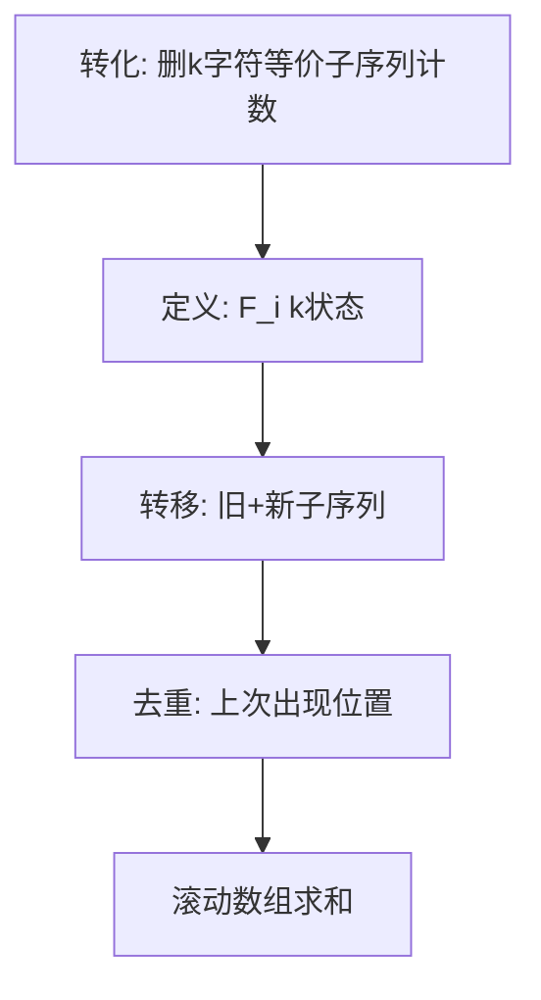

# L3-020 - 至多删三个字符（30 分）

- **时间限制**: 400 ms
- **内存限制**: 65536 KB
- **代码长度限制**: 16 KB

---

## 题目描述


给定一个全部由小写英文字母组成的字符串，允许你至多删掉其中 3 个字符，结果可能有多少种不同的字符串？

### 输入格式:

输入在一行中给出全部由小写英文字母组成的、长度在区间 [4, $10^6$] 内的字符串。

### 输出格式:

在一行中输出至多删掉其中 3 个字符后不同字符串的个数。

### 输入样例:
```in
ababcc
```

### 输出样例:
```out
25
```

## 示例

### 示例 1

**输入:**
```
ababcc
```

**输出:**
```
25
```

### 解题思路

本题可归约为在字符串/序列上计数的动态规划问题，状态转移存在重复子结构。L3-020 至多删三个字符 实现原理：删除 k 个字符等价于求长度 n-k 的不同子序列数。结合输入规模与输出要求，需要兼顾正确性与时间复杂度。

算法选用动态规划，定义 `F_i[k]` 为前 i 个字符中长度为 `i-k` 的不同子序列数。追加新字符时，新产生的子序列数为 `F_{i-1}` 的平移，而与上一次出现位置重复的部分需减去 `last[ch]` 保存的历史值，通过 4 长度的滚动数组实现 O(n) 空间与 O(n·K) 时间（K=3），巧妙处理重复计数。

### 代码流程说明

1. 读取字符串 `s`，初始化滚动数组 `previous={1,0,0,0}` 与字符上次状态表 `last`。
2. 遍历 `i=1..#s` 取字符 `ch`，对 `k=0..3` 计算 `value = (k>=1 and previous[k] or 0)+previous[k+1]` 并按 `last[ch]` 去重。
3. 去重时计算 `gap=i-record.pos` 与 `index=k-gap`，若 `index>=0` 则减去 `record.before[index+1]`，得到 `current[k+1]`。
4. 更新 `last[ch]={pos=i, before=copy(previous)}` 并滚动 `previous=current`，最终求和 `previous[1..4]` 输出。

### 代码实现

```lua
-- L3-020 至多删三个字符
-- 实现原理：删除 k 个字符等价于求长度 n-k 的不同子序列数。设 F_i[k] 为前 i
-- 个字符中长度 i-k 的不同子序列数。追加字符时，旧子序列和新追加的子序列会
-- 在该字符上一次出现处重复；只需保存每个字母上次出现前的 4 个 F 值即可去重。

local s = io.read("*l")
local previous = { 1, 0, 0, 0 }
local last = {}
for i = 1, #s do
    local ch, current = s:sub(i, i), {}
    local record = last[ch]
    for k = 0, 3 do
        local value = (k >= 1 and previous[k] or 0) + previous[k + 1]
        if record then
            local gap, index = i - record.pos, k - (i - record.pos)
            if index >= 0 then value = value - record.before[index + 1] end
        end
        current[k + 1] = value
    end
    last[ch] = { pos = i, before = { previous[1], previous[2], previous[3], previous[4] } }
    previous = current
end
local answer = previous[1] + previous[2] + previous[3] + previous[4]
print(answer)
```

### 代码流程图



### 解题流程图


