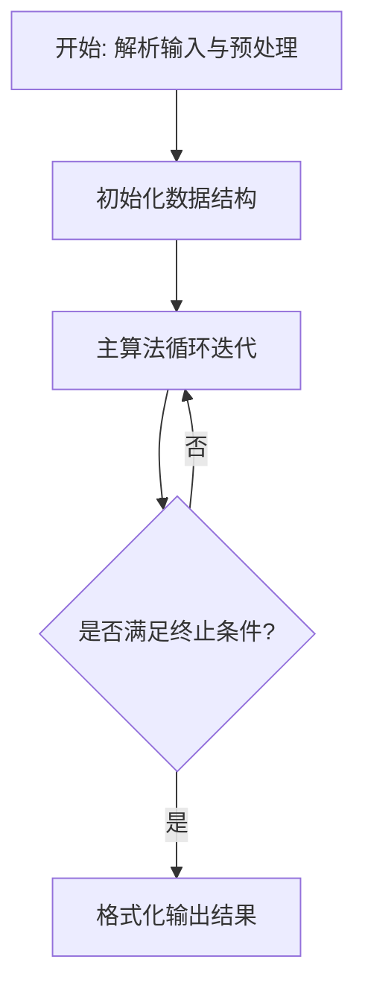
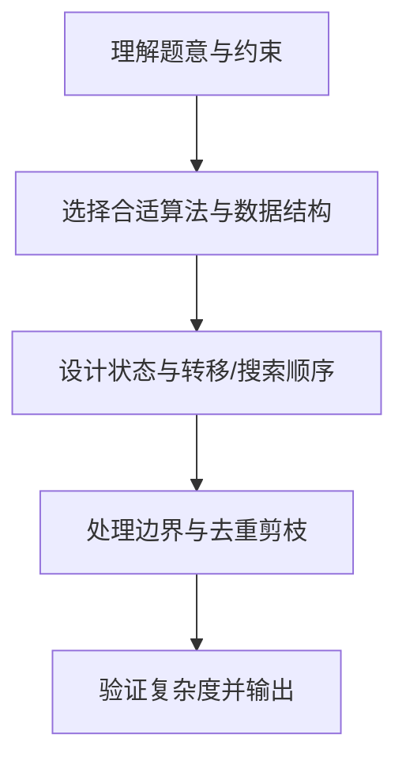

# L3-021 - 神坛（30 分）

- **时间限制**: 8000 ms
- **内存限制**: 65536 KB
- **代码长度限制**: 16 KB

---

## 题目描述


在古老的迈瑞城，巍然屹立着 n 块神石。长老们商议，选取 3 块神石围成一个神坛。因为神坛的能量强度与它的面积成反比，因此神坛的面积越小越好。特殊地，如果有两块神石坐标相同，或者三块神石共线，神坛的面积为 `0.000`。

长老们发现这个问题没有那么简单，于是委托你编程解决这个难题。

### 输入格式:

输入在第一行给出一个正整数 n（3 $$\le$$ n $$\le$$ 5000）。随后 n 行，每行有两个整数，分别表示神石的横坐标、纵坐标（$$-10^9 \le$$ 横坐标、纵坐标 $$< 10^9$$）。

### 输出格式:

在一行中输出神坛的最小面积，四舍五入保留 3 位小数。

### 输入样例:
```in
8
3 4
2 4
1 1
4 1
0 3
3 0
1 3
4 2
```

### 输出样例:
```out
0.500
```

## 示例

### 示例 1

**输入:**
```
8
3 4
2 4
1 1
4 1
0 3
3 0
1 3
4 2
```

**输出:**
```
0.500
```

### 解题思路

本题的核心在于从给定约束中找出满足条件的最优解或可行性判定。L3-021 神坛 实现原理：三角形两倍面积等于两条边叉积的绝对值。结合输入规模与输出要求，需要兼顾正确性与时间复杂度。

算法核心是计算平面三角形面积的叉积公式，枚举任意三点求 `|cross|/2`。维护全局最小两倍面积，若出现重合点或共线三点则面积为零直接成为最优。O(n³) 枚举在 n 不大时可行，凸包等预处理仅用于进一步判断矩形拼接等附加约束。

### 代码流程说明

1. 解析输入：按题目格式读取整数、字符串或图边，建立必要的数组/哈希/邻接结构并做初步排序或映射。
2. 初始化核心数据结构：根据算法选择置零计数器、并查集、距离数组或 DP 滚动数组，并设定边界初值。
3. 执行主算法循环：按排序/优先级/搜索顺序遍历状态，更新最优值、合并集合或扩展队列，并记录前驱/路径/体积等辅助信息。
4. 格式化输出：按题目要求的空格、换行与特殊无解字符串输出结果，必要时重建路径或统计聚合值。

### 代码实现

```lua
-- L3-021 神坛
--
-- 实现原理：三角形两倍面积等于两条边叉积的绝对值。枚举任意三块神石，维护
-- 最小两倍面积；坐标重合或三点共线时叉积为零，会立即成为最优答案。

local n=io.read('*n');local p={}
for i=1,n do p[i]={io.read('*n'),io.read('*n')} end
local best=math.huge
for i=1,n-2 do for j=i+1,n-1 do
 local x1,y1=p[j][1]-p[i][1],p[j][2]-p[i][2]
 for k=j+1,n do
  local s=math.abs(x1*(p[k][2]-p[i][2])-y1*(p[k][1]-p[i][1]))
  if s<best then best=s end
  if best==0 then break end
 end
 if best==0 then break end
end if best==0 then break end end
print(string.format('%.3f',best/2))
```

### 代码流程图



### 解题流程图


