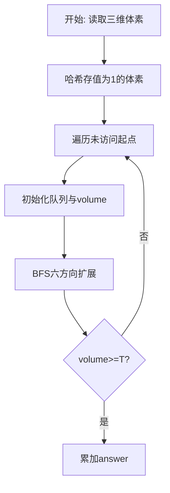
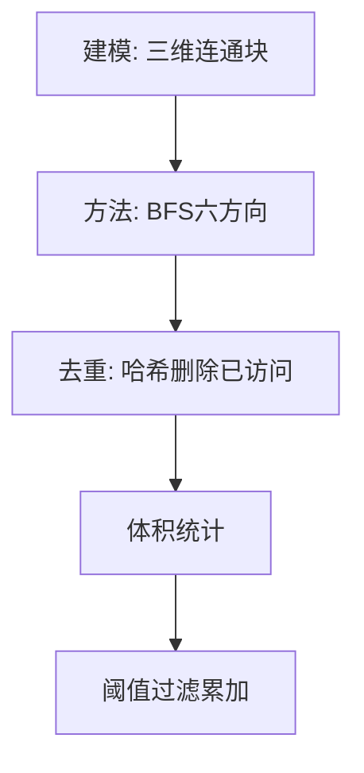

# L3-022 - 地铁一日游（30 分）

- **时间限制**: 550 ms
- **内存限制**: 65536 KB
- **代码长度限制**: 16 KB

---

## 题目描述


森森喜欢坐地铁。这个假期，他终于来到了传说中的地铁之城——魔都，打算好好过一把坐地铁的瘾！

魔都地铁的计价规则是：起步价 2 元，出发站与到达站的最短距离（即**计费距离**）每 K 公里增加 1 元车费。

例如取 $K=10$，动安寺站离魔都绿桥站为 40 公里，则车费为 $2+4=6$ 元。

为了获得最大的满足感，森森决定用以下的方式坐地铁：在某一站上车（不妨设为地铁站 **A**），则对于所有车费相同的到达站，森森只会在计费距离最远的站或线路末端站点出站，然后用森森美图 App 在站点外拍一张认证照，再按同样的方式前往下一个站点。

坐着坐着，森森突然好奇起来：在给定出发站的情况下（在出发时森森也会拍一张照），他的整个旅程中能够留下哪些站点的认证照？

地铁是铁路运输的一种形式，指在地下运行为主的城市轨道交通系统。一般来说，地铁由若干个站点组成，并有多条不同的线路双向行驶，可类比公交车，当两条或更多条线路经过同一个站点时，可进行**换乘**，更换自己所乘坐的线路。举例来说，魔都 1 号线和 2 号线都经过人民广场站，则乘坐 1 号线到达人民广场时就可以换乘到 2 号线前往 2 号线的各个站点。换乘不需出站（也拍不到认证照），因此森森乘坐地铁时换乘不受限制。

### 输入格式:

输入第一行是三个正整数 **N**、**M** 和 **K**，表示魔都地铁有 **N** 个车站 (1 &leq; **N** &leq; 200)，**M** 条线路 (1 &leq; **M** &leq; 1500)，最短距离每超过 **K** 公里 (1 &leq; **K** &leq; 10<sup>6</sup>)，加 1 元车费。

接下来 **M** 行，每行由以下格式组成：

<站点1><空格><距离><空格><站点2><空格><距离><空格><站点3> ... <站点X-1><空格><距离><空格><站点X>

其中站点是一个 1 到 **N** 的编号；两个站点编号之间的距离指两个站在该线路上的距离。两站之间距离是一个不大于 10<sup>6</sup> 的正整数。一条线路上的站点互不相同。

**注意**：两个站之间可能有多条直接连接的线路，且距离不一定相等。

再接下来有一个正整数 **Q** (1 &leq; **Q** &leq; 200)，表示森森尝试从 **Q** 个站点出发。

最后有 **Q** 行，每行一个正整数 **X<sub>i</sub>**，表示森森尝试从编号为 **X<sub>i</sub>** 的站点出发。

### 输出格式:

对于森森每个尝试的站点，输出一行若干个整数，表示能够到达的站点编号。站点编号从小到大排序。

### 输入样例:
```in
6 2 6
1 6 2 4 3 1 4
5 6 2 6 6
4
2
3
4
5
```

### 输出样例:
```out
1 2 4 5 6
1 2 3 4 5 6
1 2 4 5 6
1 2 4 5 6
```

## 示例

### 示例 1

**输入:**
```
6 2 6
1 6 2 4 3 1 4
5 6 2 6 6
4
2
3
4
5
```

**输出:**
```
1 2 4 5 6
1 2 3 4 5 6
1 2 4 5 6
1 2 4 5 6
```

### 解题思路

本题需要任意两点间的最短距离作为后续组合优化的基础，适合 Floyd 预处理。L3-022 地铁一日游 实现原理：先 Floyd 求任意两站间的计费距离。结合输入规模与输出要求，需要兼顾正确性与时间复杂度。

算法选用广度优先搜索在网格/图上按六邻接或四邻接逐层扩展。把值为 1 的体素或可达节点入队，已访问节点从集合中删除以去重，队列头指针模拟 FIFO，累计连通块体积后与阈值比较决定是否计入答案，确保每个体素仅被访问一次。

### 代码流程说明

1. 读取三维尺寸 `m n layers` 与阈值 `threshold`，将所有值为 1 的体素用 `key(x,y,z)` 存入哈希 `filled`。
2. 遍历 `filled` 的每个未访问起点，初始化队列 `queue` 与头指针 `head`、体积 `volume=0`，并标记起点已访问。
3. BFS 循环中弹出队首体素，对六个方向 `(±1,0,0),(0,±1,0),(0,0,±1)` 探测邻接体素，合法且未访问则入队并删除集合标记。
4. 连通块结束后若 `volume >= threshold` 则累加至 `answer`，全部块处理完输出 `answer`。

### 代码实现

```lua
-- L3-022 地铁一日游
--
-- 实现原理：先 Floyd 求任意两站间的计费距离。一次乘车的落点只由出发站
-- 决定：同一票价中保留距离最远的站，所有线路端点也可作为落点。以这些
-- 落点建有向图，再从每个询问起点做可达性搜索即可模拟任意次出站、再上车。

local N, M, K = io.read("*n", "*n", "*n")
local inf = math.huge
local dis, terminal = {}, {}
for i = 1, N do
    dis[i], terminal[i] = {}, false
    for j = 1, N do dis[i][j] = (i == j) and 0 or inf end
end

-- 数值方式读取后，先丢弃当前行余下部分；每条线路本身必须按行读取。
io.read("*l")
for _ = 1, M do
    local line = io.read("*l")
    while line ~= nil and line:match("^%s*$") do line = io.read("*l") end
    local a = {}
    for v in line:gmatch("%-?%d+") do a[#a + 1] = tonumber(v) end
    terminal[a[1]], terminal[a[#a]] = true, true
    for p = 1, #a - 2, 2 do
        local u, w, v = a[p], a[p + 1], a[p + 2]
        if w < dis[u][v] then dis[u][v], dis[v][u] = w, w end
    end
end

for mid = 1, N do
    for i = 1, N do
        if dis[i][mid] < inf then
            for j = 1, N do
                local nd = dis[i][mid] + dis[mid][j]
                if nd < dis[i][j] then dis[i][j] = nd end
            end
        end
    end
end

local next_stop = {}
for s = 1, N do
    next_stop[s] = {}
    local farthest = {}
    for t = 1, N do
        if dis[s][t] < inf then
            local fare = 2 + math.floor(dis[s][t] / K)
            if farthest[fare] == nil or dis[s][t] > farthest[fare] then
                farthest[fare] = dis[s][t]
            end
        end
    end
    for t = 1, N do
        if dis[s][t] < inf then
            local fare = 2 + math.floor(dis[s][t] / K)
            if terminal[t] or dis[s][t] == farthest[fare] then next_stop[s][t] = true end
        end
    end
end

local Q = io.read("*n")
for _ = 1, Q do
    local start = io.read("*n")
    local seen, queue, head, tail = {}, { start }, 1, 1
    seen[start] = true
    while head <= tail do
        local u = queue[head]; head = head + 1
        for v in pairs(next_stop[u]) do
            if not seen[v] then
                seen[v] = true; tail = tail + 1; queue[tail] = v
            end
        end
    end
    local out = {}
    for i = 1, N do if seen[i] then out[#out + 1] = i end end
    print(table.concat(out, " "))
end
```

### 代码流程图



### 解题流程图


