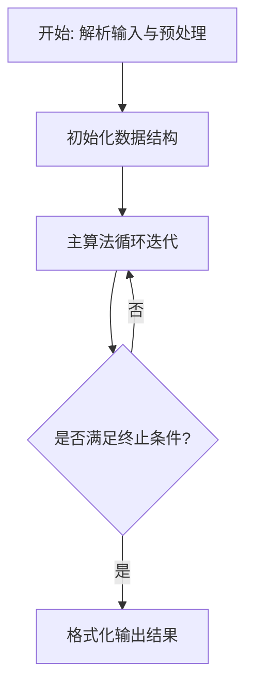
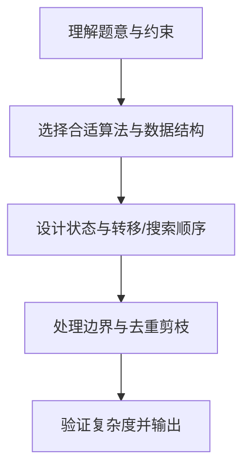

# L3-023 - 计算图（30 分）

- **时间限制**: 400 ms
- **内存限制**: 65536 KB
- **代码长度限制**: 16 KB

---

## 题目描述


“计算图”（computational graph）是现代深度学习系统的基础执行引擎，提供了一种表示任意数学表达式的方法，例如用有向无环图表示的神经网络。 图中的节点表示基本操作或输入变量，边表示节点之间的中间值的依赖性。 例如，下图就是一个函数
$$f(x_1,x_2)=\ln x_1 + x_1 x_2 - \sin x_2$$
的计算图。


现在给定一个计算图，请你根据所有输入变量计算函数值及其偏导数（即梯度）。 例如，给定输入$$ x_1 = 2, x_2 = 5 $$，上述计算图获得函数值 $$ f(2,5)=\ln (2) + 2\times 5 - \sin (5) = 11.652$$；并且根据微分链式法则，上图得到的梯度 $$\nabla f = [\partial f / \partial x_1 , \partial f / \partial x_2 ] =   [ 1/x_1 + x_2 , x_1 - \cos x_2] = [5.500,1.716]$$。

知道你已经把微积分忘了，所以这里只要求你处理几个简单的算子：加法、减法、乘法、指数（$$e^x$$，即编程语言中的 exp(x) 函数）、对数（$$\ln x$$，即编程语言中的 log(x) 函数）和正弦函数（$$\sin x$$，即编程语言中的 sin(x) 函数）。

友情提醒：

- 常数的导数是 0；$$x$$ 的导数是 1；$$e^x$$ 的导数还是 $$e^x$$；$$\ln x$$ 的导数是 $$1/x$$；$$\sin x$$ 的导数是 $$\cos x$$。
- 回顾一下什么是**偏导数**：在数学中，一个多变量的函数的偏导数，就是它关于其中一个变量的导数而保持其他变量恒定。在上面的例子中，当我们对 $$x_1$$ 求偏导数 $$\partial f / \partial x_1$$ 时，就将 $$x_2$$ 当成常数，所以得到 $$\ln x_1$$ 的导数是 $$1/x_1$$，$$x_1 x_2$$ 的导数是 $$x_2$$，$$\sin x_2$$ 的导数是 0。
- 回顾一下**链式法则**：复合函数的导数是构成复合这有限个函数在相应点的导数的乘积，即若有 $$u=f(y)$$，$$y=g(x)$$，则 $$du/dx = du/dy \cdot dy/dx$$。例如对 $$\sin (\ln x)$$ 求导，就得到 $$\cos (\ln x) \cdot (1/x)$$。

如果你注意观察，可以发现在计算图中，计算函数值是一个从左向右进行的计算，而计算偏导数则正好相反。

### 输入格式:

输入在第一行给出正整数 $$N$$（$$\le 5\times 10^4$$），为计算图中的顶点数。

以下 $$N$$ 行，第 $$i$$ 行给出第 $$i$$ 个顶点的信息，其中 $$i=0, 1, \cdots , N-1$$。第一个值是顶点的类型编号，分别为：

- 0 代表输入变量
- 1 代表加法，对应 $$x_1 + x_2$$
- 2 代表减法，对应 $$x_1 - x_2$$
- 3 代表乘法，对应 $$x_1 \times x_2$$
- 4 代表指数，对应 $$e^x$$
- 5 代表对数，对应 $$\ln x$$
- 6 代表正弦函数，对应 $$\sin x$$

对于输入变量，后面会跟它的双精度浮点数值；对于单目算子，后面会跟它对应的单个变量的顶点编号（编号从 0 开始）；对于双目算子，后面会跟它对应两个变量的顶点编号。

题目保证只有一个输出顶点（即没有出边的顶点，例如上图最右边的 `-`），且计算过程不会超过双精度浮点数的计算精度范围。

### 输出格式:

首先在第一行输出给定计算图的函数值。在第二行顺序输出函数对于每个变量的偏导数的值，其间以一个空格分隔，行首尾不得有多余空格。偏导数的输出顺序与输入变量的出现顺序相同。输出小数点后 3 位。

### 输入样例:
```in
7
0 2.0
0 5.0
5 0
3 0 1
6 1
1 2 3
2 5 4
```

### 输出样例:
```out
11.652
5.500 1.716
```

## 示例

### 示例 1

**输入:**
```
7
0 2.0
0 5.0
5 0
3 0 1
6 1
1 2 3
2 5 4
```

**输出:**
```
11.652
5.500 1.716
```

### 解题思路

本题的核心在于从给定约束中找出满足条件的最优解或可行性判定。L3-023 计算图 实现原理：节点按输入顺序计算前向数值，并保存操作数编号。结合输入规模与输出要求，需要兼顾正确性与时间复杂度。

算法在前向阶段按拓扑顺序计算每个节点的数值并保存操作数编号，输出节点梯度初始化为 1，随后逆序传播利用链式法则累加局部导数，一次反向遍历即可得到所有输入变量的偏导数，实现自动微分的反向模式。

### 代码流程说明

1. 解析输入：按题目格式读取整数、字符串或图边，建立必要的数组/哈希/邻接结构并做初步排序或映射。
2. 初始化核心数据结构：根据算法选择置零计数器、并查集、距离数组或 DP 滚动数组，并设定边界初值。
3. 执行主算法循环：按排序/优先级/搜索顺序遍历状态，更新最优值、合并集合或扩展队列，并记录前驱/路径/体积等辅助信息。
4. 格式化输出：按题目要求的空格、换行与特殊无解字符串输出结果，必要时重建路径或统计聚合值。

### 代码实现

```lua
-- L3-023 计算图
-- 实现原理：节点按输入顺序计算前向数值，并保存操作数编号。输出节点的梯度置为
-- 1 后逆序传播局部导数，即可一次反向自动微分得到所有输入变量的偏导数。

local n = io.read("*n")
local typ, left, right, value, grad, variables, outDegree = {}, {}, {}, {}, {}, {}, {}
for i = 0, n - 1 do
    typ[i] = io.read("*n")
    if typ[i] == 0 then value[i] = io.read("*n"); variables[#variables + 1] = i
    elseif typ[i] <= 3 then
        left[i], right[i] = io.read("*n"), io.read("*n")
        local a, b = value[left[i]], value[right[i]]
        if typ[i] == 1 then value[i] = a + b elseif typ[i] == 2 then value[i] = a - b else value[i] = a * b end
        outDegree[left[i]] = (outDegree[left[i]] or 0) + 1; outDegree[right[i]] = (outDegree[right[i]] or 0) + 1
    else
        left[i] = io.read("*n")
        local a = value[left[i]]
        if typ[i] == 4 then value[i] = math.exp(a) elseif typ[i] == 5 then value[i] = math.log(a) else value[i] = math.sin(a) end
        outDegree[left[i]] = (outDegree[left[i]] or 0) + 1
    end
end
local output
for i = 0, n - 1 do if not outDegree[i] then output = i; break end end
grad[output] = 1
for i = n - 1, 0, -1 do
    local g = grad[i] or 0
    if typ[i] == 1 then grad[left[i]] = (grad[left[i]] or 0) + g; grad[right[i]] = (grad[right[i]] or 0) + g
    elseif typ[i] == 2 then grad[left[i]] = (grad[left[i]] or 0) + g; grad[right[i]] = (grad[right[i]] or 0) - g
    elseif typ[i] == 3 then grad[left[i]] = (grad[left[i]] or 0) + g * value[right[i]]; grad[right[i]] = (grad[right[i]] or 0) + g * value[left[i]]
    elseif typ[i] == 4 then grad[left[i]] = (grad[left[i]] or 0) + g * value[i]
    elseif typ[i] == 5 then grad[left[i]] = (grad[left[i]] or 0) + g / value[left[i]]
    elseif typ[i] == 6 then grad[left[i]] = (grad[left[i]] or 0) + g * math.cos(value[left[i]]) end
end
local out = {}
for i, v in ipairs(variables) do out[i] = string.format("%.3f", grad[v] or 0) end
print(string.format("%.3f", value[output]))
print(table.concat(out, " "))
```

### 代码流程图



### 解题流程图


