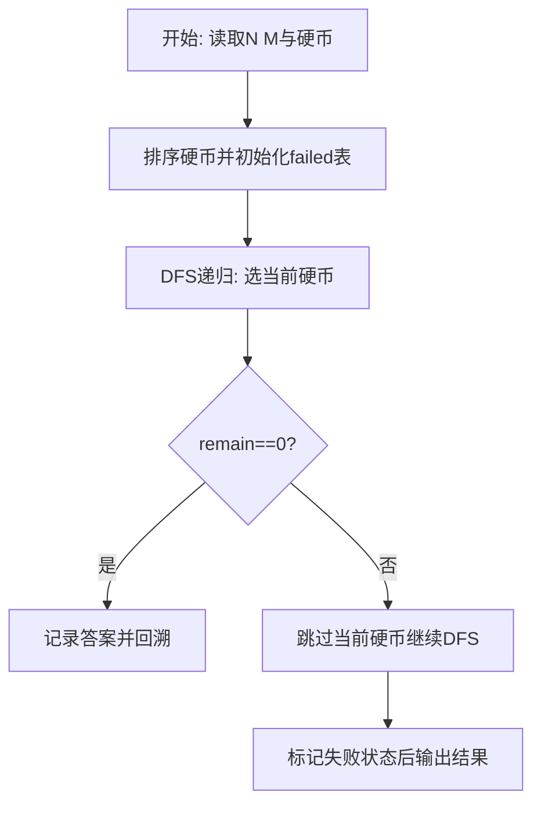
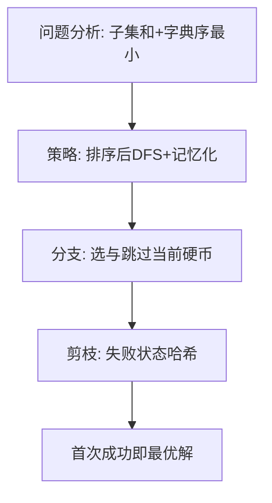

# L3-025 - 那就别担心了（30 分）

- **时间限制**: 400 ms
- **内存限制**: 65536 KB
- **代码长度限制**: 16 KB

---

## 题目描述


下图转自“英式没品笑话百科”的新浪微博 —— 所以无论有没有遇到难题，其实都不用担心。


博主将这种逻辑推演称为“逻辑自洽”，即从某个命题出发的所有推理路径都会将结论引导到同一个最终命题（开玩笑的，千万别以为这是真正的逻辑自洽的定义……）。现给定一个更为复杂的逻辑推理图，本题就请你检查从一个给定命题到另一个命题的推理是否是“逻辑自洽”的，以及存在多少种不同的推理路径。例如上图，从“你遇到难题了吗？”到“那就别担心了”就是一种“逻辑自洽”的推理，一共有 3 条不同的推理路径。

### 输入格式:

输入首先在一行中给出两个正整数 $N$（$1 < N \le 500$）和 $M$，分别为命题个数和推理个数。这里我们假设命题从 1 到 $N$ 编号。

接下来 $M$ 行，每行给出一对命题之间的推理关系，即两个命题的编号 `S1 S2`，表示可以从 `S1` 推出 `S2`。题目保证任意两命题之间只存在最多一种推理关系，且任一命题不能循环自证（即从该命题出发推出该命题自己）。

最后一行给出待检验的两个命题的编号 `A B`。

### 输出格式:

在一行中首先输出从 `A` 到 `B` 有多少种不同的推理路径，然后输出 `Yes` 如果推理是“逻辑自洽”的，或 `No` 如果不是。

题目保证输出数据不超过 $10^9$。

### 输入样例 1：
```in
7 8
7 6
7 4
6 5
4 1
5 2
5 3
2 1
3 1
7 1
```

### 输出样例 1：
```out
3 Yes
```

### 输入样例 2：
```in
7 8
7 6
7 4
6 5
4 1
5 2
5 3
6 1
3 1
7 1
```

### 输出样例 2：
```out
3 No
```

## 示例

### 示例 1

**输入:**
```
7 8
7 6
7 4
6 5
4 1
5 2
5 3
2 1
3 1
7 1
```

**输出:**
```
3 Yes
```

### 示例 2

**输入:**
```
7 8
7 6
7 4
6 5
4 1
5 2
5 3
6 1
3 1
7 1
```

**输出:**
```
3 No
```

### 解题思路

本题需在指数级搜索空间中找到满足约束且字典序最小的解，适合深度优先搜索配合剪枝。L3-025 那就别担心了 实现原理：图为 DAG。结合输入规模与输出要求，需要兼顾正确性与时间复杂度。

算法选用深度优先搜索按“选当前元素 / 跳过当前元素”的分支顺序展开，并在状态 `(下标, 剩余量)` 上做记忆化去重以避免重复搜索。由于硬币已按升序排列，首次到达 `remain==0` 的路径即为题目定义的字典序最小解，搜索过程中一旦命中已失败的状态则立即回溯，显著削减无效分支。

### 代码流程说明

1. 读取 N 与目标 M，过滤大于 M 的硬币后存入 `coins` 并升序 `table.sort`，准备记忆表 `failed` 与答案 `answer`。
2. 定义递归 `dfs(i, remain, chosen)`：若 `remain==0` 则深拷贝当前选择为答案并返回真；若越界或 `remain<0` 返回假。
3. 用 `key=i:remain` 查 `failed` 剪枝，先尝试选 `coins[i]` 递归，再回溯跳过该硬币再次递归，失败则标记 `failed[key]=true`。
4. 从 `dfs(1,target,{})` 启动，成功则 `table.concat(answer," ")` 输出否则输出 `No Solution`。

### 代码实现

```lua
-- L3-025 那就别担心了
-- 实现原理：图为 DAG。记忆化 DFS 统计 A 到 B 的路径数；同时遍历 A 可达子图，
-- 若存在一个终止命题不是 B，则并非所有推理路径都导向 B，输出 No。

local n, m = io.read("*n"), io.read("*n")
local graph = {}; for i = 1, n do graph[i] = {} end
for _ = 1, m do local a, b = io.read("*n"), io.read("*n"); graph[a][#graph[a] + 1] = b end
local a, b = io.read("*n"), io.read("*n")
local memo = {}
local function paths(x)
    if x == b then return 1 end
    if memo[x] then return memo[x] end
    local total = 0
    for _, y in ipairs(graph[x]) do total = total + paths(y) end
    memo[x] = total
    return total
end
local seen, stack, allEndAtB = { [a] = true }, { a }, true
while #stack > 0 do
    local x = stack[#stack]; stack[#stack] = nil
    if #graph[x] == 0 and x ~= b then allEndAtB = false end
    for _, y in ipairs(graph[x]) do if not seen[y] then seen[y] = true; stack[#stack + 1] = y end end
end
print(paths(a) .. " " .. (allEndAtB and "Yes" or "No"))
```

### 代码流程图



### 解题流程图


