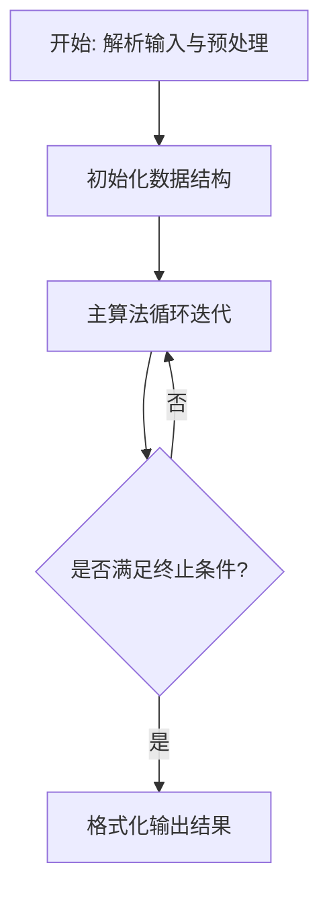
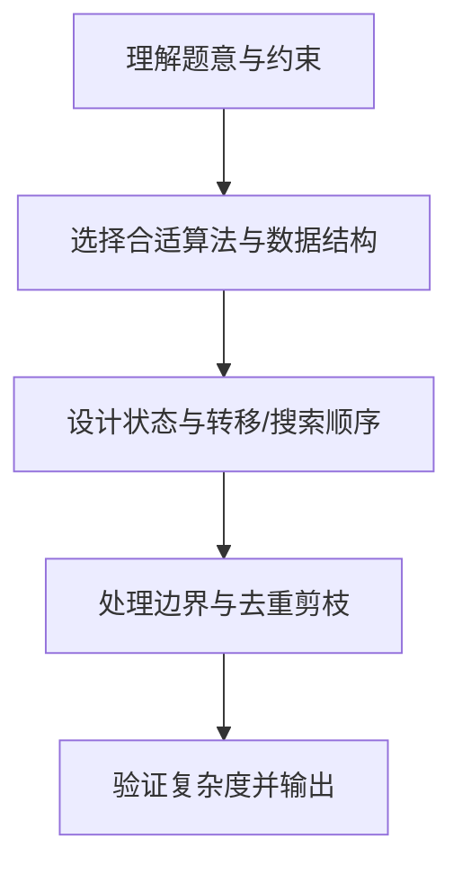

# L3-026 - 传送门（30 分）

- **时间限制**: 3500 ms
- **内存限制**: 524288 KB
- **代码长度限制**: 16 KB

---

## 题目描述


平面上有 $$2n$$ 个点，它们的坐标分别是 $$(1, 0), (2, 0), \cdots (n, 0)$$ 和 $$(1, 10^9), (2, 10^9), \cdots, (n, 10^9)$$。我们称这些点中所有 $$y$$ 坐标为 $$0$$ 的点为“起点”，所有 $$y$$ 坐标为 $$10^9$$ 的点为终点。一个机器人将从坐标为 $$(x, 0)$$ 的起点出发向 $$y$$ 轴正方向移动。显然，该机器人最后会到达某个终点，我们设该终点的 $$x$$ 坐标为 $$f(x)$$。

在上述条件下，显然有 $$f(x) = x$$。不过这样的数学模型就太无趣了，因此我们对上述数学模型做一些小小的改变。我们将会对模型进行 $$q$$ 次修改，每一次修改都是以下两种操作之一：

* \+ $$x'$$ $$x''$$ $$y$$: 在 $$(x', y)$$ 与 $$(x'', y)$$ 处增加一对传送门。当机器人碰到其中一个传送门时，它会立刻被传送到另一个传送门处。数据保证进行该操作时，$$(x', y)$$ 与 $$(x'', y)$$ 处当前不存在传送门。
* \- $$x'$$ $$x''$$ $$y$$: 移除 $$(x', y)$$ 与 $$(x'', y)$$ 处的一对传送门。数据保证这对传送门存在。

求每次修改后 $$\sum\limits_{x=1}^n xf(x)$$ 的值。

### 输入格式:

第一行输入两个整数 $$n$$ 与 $$q$$ ($$2 \le n \le 10^5$$, $$1 \le q \le 10^5$$)，代表起点和终点的数量以及修改的次数。

接下来 $$q$$ 行中，第 $$i$$ 行输入一个字符 $$op_i$$ 以及三个整数 $$x'_i$$, $$x''_i$$ and $$y_i$$ ($$op_i \in \{\text{`+' (ascii: 43)}, \text{`-' (ascii: 45)}\}$$, $$1 \le x'_i < x''_i \le n$$, $$1 \le y_i < 10^9$$)，代表第 $$i$$ 次修改的内容。修改顺序与输入顺序相同。

### 输出格式:

输出 $$q$$ 行，其中第 $$i$$ 行包含一个整数代表第 $$i$$ 次修改后的答案。

### 输入样例:
```in
5 4
+ 1 3 1
+ 1 4 3
+ 2 5 2
- 1 4 3
```

### 输出样例:
```out
51
48
39
42
```

## 示例

### 示例 1

**输入:**
```
5 4
+ 1 3 1
+ 1 4 3
+ 2 5 2
- 1 4 3
```

**输出:**
```
51
48
39
42
```

### 解题思路

本题的核心在于从给定约束中找出满足条件的最优解或可行性判定。L3-026 传送门 实现原理：机器人自下而上穿越传送门。结合输入规模与输出要求，需要兼顾正确性与时间复杂度。

实现上直接依据注释原理展开：L3-026 传送门 实现原理：机器人自下而上穿越传送门；同一高度的一对传送门等价于对当前横坐标 作一次交换。每次修改后按高度重放全部交换，得到 f(x)，再累加 x*f(x)。 代码中通过排序、预处理与主循环的配合，将理论转化为可执行的迭代与分支判断，保证逻辑与题目定义的比较规则完全一致。

### 代码流程说明

1. 解析输入：按题目格式读取整数、字符串或图边，建立必要的数组/哈希/邻接结构并做初步排序或映射。
2. 初始化核心数据结构：根据算法选择置零计数器、并查集、距离数组或 DP 滚动数组，并设定边界初值。
3. 执行主算法循环：按排序/优先级/搜索顺序遍历状态，更新最优值、合并集合或扩展队列，并记录前驱/路径/体积等辅助信息。
4. 格式化输出：按题目要求的空格、换行与特殊无解字符串输出结果，必要时重建路径或统计聚合值。

### 代码实现

```lua
-- L3-026 传送门
--
-- 实现原理：机器人自下而上穿越传送门；同一高度的一对传送门等价于对当前横坐标
-- 作一次交换。每次修改后按高度重放全部交换，得到 f(x)，再累加 x*f(x)。

local n,q=io.read('*n','*n');local portals={}
for _=1,q do
 local line=io.read('*l');while line and line:match('^%s*$') do line=io.read('*l') end
 local op,x,y,h=line:match('(%S+)%s+(%d+)%s+(%d+)%s+(%d+)')
 x,y,h=tonumber(x),tonumber(y),tonumber(h);local key=x..':'..y..':'..h
 if op=='+' then portals[key]={x=x,y=y,h=h} else portals[key]=nil end
 local arr={};for _,v in pairs(portals) do arr[#arr+1]=v end;table.sort(arr,function(a,b)return a.h<b.h end)
 local f={};for i=1,n do f[i]=i end
 for _,v in ipairs(arr) do
  for i=1,n do if f[i]==v.x then f[i]=v.y elseif f[i]==v.y then f[i]=v.x end end
 end
 local ans=0;for i=1,n do ans=ans+i*f[i] end;print(ans)
end
```

### 代码流程图



### 解题流程图


