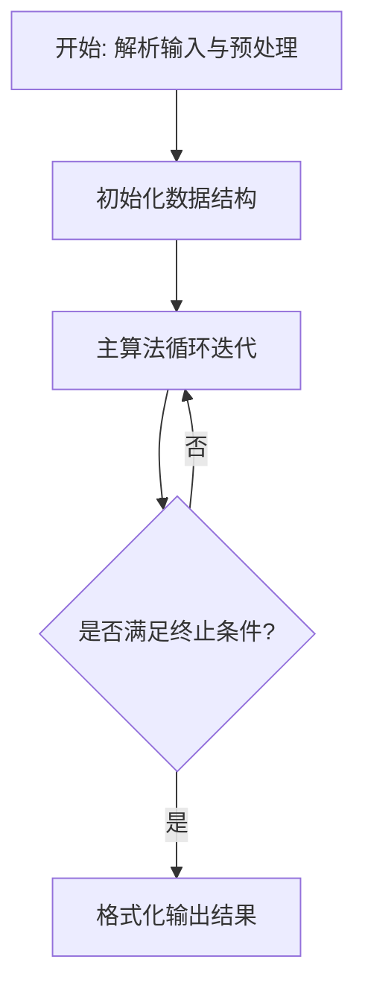
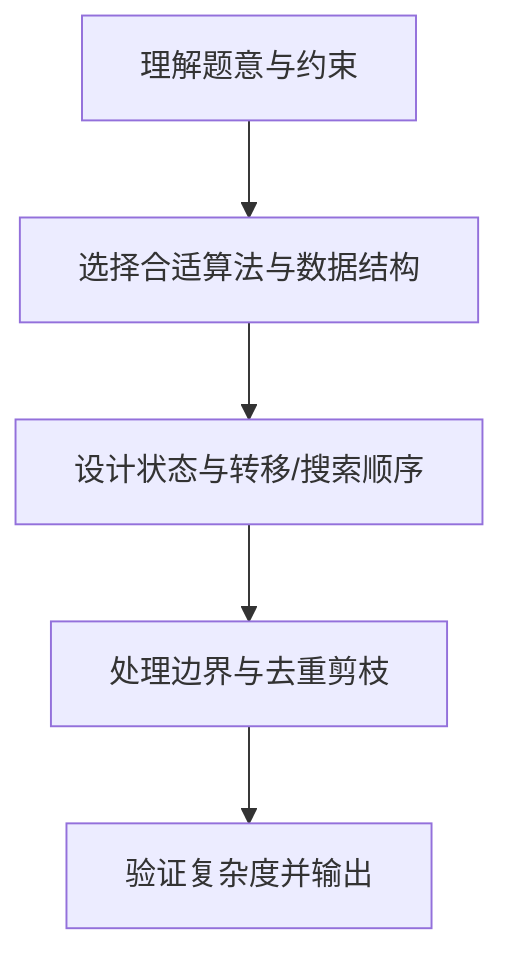

# L3-028 - 森森旅游（30 分）

- **时间限制**: 1000 ms
- **内存限制**: 131072 KB
- **代码长度限制**: 16 KB

---

## 题目描述


好久没出去旅游啦！森森决定去 Z 省旅游一下。

Z 省有 $n$ 座城市（从 $1$ 到 $n$ 编号）以及 $m$ 条连接两座城市的有向旅行线路（例如自驾、长途汽车、火车、飞机、轮船等），每次经过一条旅行线路时都需要支付该线路的费用（但这个收费标准可能不止一种，例如车票跟机票一般不是一个价格）。

Z 省为了鼓励大家在省内多逛逛，推出了**旅游金计划**：在 $i$ 号城市可以用 $1$ 元现金兑换 $a_i$ 元旅游金（只要现金足够，可以无限次兑换）。城市间的交通即可以使用现金支付路费，也可以用旅游金支付。具体来说，当通过第 $j$ 条旅行线路时，可以用 $c_j$ 元现金**或** $d_j$ 元旅游金支付路费。**注意：** 每次只能选择一种支付方式，不可同时使用现金和旅游金混合支付。但对于不同的线路，旅客可以自由选择不同的支付方式。

森森决定从 $1$ 号城市出发，到 $n$ 号城市去。他打算在出发前准备一些现金，并在途中的某个城市将剩余现金 **全部** 换成旅游金后继续旅游，直到到达 $n$ 号城市为止。当然，他也可以选择在 $1$ 号城市就兑换旅游金，或全部使用现金完成旅程。

Z 省政府会根据每个城市参与活动的情况调整汇率（即调整在某个城市 $1$ 元现金能换多少旅游金）。现在你需要帮助森森计算一下，在每次调整之后最少需要携带多少现金才能完成他的旅程。

### 输入格式:

输入在第一行给出三个整数 $n$，$m$ 与 $q$（$1 \le n \le 10^5$，$1 \le m \le 2 \times 10^5$，$1 \le q \le 10^5$），依次表示城市的数量、旅行线路的数量以及汇率调整的次数。

接下来 $m$ 行，每行给出四个整数 $u$，$v$，$c$ 与 $d$（$1 \le u, v \le n$，$1 \le c, d \le 10^9$），表示一条从 $u$ 号城市通向 $v$ 号城市的有向旅行线路。每次通过该线路需要支付 $c$ 元现金或 $d$ 元旅游金。数字间以空格分隔。输入保证从 $1$ 号城市出发，一定可以通过若干条线路到达 $n$ 号城市，但两城市间的旅行线路可能不止一条，对应不同的收费标准；也允许在城市内部游玩（即 $u$ 和 $v$ 相同）。

接下来的一行输入 $n$ 个整数 $a_1, a_2, \cdots, a_n$（$1 \le a_i \le 10^9$），其中 $a_i$ 表示一开始在 $i$ 号城市能用 $1$ 元现金兑换 $a_i$ 个旅游金。数字间以空格分隔。

接下来 $q$ 行描述汇率的调整。第 $i$ 行输入两个整数 $x_i$ 与 $a'_i$（$1 \le x_i \le n$，$1 \le a'_i \le 10^9$），表示第 $i$ 次汇率调整后，$x_i$ 号城市能用 $1$ 元现金兑换 $a'_i$ 个旅游金，而其它城市旅游金汇率不变。**请注意：**每次汇率调整都是在上一次汇率调整的基础上进行的。

### 输出格式:

对每一次汇率调整，在对应的一行中输出调整后森森至少需要准备多少现金，才能按他的计划从 $1$ 号城市旅行到 $n$ 号城市。

**再次提醒：**如果森森决定在途中的某个城市兑换旅游金，那么他必须将剩余现金**全部、一次性**兑换，剩下的旅途将完全使用旅游金支付。

### 输入样例:
```in
6 11 3
1 2 3 5
1 3 8 4
2 4 4 6
3 1 8 6
1 3 10 8
2 3 2 8
3 4 5 3
3 5 10 7
3 3 2 3
4 6 10 12
5 6 10 6
3 4 5 2 5 100
1 2
2 1
1 17
```

### 输出样例:
```out
8
8
1
```

## 示例

### 示例 1

**输入:**
```
6 11 3
1 2 3 5
1 3 8 4
2 4 4 6
3 1 8 6
1 3 10 8
2 3 2 8
3 4 5 3
3 5 10 7
3 3 2 3
4 6 10 12
5 6 10 6
3 4 5 2 5 100
1 2
2 1
1 17
```

**输出:**
```
8
8
1
```

### 解题思路

本题的核心在于从给定约束中找出满足条件的最优解或可行性判定。L3-028 森森旅游 实现原理：分别以现金边权从 1 求 distCash，以旅游金边权在反图从 n 求 distGold。结合输入规模与输出要求，需要兼顾正确性与时间复杂度。

实现上直接依据注释原理展开：L3-028 森森旅游 实现原理：分别以现金边权从 1 求 distCash，以旅游金边权在反图从 n 求 distGold。若在 v 兑换，所需现金为 distCash[v]+ceil(distGold[v]/a[v])。 每次只修改一个 v 的汇率，使用惰性最小堆维护所有候选值的最小值。 代码中通过排序、预处理与主循环的配合，将理论转化为可执行的迭代与分支判断，保证逻辑与题目定义的比较规则完全一致。

### 代码流程说明

1. 解析输入：按题目格式读取整数、字符串或图边，建立必要的数组/哈希/邻接结构并做初步排序或映射。
2. 初始化核心数据结构：根据算法选择置零计数器、并查集、距离数组或 DP 滚动数组，并设定边界初值。
3. 执行主算法循环：按排序/优先级/搜索顺序遍历状态，更新最优值、合并集合或扩展队列，并记录前驱/路径/体积等辅助信息。
4. 格式化输出：按题目要求的空格、换行与特殊无解字符串输出结果，必要时重建路径或统计聚合值。

### 代码实现

```lua
-- L3-028 森森旅游
--
-- 实现原理：分别以现金边权从 1 求 distCash，以旅游金边权在反图从 n 求
-- distGold。若在 v 兑换，所需现金为 distCash[v]+ceil(distGold[v]/a[v])。
-- 每次只修改一个 v 的汇率，使用惰性最小堆维护所有候选值的最小值。

local n,m,q=io.read('*n','*n','*n')
local g,rg={},{}
for i=1,n do g[i]={};rg[i]={} end
for _=1,m do
 local u,v,c,d=io.read('*n','*n','*n','*n')
 g[u][#g[u]+1]={v,c,d}; rg[v][#rg[v]+1]={u,c,d}
end
local a={};for i=1,n do a[i]=io.read('*n') end
local function dij(start,adj,which)
 local dis,hv,hd,sz={}, {},{},0
 local function push(v,d)
  sz=sz+1;local i=sz
  while i>1 do local p=i//2;if hd[p]<=d then break end;hv[i],hd[i]=hv[p],hd[p];i=p end
  hv[i],hd[i]=v,d
 end
 local function pop()
  local v,d=hv[1],hd[1];local lv,ld=hv[sz],hd[sz];sz=sz-1;local i=1
  while i*2<=sz do local c=i*2;if c+1<=sz and hd[c+1]<hd[c] then c=c+1 end;if hd[c]>=ld then break end;hv[i],hd[i]=hv[c],hd[c];i=c end
  if sz>0 then hv[i],hd[i]=lv,ld end;return v,d
 end
 dis[start]=0;push(start,0)
 while sz>0 do local u,d=pop();if d==dis[u] then
  for _,e in ipairs(adj[u]) do local nd=d+e[which];if not dis[e[1]] or nd<dis[e[1]] then dis[e[1]]=nd;push(e[1],nd) end end
 end end
 return dis
end
local cash=dij(1,g,2);local gold=dij(n,rg,3)
local hv,hd,sz={}, {},0
local function push(v,d)
 sz=sz+1;local i=sz;while i>1 do local p=i//2;if hd[p]<=d then break end;hv[i],hd[i]=hv[p],hd[p];i=p end;hv[i],hd[i]=v,d
end
local function value(v)
 if not cash[v] or not gold[v] then return math.huge end
 return cash[v]+(gold[v]+a[v]-1)//a[v]
end
for i=1,n do push(i,value(i)) end
for _=1,q do
 local x,z=io.read('*n','*n');a[x]=z;push(x,value(x))
 while hd[1]~=value(hv[1]) do
  local lv,ld=hv[sz],hd[sz];sz=sz-1;local i=1
  while i*2<=sz do local c=i*2;if c+1<=sz and hd[c+1]<hd[c] then c=c+1 end;if hd[c]>=ld then break end;hv[i],hd[i]=hv[c],hd[c];i=c end
  if sz>0 then hv[i],hd[i]=lv,ld end
 end
 print(hd[1])
end
```

### 代码流程图



### 解题流程图


