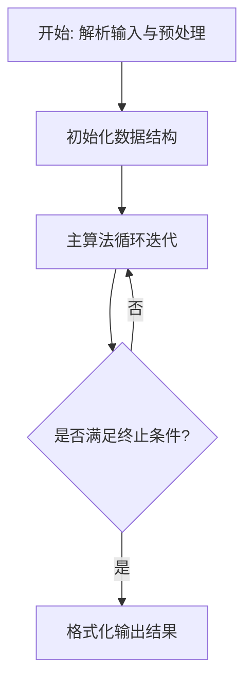
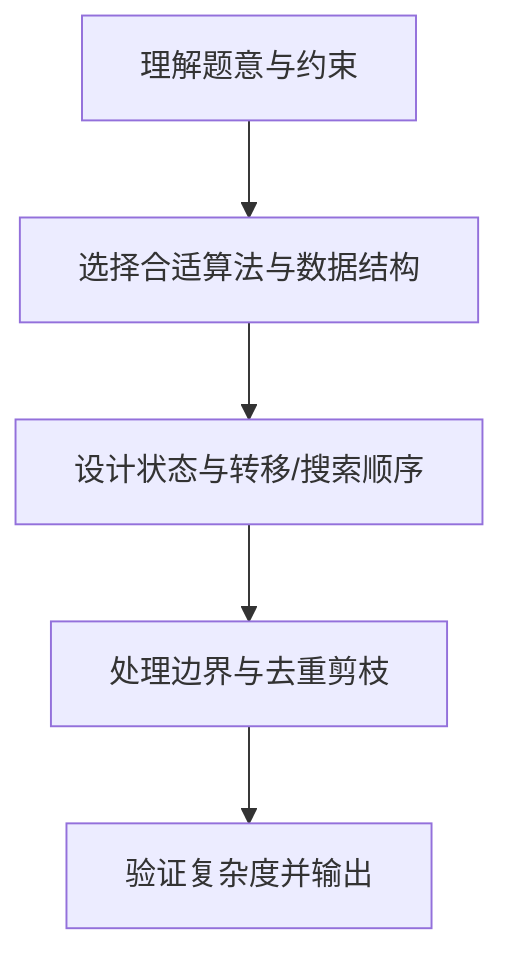

# L3-029 - 还原文件（30 分）

- **时间限制**: 200 ms
- **内存限制**: 65536 KB
- **代码长度限制**: 16 KB

---

## 题目描述


一份重要文件被撕成两半，其中一半还被送进了碎纸机。我们将碎纸机里找到的纸条进行编号，如图 1 所示。然后根据断口的折线形状跟没有切碎的半张纸进行匹配，最后还原成图 2 的样子。要求你输出还原后纸条的正确拼接顺序。


图1 纸条编号


图2 还原结果

### 输入格式:

输入首先在第一行中给出一个正整数 $$N$$（$$1 < N \le 10^5$$），为没有切碎的半张纸上断口折线角点的个数；随后一行给出从左到右 $$N$$ 个折线角点的高度值（均为不超过 100 的非负整数）。

随后一行给出一个正整数 $$M$$（$$\le 100$$），为碎纸机里的纸条数量。接下去有 $$M$$ 行，其中第 $$i$$ 行给出编号为 $$i$$（$$1\le i \le M$$）的纸条的断口信息，格式为：

```
K h[1] h[2] ... h[K]
```

其中 `K` 是断口折线角点的个数（不超过 $$10^4 +1$$），后面是从左到右 `K` 个折线角点的高度值。为简单起见，这个“高度”跟没有切碎的半张纸上断口折线角点的高度是一致的。

### 输出格式:

在一行中输出还原后纸条的正确拼接顺序。纸条编号间以一个空格分隔，行首尾不得有多余空格。

题目数据保证存在唯一解。

### 输入样例:
```in
17
95 70 80 97 97 68 58 58 80 72 88 81 81 68 68 60 80
6
4 68 58 58 80
3 81 68 68
3 95 70 80
3 68 60 80
5 80 72 88 81 81
4 80 97 97 68
```

### 输出样例:
```out
3 6 1 5 2 4
```

## 示例

### 示例 1

**输入:**
```
17
95 70 80 97 97 68 58 58 80 72 88 81 81 68 68 60 80
6
4 68 58 58 80
3 81 68 68
3 95 70 80
3 68 60 80
5 80 72 88 81 81
4 80 97 97 68
```

**输出:**
```
3 6 1 5 2 4
```

### 解题思路

本题的核心在于从给定约束中找出满足条件的最优解或可行性判定。L3-029 还原文件 实现原理：每张纸条的断口高度序列必是完整断口序列中的一个连续片段。结合输入规模与输出要求，需要兼顾正确性与时间复杂度。

实现上直接依据注释原理展开：L3-029 还原文件 实现原理：每张纸条的断口高度序列必是完整断口序列中的一个连续片段。 在完整序列中定位每张纸条（必要时同时尝试翻转方向），按起始位置排序即可得到 唯一的拼接顺序。 代码中通过排序、预处理与主循环的配合，将理论转化为可执行的迭代与分支判断，保证逻辑与题目定义的比较规则完全一致。

### 代码流程说明

1. 解析输入：按题目格式读取整数、字符串或图边，建立必要的数组/哈希/邻接结构并做初步排序或映射。
2. 初始化核心数据结构：根据算法选择置零计数器、并查集、距离数组或 DP 滚动数组，并设定边界初值。
3. 执行主算法循环：按排序/优先级/搜索顺序遍历状态，更新最优值、合并集合或扩展队列，并记录前驱/路径/体积等辅助信息。
4. 格式化输出：按题目要求的空格、换行与特殊无解字符串输出结果，必要时重建路径或统计聚合值。

### 代码实现

```lua
-- L3-029 还原文件
-- 实现原理：每张纸条的断口高度序列必是完整断口序列中的一个连续片段。
-- 在完整序列中定位每张纸条（必要时同时尝试翻转方向），按起始位置排序即可得到
-- 唯一的拼接顺序。

local n = io.read("*n")
local full = {}; for i = 1, n do full[i] = io.read("*n") end
local m = io.read("*n")
local strips = {}
local function locate(a)
    for start = 1, n - #a + 1 do
        local ok = true
        for j = 1, #a do if full[start + j - 1] ~= a[j] then ok = false; break end end
        if ok then return start end
    end
    return nil
end
for id = 1, m do
    local k, a = io.read("*n"), {}
    for j = 1, k do a[j] = io.read("*n") end
    local pos = locate(a)
    if not pos then
        local rev = {}; for j = #a, 1, -1 do rev[#rev + 1] = a[j] end
        pos = locate(rev)
    end
    strips[id] = { id = id, pos = pos }
end
table.sort(strips, function(a, b) return a.pos < b.pos end)
local out = {}; for i, strip in ipairs(strips) do out[i] = strip.id end
print(table.concat(out, " "))
```

### 代码流程图



### 解题流程图


