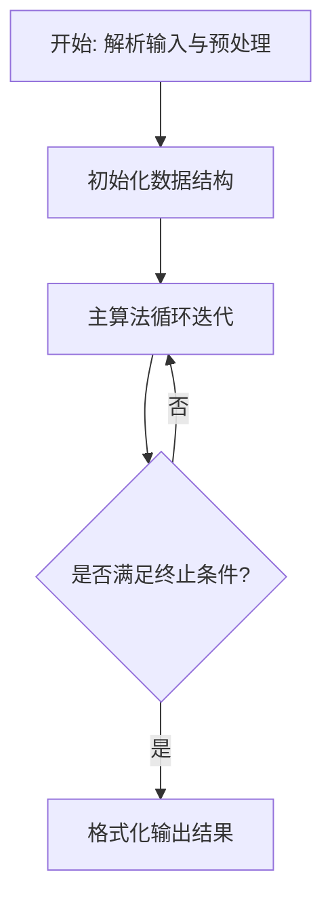
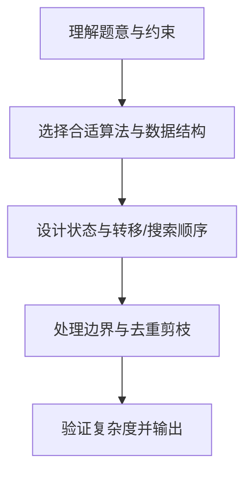

# L3-030 - 可怜的简单题（30 分）

- **时间限制**: 10000 ms
- **内存限制**: 524288 KB
- **代码长度限制**: 16 KB

---

## 题目描述


九条可怜去年出了一道题，导致一众参赛高手惨遭团灭。今年她出了一道简单题 —— 打算按照如下的方式生成一个随机的整数数列 $$A$$:

1. 最开始，数列 $$A$$ 为空。

2. 可怜会从区间 $$[1,n]$$ 中等概率随机一个整数 $$i$$ 加入到数列 $$A$$ 中。

3. 如果不存在一个大于 $$1$$ 的正整数 $$w$$，满足 $$A$$ 中所有元素都是 $$w$$ 的倍数，数组 $$A$$ 将会作为随机生成的结果返回。否则，可怜将会返回第二步，继续增加 $$A$$ 的长度。

现在，可怜告诉了你数列 $$n$$ 的值，她希望你计算返回的数列 $$A$$ 的期望长度。

### 输入格式:

输入一行两个整数 $$n, p$$ $$(1 \le n \le 10^{11}, n < p \le 10^{12})$$，$$p$$ 是一个质数。

### 输出格式:

在一行中输出一个整数，表示答案对 $$p$$ 取模的值。具体来说，假设答案的最简分数表示为 $$\frac{x}{y}$$，你需要输出最小的非负整数 $$z$$ 满足 $$y \times z \equiv x \text{ mod } p$$。

### 输入样例 1：
```in
2 998244353
```

### 输出样例 1：
```out
2
```

### 输入样例 2：
```in
100000000 998244353
```

### 输出样例 2：
```out
3056898
```

## 示例

### 示例 1

**输入:**
```
2 998244353
```

**输出:**
```
2
```

### 示例 2

**输入:**
```
100000000 998244353
```

**输出:**
```
3056898
```

### 解题思路

本题的核心在于从给定约束中找出满足条件的最优解或可行性判定。L3-030 可怜的简单题 实现原理：E[T]=1+sum_{k>=1}P(gcd(A_1..A_k)>1)。结合输入规模与输出要求，需要兼顾正确性与时间复杂度。

算法核心是计算平面三角形面积的叉积公式，枚举任意三点求 `|cross|/2`。维护全局最小两倍面积，若出现重合点或共线三点则面积为零直接成为最优。O(n³) 枚举在 n 不大时可行，凸包等预处理仅用于进一步判断矩形拼接等附加约束。

### 代码流程说明

1. 解析输入：按题目格式读取整数、字符串或图边，建立必要的数组/哈希/邻接结构并做初步排序或映射。
2. 初始化核心数据结构：根据算法选择置零计数器、并查集、距离数组或 DP 滚动数组，并设定边界初值。
3. 执行主算法循环：按排序/优先级/搜索顺序遍历状态，更新最优值、合并集合或扩展队列，并记录前驱/路径/体积等辅助信息。
4. 格式化输出：按题目要求的空格、换行与特殊无解字符串输出结果，必要时重建路径或统计聚合值。

### 代码实现

```lua
-- L3-030 可怜的简单题
--
-- 实现原理：E[T]=1+sum_{k>=1}P(gcd(A_1..A_k)>1)。由 Möbius 反演，
-- P(gcd>1)=sum_{d>=2}-mu[d]*(floor(n/d)/n)^k；对几何级数求和即可得到
-- 1+sum_{d>=2}-mu[d]*q/(n-q)，其中 q=floor(n/d)。

local n,p=io.read('*n','*n')
local function mul(a,b) -- 避免 p 可达 1e12 时的整数乘法溢出
 local r=0;a=a%p
 while b>0 do if b%2==1 then r=(r+a)%p end;a=(a*2)%p;b=b//2 end
 return r
end
local function power(a,e)
 local r=1
 while e>0 do if e%2==1 then r=mul(r,a) end;a=mul(a,a);e=e//2 end
 return r
end
local mu={};local prime={},{};mu[1]=1
for i=2,n do
 if not prime[i] then prime[#prime+1]=i;mu[i]=-1 end
 for _,v in ipairs(prime) do
  if i*v>n then break end
  if i%v==0 then mu[i*v]=0;break else mu[i*v]=-mu[i] end
 end
end
local ans=1%p
for d=2,n do
 if mu[d] and mu[d]~=0 then
  local q=n//d;local term=mul(q%p,power((n-q)%p,p-2))
  if mu[d]==1 then ans=(ans-term)%p else ans=(ans+term)%p end
 end
end
print((ans+p)%p)
```

### 代码流程图



### 解题流程图


