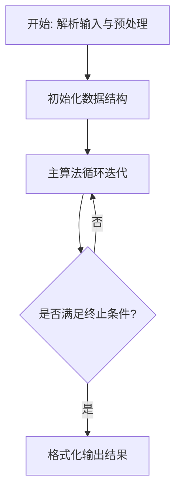
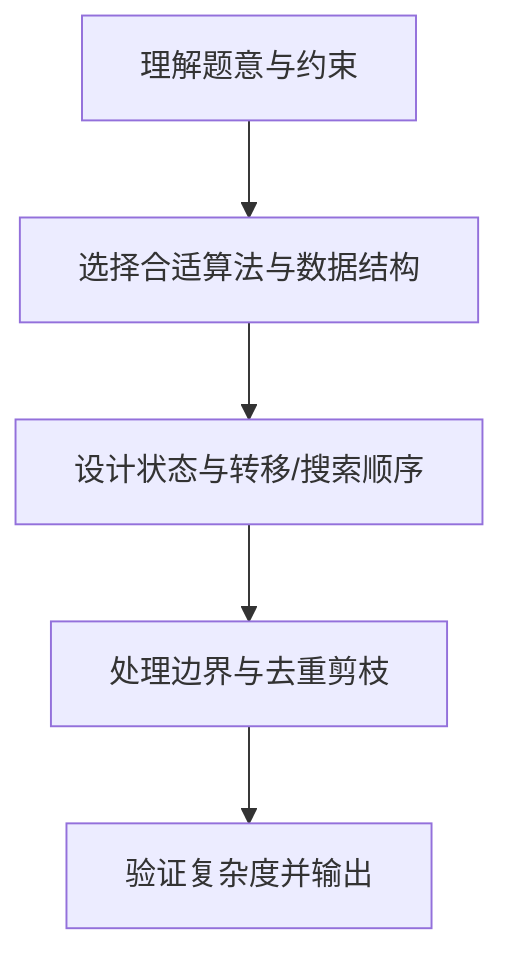

# L3-031 - 千手观音（30 分）

- **时间限制**: 200 ms
- **内存限制**: 65536 KB
- **代码长度限制**: 16 KB

---

## 题目描述


人类喜欢用 10 进制，大概是因为人类有一双手 10 根手指用于计数。于是在千手观音的世界里，数字都是 10 000 进制的，因为每位观音有 1 000 双手 ……


千手观音们的每一根手指都对应一个符号（但是观音世界里的符号太难画了，我们暂且用小写英文字母串来代表），就好像人类用自己的 10 根手指对应 0 到 9 这 10 个数字。同样的，就像人类把这 10 个数字排列起来表示更大的数字一样，ta们也把这些名字排列起来表示更大的数字，并且也遵循左边高位右边低位的规则，相邻名字间用一个点 `.` 分隔，例如 `pat.pta.cn` 表示千手观音世界里的一个 3 位数。


人类不知道这些符号代表的数字的大小。不过幸运的是，人类发现了千手观音们留下的一串数字，并且有理由相信，这串数字是从小到大有序的！于是你的任务来了：请你根据这串有序的数字，推导出千手观音每只手代表的符号的相对顺序。


注意：有可能无法根据这串数字得到全部的顺序，你只要尽量推出能得到的结果就好了。当若干根手指之间的相对顺序无法确定时，就暂且按它们的英文字典序升序排列。例如给定下面几个数字：

```
pat
cn
lao.cn
lao.oms
pta.lao
pta.pat
cn.pat
```

我们首先可以根据前两个数字推断 `pat` < `cn`；根据左边高位的顺序可以推断 `lao` < `pta` < `cn`；再根据高位相等时低位的顺序，可以推断出 `cn` < `oms`，`lao` < `pat`。综上我们得到两种可能的顺序：`lao` < `pat` < `pta` < `cn` < `oms`；或者 `lao` < `pta` < `pat` < `cn` < `oms`，即 `pat` 和 `pta` 之间的相对顺序无法确定，这时我们按字典序排列，得到 `lao` < `pat` < `pta` < `cn` < `oms`。

### 输入格式:

输入第一行给出一个正整数 $$N$$ ($$\le 10^5$$)，为千手观音留下的数字的个数。随后 $$N$$ 行，每行给出一个千手观音留下的数字，不超过 10 位数，每一位的符号用不超过 3 个小写英文字母表示，相邻两符号之间用 `.` 分隔。

我们假设给出的数字顺序在千手观音的世界里是严格递增的。题目保证数字是 $$10^4$$ 进制的，即符号的种类肯定不超过 $$10^4$$ 种。

### 输出格式:

在一行中按大小递增序输出符号。当若干根手指之间的相对顺序无法确定时，按它们的英文字典序升序排列。符号间仍然用 `.` 分隔。

### 输入样例:
```in
7
pat
cn
lao.cn
lao.oms
pta.lao
pta.pat
cn.pat
```

### 输出样例:
```out
lao.pat.pta.cn.oms
```

## 示例

### 示例 1

**输入:**
```
7
pat
cn
lao.cn
lao.oms
pta.lao
pta.pat
cn.pat
```

**输出:**
```
lao.pat.pta.cn.oms
```

### 解题思路

本题的核心在于从给定约束中找出满足条件的最优解或可行性判定。L3-031 千手观音 实现原理：相邻两个有序数的首个不同“位”决定一条符号大小关系边。结合输入规模与输出要求，需要兼顾正确性与时间复杂度。

算法收集相邻有序字符串的首个差异字符形成偏序边，构建字符间的有向图。随后执行按字典序最小的拓扑排序——每次在入度为零的节点中选最小者——若存在环则无解，否则得到的顺序即满足所有符号约束且在任意关系未确定时保持字典序最小。

### 代码流程说明

1. 解析输入：按题目格式读取整数、字符串或图边，建立必要的数组/哈希/邻接结构并做初步排序或映射。
2. 初始化核心数据结构：根据算法选择置零计数器、并查集、距离数组或 DP 滚动数组，并设定边界初值。
3. 执行主算法循环：按排序/优先级/搜索顺序遍历状态，更新最优值、合并集合或扩展队列，并记录前驱/路径/体积等辅助信息。
4. 格式化输出：按题目要求的空格、换行与特殊无解字符串输出结果，必要时重建路径或统计聚合值。

### 代码实现

```lua
-- L3-031 千手观音
-- 实现原理：相邻两个有序数的首个不同“位”决定一条符号大小关系边。
-- 收集所有符号后，以字典序最小的可选入度 0 节点进行拓扑排序，正好满足
-- 无法由数据确定相对顺序时按英文词典序排列的要求。

local n = tonumber(io.read("*l"))
local numbers, symbols = {}, {}
for i = 1, n do
    local line, a = io.read("*l"), {}
    for word in line:gmatch("[^%.]+") do a[#a + 1] = word; symbols[word] = true end
    numbers[i] = a
end
local graph, indegree = {}, {}
for s in pairs(symbols) do graph[s], indegree[s] = {}, 0 end
for i = 1, n - 1 do
    local a, b = numbers[i], numbers[i + 1]
    for j = 1, math.min(#a, #b) do
        if a[j] ~= b[j] then
            if not graph[a[j]][b[j]] then graph[a[j]][b[j]] = true; indegree[b[j]] = indegree[b[j]] + 1 end
            break
        end
    end
end
local available, answer = {}, {}
for s in pairs(symbols) do if indegree[s] == 0 then available[#available + 1] = s end end
while #available > 0 do
    table.sort(available)
    local x = table.remove(available, 1)
    answer[#answer + 1] = x
    for y in pairs(graph[x]) do
        indegree[y] = indegree[y] - 1
        if indegree[y] == 0 then available[#available + 1] = y end
    end
end
print(table.concat(answer, "."))
```

### 代码流程图



### 解题流程图


