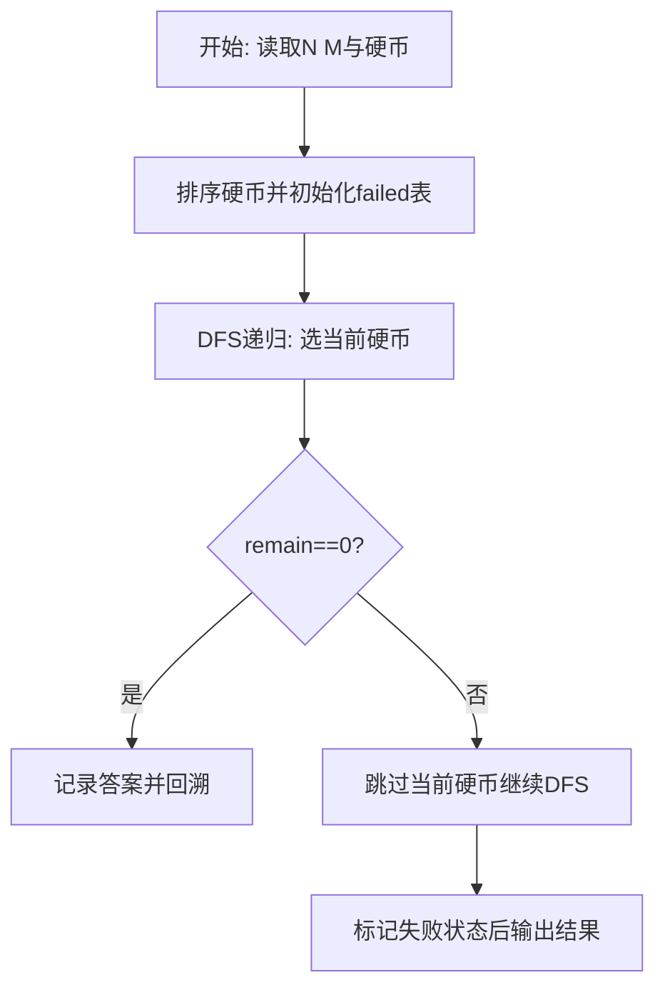
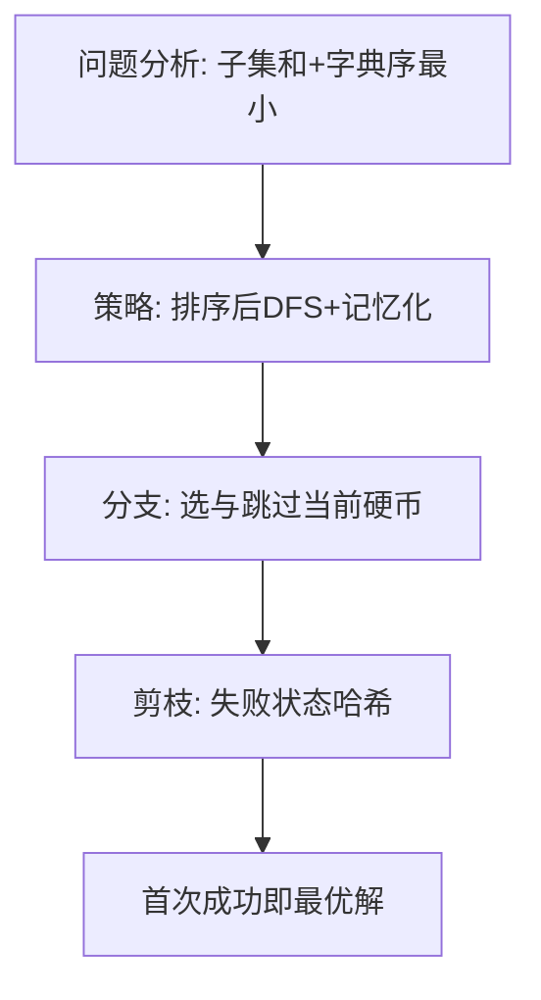

# L3-032 - 关于深度优先搜索和逆序对的题应该不会很难吧这件事（30 分）

- **时间限制**: 1000 ms
- **内存限制**: 262144 KB
- **代码长度限制**: 16 KB

---

## 题目描述


## 示例

### 示例 1

**输入:**
```
无
```

**输出:**
```

```

### 解题思路

本题要求在动态栈上支持中位数查询，核心是在线维护多重集合的顺序统计。L3-032 关于深度优先搜索和逆序对的题应该不会很难吧这件事 实现原理：DFS 序数量为每个结点的“孩子数阶乘”之积。结合输入规模与输出要求，需要兼顾正确性与时间复杂度。

算法选用深度优先搜索按“选当前元素 / 跳过当前元素”的分支顺序展开，并在状态 `(下标, 剩余量)` 上做记忆化去重以避免重复搜索。由于硬币已按升序排列，首次到达 `remain==0` 的路径即为题目定义的字典序最小解，搜索过程中一旦命中已失败的状态则立即回溯，显著削减无效分支。

### 代码流程说明

1. 读取操作数 Q 并初始化 `maxKey=100000` 的 Fenwick 数组 `bit` 与真实栈 `stack`，定义 `add(i,delta)` 与 `kth(k)` 两个核心函数。
2. 逐行解析指令：`Push x` 则入栈并 `add(x,1)`；`Pop` 与 `PeekMedian` 先判空输出 `Invalid`。
3. Pop 时取栈顶值 `v` 并 `add(v,-1)` 后输出；PeekMedian 时计算 `k=(#stack+1)//2` 并调用 `kth(k)` 输出第 k 小即中位数。
4. 循环结束后所有操作均在 O(log MAX) 内完成，整体保持对数复杂度与正确性。

### 代码实现

```lua
-- L3-032 关于深度优先搜索和逆序对的题应该不会很难吧这件事
--
-- 实现原理：DFS 序数量为每个结点的“孩子数阶乘”之积。祖先一定先于后代，
-- 用 Euler 序和 Fenwick 统计这类固定逆序；不在祖先链上的两点属于某处不同
-- 子树，它们的相对顺序在孩子排列中恰有一半情况形成逆序。

local MOD=1000000007
local n,root=io.read('*n','*n');local g={}
for i=1,n do g[i]={} end
for _=1,n-1 do local u,v=io.read('*n','*n');g[u][#g[u]+1]=v;g[v][#g[v]+1]=u end
local par,child,tin,tout,order={}, {},{}, {},{}
for i=1,n do child[i]=0 end
local st={{root,0,1}};par[root]=0;local timer=0
while #st>0 do
 local z=st[#st]
 if z[3]==1 then timer=timer+1;tin[z[1]]=timer;order[timer]=z[1];z[3]=2
 elseif z[2]<=#g[z[1]] then z[2]=z[2]+1;local v=g[z[1]][z[2]];if v~=par[z[1]] then par[v]=z[1];child[z[1]]=child[z[1]]+1;st[#st+1]={v,0,1} end
 else tout[z[1]]=timer;st[#st]=nil end
end
local fac={1};for i=1,n do fac[i]=fac[i-1]*i%MOD end
local ways=1;for i=1,n do ways=ways*fac[child[i]]%MOD end
local bit={};for i=1,n do bit[i]=0 end
local function add(i) while i<=n do bit[i]=bit[i]+1;i=i+(i&-i) end end
local function sum(i) local r=0;while i>0 do r=r+bit[i];i=i-(i&-i) end;return r end
local fixed=0
for label=1,n do
 fixed=fixed+(sum(tout[label])-sum(tin[label]-1));add(tin[label])
end
local ancestorPairs=0;for u=1,n do ancestorPairs=ancestorPairs+(tout[u]-tin[u]) end
local allPairs=n*(n-1)/2;local incomparable=allPairs-ancestorPairs
local inv2=(MOD+1)//2
local ans=ways*((fixed%MOD+incomparable%MOD*inv2)%MOD)%MOD
print(ans)
```

### 代码流程图



### 解题流程图


