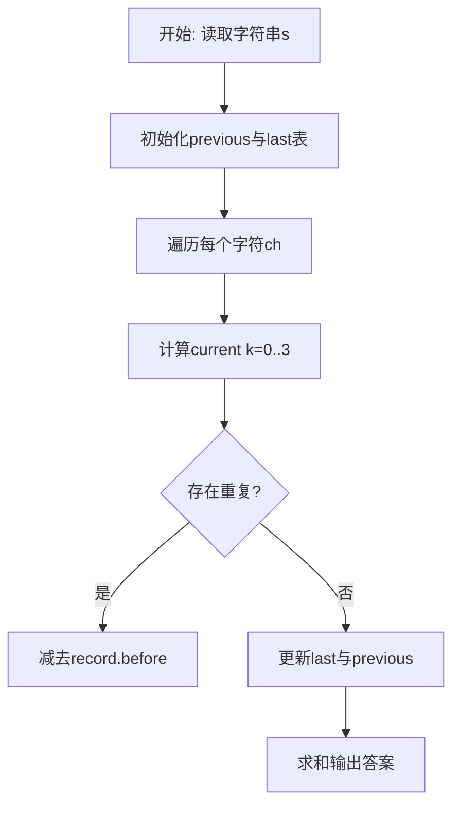
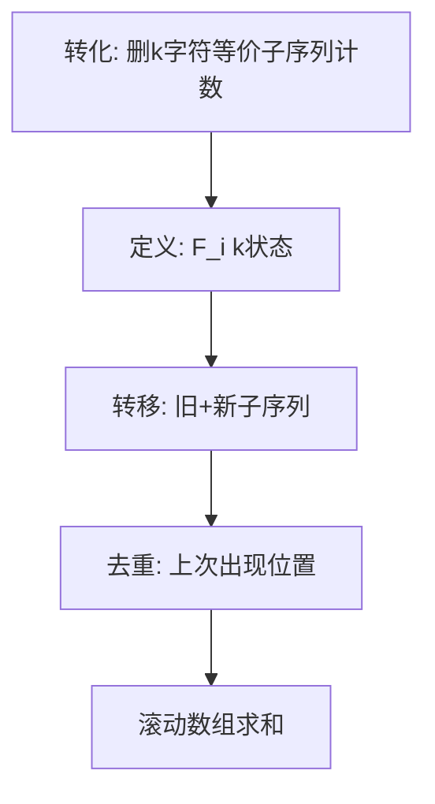

# L3-033 - 教科书般的亵渎（30 分）

- **时间限制**: 2000 ms
- **内存限制**: 262144 KB
- **代码长度限制**: 16 KB

---

## 题目描述


九条可怜最近在玩一款卡牌游戏。在每一局游戏中，可怜都要使用抽到的卡牌来消灭一些敌人。每一名敌人都有一个初始血量，而当血量降低到 $$0$$ 及以下的时候，这名敌人就会立即被消灭并从场上消失。

现在，可怜面前有 $$n$$ 个敌人，其中第 $$i$$ 名敌人的血量是 $$a_i$$，而可怜手上只有如下两张手牌：

1. 如果场上还有敌人，等概率随机选中一个敌人并对它造成一点伤害（即血量减 $$1$$），重复 $$K$$ 次。

2. 对所有敌人造成一点伤害，重复该效果直到没有新的敌人被消灭。

下面是这两张手牌效果的一些示例：

1. 假设存在两名敌人，他们的血量分别是 $$1, 2$$ 且 $$K = 2$$。那么在可怜打出第一张手牌后，可能会发生如下情况：

- 第一轮中，两名敌人各有 $$0.5$$ 的概率被选中。假设第一名敌人被选中，那么它会被造成一点伤害。这时它的血量变成了 $$0$$，因此它被消灭并消失了。
- 第二轮中，因为场上只剩下了第二名敌人，所以它一定会被选中并被造成一点伤害。这时它剩下的血量为 $$1$$。

2. 同样假设存在两名敌人且血量分别为 $$1, 2$$。那么在可怜打出第二张手牌后，会发生如下情况：

- 第一轮中，所有敌人被造成了一点伤害。这时第一名敌人被消灭了，因此卡牌效果会被重复一遍。
- 第二轮中，所有敌人（此时只剩下第二名敌人了）被造成了一点伤害。这时第二名敌人也被消灭了，因此卡牌效果会被再重复一遍。
- 第三轮中，所有敌人（此时没有敌人剩下了）被造成了一点伤害。因为没有新的敌人被消灭了，所以卡牌效果结束。

3. 如果面对的是四名血量分别为 $$1,2,2,4$$ 的敌人，那么在可怜打出第二张手牌后，只有第四名敌人还会存活，且它的剩余血量为 $$1$$。

现在，可怜先打出了第一张手牌，再打出了第二张手牌。她发现，在第一张手牌效果结束后，没有任何一名敌人被消灭，但是在第二张手牌的效果结束后，所有敌人都被消灭了。

可怜想让你计算一下这种情况发生的概率是多少。

### 输入格式:

第一行输入两个整数 $$n, K(1 \le n, K \le 50)$$，分别表示敌人的数量以及第一张卡牌效果的发动次数。

第二行输入 $$n$$ 个由空格隔开的整数 $$a_i (1 \le a_i \le 50)$$，表示每个敌人的初始血量。

### 输出格式:

在一行中输出一个整数，表示发生概率对 $$998244353$$ 取模后的结果。

具体来说，如果概率的最简分数表示为 $$a/b (a \ge 0, b \ge 1, \gcd(a,b) = 1)$$，那么你需要输出 

$$a \times b^{998244351} \mod 998244353$$。

### 输入样例 1：
```in
3 2
2 3 3
```

### 输出样例 1：
```out
665496236
```

### 输入样例 2：
```in
3 3
2 3 3
```

### 输出样例 2：
```out
776412275
```

### 输入样例 3：
```in
5 3
1 4 4 2 5
```

### 输出样例 3：
```out
367353922
```

### 输入样例 4：
```in
12 12
1 2 3 4 5 6 7 8 9 10 11 12
```

### 输出样例 4：
```out
452061016
```

## 示例

### 示例 1

**输入:**
```
3 2
2 3 3
```

**输出:**
```
665496236
```

### 示例 2

**输入:**
```
3 3
2 3 3
```

**输出:**
```
776412275
```

### 示例 3

**输入:**
```
5 3
1 4 4 2 5
```

**输出:**
```
367353922
```

### 示例 4

**输入:**
```
12 12
1 2 3 4 5 6 7 8 9 10 11 12
```

**输出:**
```
452061016
```

### 解题思路

本题可归约为在字符串/序列上计数的动态规划问题，状态转移存在重复子结构。L3-033 教科书般的亵渎 实现原理：第一张牌未击杀任何敌人时，每次选择仍等概率为 1/n。结合输入规模与输出要求，需要兼顾正确性与时间复杂度。

算法选用动态规划，定义 `F_i[k]` 为前 i 个字符中长度为 `i-k` 的不同子序列数。追加新字符时，新产生的子序列数为 `F_{i-1}` 的平移，而与上一次出现位置重复的部分需减去 `last[ch]` 保存的历史值，通过 4 长度的滚动数组实现 O(n) 空间与 O(n·K) 时间（K=3），巧妙处理重复计数。

### 代码流程说明

1. 读取字符串 `s`，初始化滚动数组 `previous={1,0,0,0}` 与字符上次状态表 `last`。
2. 遍历 `i=1..#s` 取字符 `ch`，对 `k=0..3` 计算 `value = (k>=1 and previous[k] or 0)+previous[k+1]` 并按 `last[ch]` 去重。
3. 去重时计算 `gap=i-record.pos` 与 `index=k-gap`，若 `index>=0` 则减去 `record.before[index+1]`，得到 `current[k+1]`。
4. 更新 `last[ch]={pos=i, before=copy(previous)}` 并滚动 `previous=current`，最终求和 `previous[1..4]` 输出。

### 代码实现

```lua
-- L3-033 教科书般的亵渎
--
-- 实现原理：第一张牌未击杀任何敌人时，每次选择仍等概率为 1/n。状态 DP 记录
-- 每名敌人累计受击次数；K 次后，第二张牌可清场当且仅当剩余血量的不同取值连续。

local MOD=998244353;local n,K=io.read('*n','*n');local hp={}
for i=1,n do hp[i]=io.read('*n') end
local function modpow(a,e)local r=1;while e>0 do if e%2==1 then r=r*a%MOD end;a=a*a%MOD;e=e//2 end;return r end
local invn=modpow(n,MOD-2);local dp={['']=1}
for _=1,K do
 local nd={}
 for key,val in pairs(dp) do
  local hit={};for x in key:gmatch('%d+') do hit[#hit+1]=tonumber(x) end;while #hit<n do hit[#hit+1]=0 end
  for i=1,n do if hit[i]+1<hp[i] then
   hit[i]=hit[i]+1;local t=table.concat(hit,',');nd[t]=((nd[t] or 0)+val*invn)%MOD;hit[i]=hit[i]-1
  end end
 end;dp=nd
end
local ans=0
for key,val in pairs(dp) do
 local hit={};for x in key:gmatch('%d+') do hit[#hit+1]=tonumber(x) end;while #hit<n do hit[#hit+1]=0 end
 local seen,minv,maxv={},math.huge,0
 for i=1,n do local v=hp[i]-hit[i];seen[v]=true;minv=math.min(minv,v);maxv=math.max(maxv,v) end
 local ok=true;for v=minv,maxv do if not seen[v] then ok=false;break end end
 if ok then ans=(ans+val)%MOD end
end
print(ans)
```

### 代码流程图



### 解题流程图


