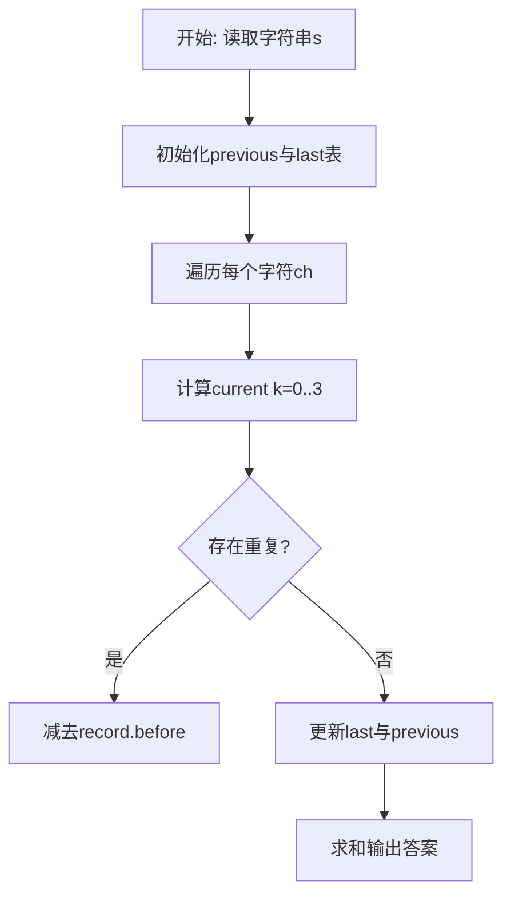
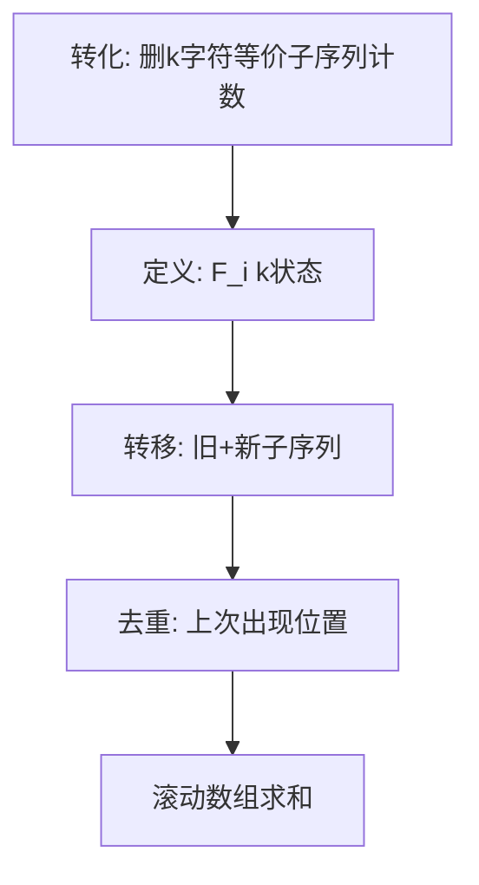

# L3-035 - 完美树（30 分）

- **时间限制**: 400 ms
- **内存限制**: 262144 KB
- **代码长度限制**: 16 KB

---

## 题目描述


给定一棵有 $N$ 个结点的树（树中结点从 $1$ 到 $N$ 编号，根结点编号为 $1$）。每个结点有一种颜色，或为黑，或为白。

称以结点 $u$ 为根的子树是 **好的**，若子树中黑色结点与白色结点的数量之差的绝对值不超过 $1$。称整棵树是 **完美树**，若对于所有 $1 \le i \le N$，以结点 $i$ 为根的子树都是好的。

你需要将整棵树变成完美树，为此你可以进行以下操作任意次（包括零次）：选择任意一个结点 $i$  ($1 \le i \le N$)，改变结点 $i$ 的颜色（若结点 $i$ 目前是黑色则将其改为白色，若结点 $i$ 目前是白色则将其改为黑色）。这次操作的代价为 $P_i$。

求将给定的树变为完美树的最小代价。

注：以结点 $i$ 为根的子树，由结点 $i$ 以及结点 $i$ 的所有后代结点组成。

### 输入格式:

输入第一行为一个数 $N$ ($1 \le N \le 10^5$)，表示树的结点个数。

接下来的 $N$ 行，第 $i$ 行的前三个数为 $C_i, P_i, K_i$ ($1 \le P_i \le 10^4, 0 \le K_i \le N$)，分别表示树上编号为 $i$ 的结点的初始颜色（$0$ 为白色，$1$ 为黑色）、变换颜色的代价及孩子结点的数量。紧跟着有 $K_i$ 个数，为孩子结点的编号。数字均用一个空格隔开，所有的编号保证在 $1$ 到 $N$ 里，且不会有环。

数据中只包含一棵树。

### 输出格式:

输出一行一个数，表示将树 $T$ 变为完美树的最小代价。

### 输入样例:
```in
10
1 100 3 2 3 4
0 20 1 7
0 5 2 5 6
0 8 1 10
0 7 0
0 2 0
1 1 2 8 9
0 15 0
0 13 0
1 8 0
```

### 输出样例:
```out
15
```

## 示例

### 示例 1

**输入:**
```
10
1 100 3 2 3 4
0 20 1 7
0 5 2 5 6
0 8 1 10
0 7 0
0 2 0
1 1 2 8 9
0 15 0
0 13 0
1 8 0
```

**输出:**
```
15
```

### 解题思路

本题可归约为在字符串/序列上计数的动态规划问题，状态转移存在重复子结构。L3-035 完美树 实现原理：好子树的黑白数量差只能为 -1、0、1。结合输入规模与输出要求，需要兼顾正确性与时间复杂度。

算法选用动态规划，定义 `F_i[k]` 为前 i 个字符中长度为 `i-k` 的不同子序列数。追加新字符时，新产生的子序列数为 `F_{i-1}` 的平移，而与上一次出现位置重复的部分需减去 `last[ch]` 保存的历史值，通过 4 长度的滚动数组实现 O(n) 空间与 O(n·K) 时间（K=3），巧妙处理重复计数。

### 代码流程说明

1. 读取字符串 `s`，初始化滚动数组 `previous={1,0,0,0}` 与字符上次状态表 `last`。
2. 遍历 `i=1..#s` 取字符 `ch`，对 `k=0..3` 计算 `value = (k>=1 and previous[k] or 0)+previous[k+1]` 并按 `last[ch]` 去重。
3. 去重时计算 `gap=i-record.pos` 与 `index=k-gap`，若 `index>=0` 则减去 `record.before[index+1]`，得到 `current[k+1]`。
4. 更新 `last[ch]={pos=i, before=copy(previous)}` 并滚动 `previous=current`，最终求和 `previous[1..4]` 输出。

### 代码实现

```lua
-- L3-035 完美树
-- 实现原理：好子树的黑白数量差只能为 -1、0、1。后序 DP 中，记录每个子树
-- 达到这三种差值的最小成本；合并子树时对孩子差值做最小代价卷积，最后加上
-- 当前节点选择黑色(+1)或白色(-1)的翻色代价。

local n = io.read("*n")
local color, price, children = {}, {}, {}
for i = 1, n do
    color[i], price[i], children[i] = io.read("*n"), io.read("*n"), {}
    local k = io.read("*n")
    for j = 1, k do children[i][j] = io.read("*n") end
end
local order, stack = {}, { 1 }
while #stack > 0 do local x = stack[#stack]; stack[#stack] = nil; order[#order + 1] = x; for _, y in ipairs(children[x]) do stack[#stack + 1] = y end end
local dp, inf = {}, 10 ^ 30
for oi = #order, 1, -1 do
    local x, ways = order[oi], { [0] = 0 }
    for ci, child in ipairs(children[x]) do
        local nextWays = {}
        local remaining = #children[x] - ci
        for sum, cost in pairs(ways) do
            for delta, childCost in pairs(dp[child]) do
                local v = sum + delta
                -- 余下孩子每个最多补偿 1，无法回到节点允许范围的状态可丢弃。
                if math.abs(v) <= remaining + 2 and (not nextWays[v] or cost + childCost < nextWays[v]) then nextWays[v] = cost + childCost end
            end
        end
        ways = nextWays
    end
    dp[x] = {}
    for target = -1, 1 do
        local best = inf
        for own, extra in pairs({ [-1] = color[x] == 0 and 0 or price[x], [1] = color[x] == 1 and 0 or price[x] }) do
            local childCost = ways[target - own]
            if childCost and childCost + extra < best then best = childCost + extra end
        end
        if best < inf then dp[x][target] = best end
    end
end
local answer = math.min(dp[1][-1] or inf, dp[1][0] or inf, dp[1][1] or inf)
print(answer)
```

### 代码流程图



### 解题流程图


