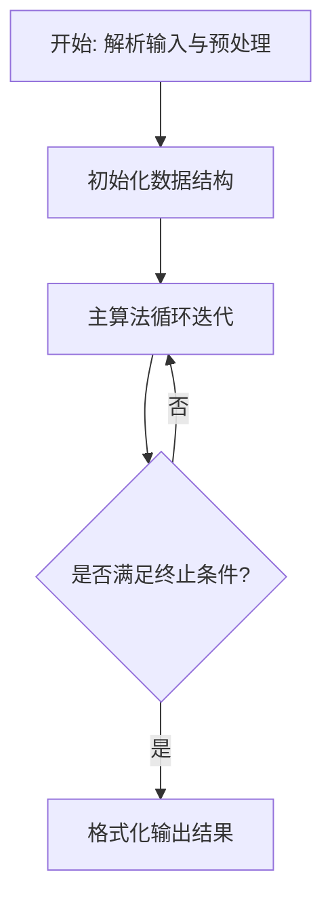
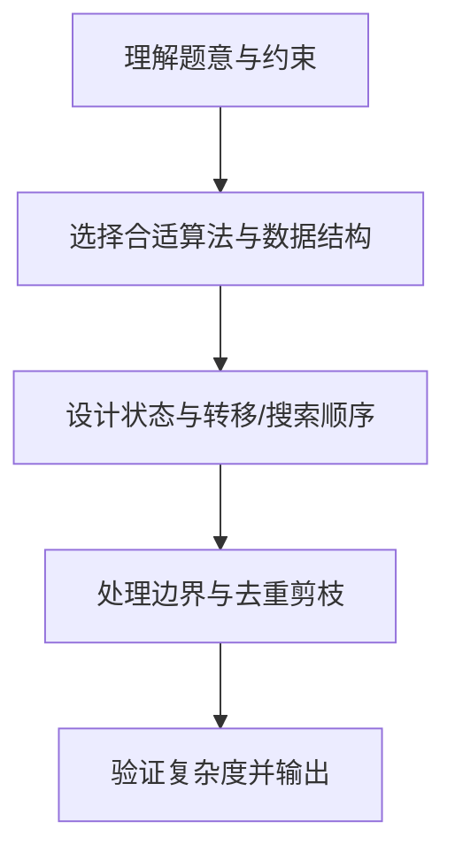

# L3-036 - 血染钟楼（30 分）

- **时间限制**: 6000 ms
- **内存限制**: 65536 KB
- **代码长度限制**: 16 KB

---

## 题目描述


九条可怜最近非常沉迷血染钟楼 —— 一款类狼人杀的身份推理类的游戏。在一局血染钟楼的游戏中，玩家们之间隐藏着一名"恶魔"，而所有善良玩家的目标就是将抽到恶魔身份的玩家绳之以法。

今天，九条可怜和她的小伙伴们开了一局 $n+1$ 名玩家参与的游戏，可怜的编号是 $0$，其他玩家编号从 $1$ 到 $n$。
可怜抽到的身份是占卜师，其技能如下（注意这儿和标准钟楼规则有出入）：

1. 每个夜晚，你可以选择任意名玩家，并得知被选择的玩家中是否有恶魔。
2. 有一名除你以外善良玩家始终被你的能力视为恶魔。

换句话说，在剩下的 $n$ 名玩家中，存在着两名未知的玩家，如果这两名玩家均未被可怜选中，可怜就会得到信息 0，否则就会得到信息 1。
在抽到身份的时候，可怜就对游戏开始的前 $m$ 个夜晚进行了规划：她打算在第 $i$ 个夜晚选中编号在区间 $[l_i, r_i]$ 内的所有玩家。
因为血染钟楼的第一个夜晚通常比较漫长，所以可怜在百无聊赖之际开始了头脑风暴。如果一切顺利，在 $m$ 晚之后，她将能得到 $m$ 个 0 或 1 的信息，共有 $2^m$ 种不同的可能性。可怜想要知道在这些可能性中，有多少种结果是可能发生的且可以让她**唯一**确定被她技能识别的两名玩家。

### 输入格式:

第一行输入一个整数 $t (1 \leq t \leq 10^3)$，表示数据组数。
第二行输入两个整数 $n, m(1 \leq n,m \leq 10^5)$，表示可怜以外的玩家数量以及可怜规划的夜晚数量。
接下来 $m$ 行每行两个整数 $l_i, r_i (1 \leq l_i \leq r_i \leq n)$，表示可怜的计划中在第 $i$ 晚会被选中的玩家编号区间。
输入保证所有数据中满足 $n > 10^3$ 或 $m > 10^3$ 的数据不超过 $5$ 组。

### 输出格式:

对于每组数据，输出一行一个整数，表示满足条件的可能性数量。答案可能很大，你只需要输出对 $998244353$ 取模后的结果。

### 输入样例:
```in
3
4 1
2 3
5 4
2 5
1 3
5 5
2 4
10 10
1 2
6 6
3 7
3 6
1 8
9 10
1 6
4 4
8 8
5 8
```

### 输出样例:
```out
1
2
7
```

## 示例

### 示例 1

**输入:**
```
3
4 1
2 3
5 4
2 5
1 3
5 5
2 4
10 10
1 2
6 6
3 7
3 6
1 8
9 10
1 6
4 4
8 8
5 8
```

**输出:**
```
1
2
7
```

### 解题思路

本题的核心在于从给定约束中找出满足条件的最优解或可行性判定。L3-036 血染钟楼 实现原理：一对目标 (a,b) 在某夜的结果为 1，当且仅当区间包含 a 或 b。结合输入规模与输出要求，需要兼顾正确性与时间复杂度。

实现上直接依据注释原理展开：L3-036 血染钟楼 实现原理：一对目标 (a,b) 在某夜的结果为 1，当且仅当区间包含 a 或 b。 因而可将 m 个夜晚的结果拼成签名；统计每种签名出现的目标对数量，出现一次 的签名即能唯一确定一对目标，最后统计这样的签名数。 代码中通过排序、预处理与主循环的配合，将理论转化为可执行的迭代与分支判断，保证逻辑与题目定义的比较规则完全一致。

### 代码流程说明

1. 解析输入：按题目格式读取整数、字符串或图边，建立必要的数组/哈希/邻接结构并做初步排序或映射。
2. 初始化核心数据结构：根据算法选择置零计数器、并查集、距离数组或 DP 滚动数组，并设定边界初值。
3. 执行主算法循环：按排序/优先级/搜索顺序遍历状态，更新最优值、合并集合或扩展队列，并记录前驱/路径/体积等辅助信息。
4. 格式化输出：按题目要求的空格、换行与特殊无解字符串输出结果，必要时重建路径或统计聚合值。

### 代码实现

```lua
-- L3-036 血染钟楼
--
-- 实现原理：一对目标 (a,b) 在某夜的结果为 1，当且仅当区间包含 a 或 b。
-- 因而可将 m 个夜晚的结果拼成签名；统计每种签名出现的目标对数量，出现一次
-- 的签名即能唯一确定一对目标，最后统计这样的签名数。

local n,m=io.read('*n','*n');local l,r={},{}
for i=1,m do l[i],r[i]=io.read('*n','*n') end
local count={}
for a=1,n-1 do
 for b=a+1,n do
  local bits={}
  for k=1,m do bits[k]=(l[k]<=a and a<=r[k]) or (l[k]<=b and b<=r[k]) and '1' or '0' end
  -- Lua 运算符优先级会先计算 and，显式重写保证布尔逻辑不歧义。
  for k=1,m do if (l[k]<=a and a<=r[k]) or (l[k]<=b and b<=r[k]) then bits[k]='1' else bits[k]='0' end end
  local key=table.concat(bits);count[key]=(count[key] or 0)+1
 end
end
local ans=0;for _,v in pairs(count) do if v==1 then ans=ans+1 end end
print(ans)
```

### 代码流程图



### 解题流程图


