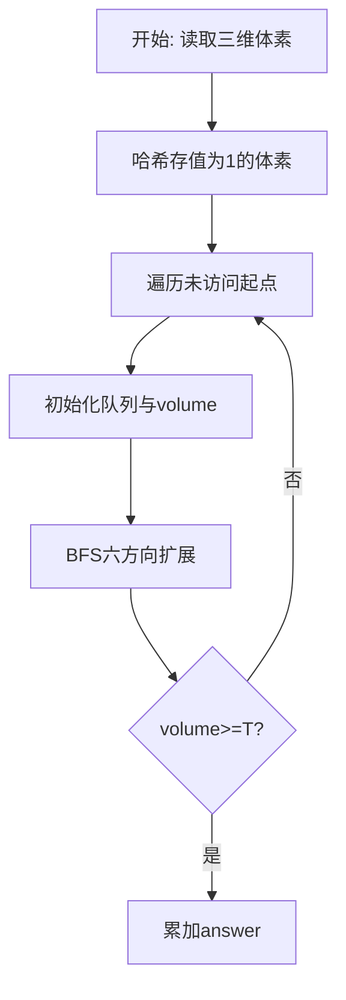
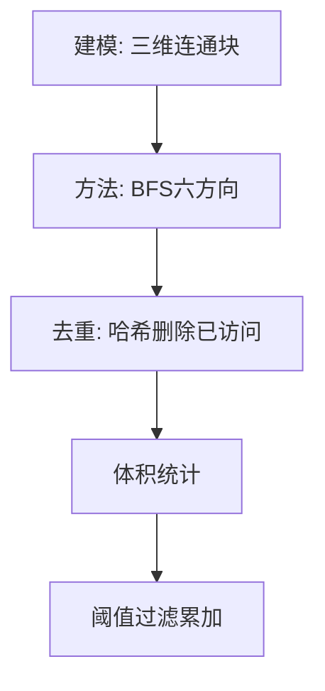

# L3-037 - 夺宝大赛（30 分）

- **时间限制**: 400 ms
- **内存限制**: 65536 KB
- **代码长度限制**: 16 KB

---

## 题目描述


夺宝大赛的地图是一个由 $n\times m$ 个方格子组成的长方形，主办方在地图上标明了所有障碍、以及大本营宝藏的位置。参赛的队伍一开始被随机投放在地图的各个方格里，同时开始向大本营进发。所有参赛队从一个方格移动到另一个无障碍的相邻方格（“相邻”是指两个方格有一条公共边）所花的时间都是 1 个单位时间。但当有多支队伍同时进入大本营时，必将发生火拼，造成参与火拼的所有队伍无法继续比赛。大赛规定：最先到达大本营并能活着夺宝的队伍获得胜利。
假设所有队伍都将以最快速度冲向大本营，请你判断哪个队伍将获得最后的胜利。

### 输入格式:

输入首先在第一行给出两个正整数 $m$ 和 $n$（$2< m,n\le 100$），随后 $m$ 行，每行给出 $n$ 个数字，表示地图上对应方格的状态：$1$ 表示方格可通过；$0$ 表示该方格有障碍物，不可通行；$2$ 表示该方格是大本营。题目保证只有 1 个大本营。
接下来是参赛队伍信息。首先在一行中给出正整数 $k$（$0<k<m\times n/2$），随后 $k$ 行，第 $i$（$1\le i \le k$）行给出编号为 $i$ 的参赛队的初始落脚点的坐标，格式为 `x y`。这里规定地图左上角坐标为 `1 1`，右下角坐标为 `n m`，其中 `n` 为列数，`m` 为行数。注意参赛队只能在地图范围内移动，不得走出地图。题目保证没有参赛队一开始就落在有障碍的方格里。

### 输出格式:

在一行中输出获胜的队伍编号和其到达大本营所用的单位时间数量，数字间以 1 个空格分隔，行首尾不得有多余空格。若没有队伍能获胜，则在一行中输出 `No winner.`

### 输入样例 1：
```in
5 7
1 1 1 1 1 0 1
1 1 1 1 1 0 0
1 1 0 2 1 1 1
1 1 0 0 1 1 1
1 1 1 1 1 1 1
7
1 5
7 1
1 1
5 5
3 1
3 5
1 4
```

### 输出样例 1：
```out
7 6
```

### 输入样例 2：
```in
5 7
1 1 1 1 1 0 1
1 1 1 1 1 0 0
1 1 0 2 1 1 1
1 1 0 0 1 1 1
1 1 1 1 1 1 1
7
7 5
1 3
7 1
1 1
5 5
3 1
3 5
```

### 输出样例 2：
```out
No winner.
```

## 示例

### 示例 1

**输入:**
```
5 7
1 1 1 1 1 0 1
1 1 1 1 1 0 0
1 1 0 2 1 1 1
1 1 0 0 1 1 1
1 1 1 1 1 1 1
7
1 5
7 1
1 1
5 5
3 1
3 5
1 4
```

**输出:**
```
7 6
```

### 示例 2

**输入:**
```
5 7
1 1 1 1 1 0 1
1 1 1 1 1 0 0
1 1 0 2 1 1 1
1 1 0 0 1 1 1
1 1 1 1 1 1 1
7
7 5
1 3
7 1
1 1
5 5
3 1
3 5
```

**输出:**
```
No winner.
```

### 解题思路

本题是无权图/网格上的连通或可达性问题，天然适合广度优先搜索逐层扩散。L3-037 夺宝大赛 实现原理：终点（大本营）固定，先从大本营做一次 BFS，即可得到每个可通行 格子的最短路长度。结合输入规模与输出要求，需要兼顾正确性与时间复杂度。

算法选用广度优先搜索在网格/图上按六邻接或四邻接逐层扩展。把值为 1 的体素或可达节点入队，已访问节点从集合中删除以去重，队列头指针模拟 FIFO，累计连通块体积后与阈值比较决定是否计入答案，确保每个体素仅被访问一次。

### 代码流程说明

1. 读取三维尺寸 `m n layers` 与阈值 `threshold`，将所有值为 1 的体素用 `key(x,y,z)` 存入哈希 `filled`。
2. 遍历 `filled` 的每个未访问起点，初始化队列 `queue` 与头指针 `head`、体积 `volume=0`，并标记起点已访问。
3. BFS 循环中弹出队首体素，对六个方向 `(±1,0,0),(0,±1,0),(0,0,±1)` 探测邻接体素，合法且未访问则入队并删除集合标记。
4. 连通块结束后若 `volume >= threshold` 则累加至 `answer`，全部块处理完输出 `answer`。

### 代码实现

```lua
-- L3-037 夺宝大赛
--
-- 实现原理：终点（大本营）固定，先从大本营做一次 BFS，即可得到每个可通行
-- 格子的最短路长度。每支队伍到达大本营的最早时间就是其初始格子的距离。
-- 最短时间唯一的队伍获胜；若最短时间有多支队伍，则它们同时相遇并全部淘汰。

local rows, cols = io.read("*n", "*n")
local map, dist = {}, {}
local qx, qy = {}, {}
local head, tail = 1, 0

for r = 1, rows do
    map[r], dist[r] = {}, {}
    for c = 1, cols do
        map[r][c] = io.read("*n")
        if map[r][c] == 2 then
            tail = tail + 1
            qx[tail], qy[tail] = c, r
            dist[r][c] = 0
        end
    end
end

local dx = { 1, -1, 0, 0 }
local dy = { 0, 0, 1, -1 }
while head <= tail do
    local x, y = qx[head], qy[head]
    head = head + 1
    for d = 1, 4 do
        local nx, ny = x + dx[d], y + dy[d]
        if nx >= 1 and nx <= cols and ny >= 1 and ny <= rows
            and map[ny][nx] ~= 0 and dist[ny][nx] == nil then
            dist[ny][nx] = dist[y][x] + 1
            tail = tail + 1
            qx[tail], qy[tail] = nx, ny
        end
    end
end

local team_count = io.read("*n")
local best_distance, winner, same_time_count = math.huge, nil, 0
for id = 1, team_count do
    local x, y = io.read("*n", "*n")
    local d = dist[y] and dist[y][x]
    if d ~= nil then
        if d < best_distance then
            best_distance, winner, same_time_count = d, id, 1
        elseif d == best_distance then
            same_time_count = same_time_count + 1
        end
    end
end

if same_time_count == 1 then
    print(winner .. " " .. best_distance)
else
    print("No winner.")
end
```

### 代码流程图



### 解题流程图


