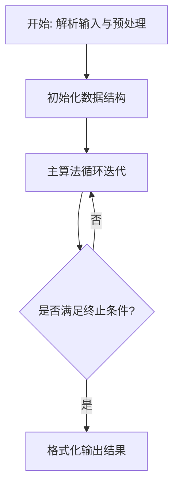
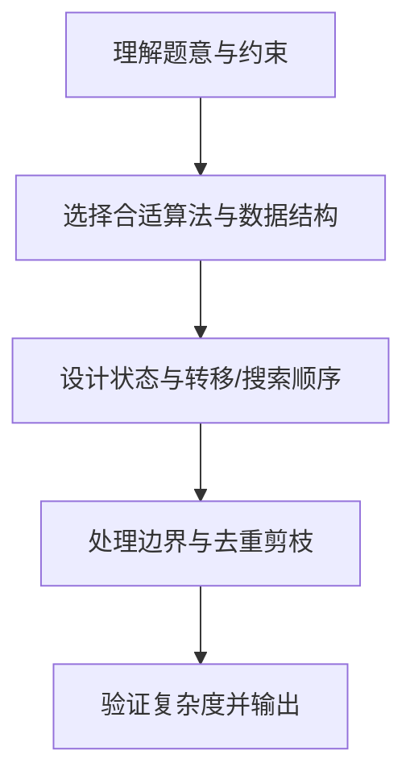

# L3-038 - 工业园区建设（30 分）

- **时间限制**: 800 ms
- **内存限制**: 65536 KB
- **代码长度限制**: 16 KB

---

## 题目描述


某工业园区要进行建设，共有 $N$ 块工业用地排成一条直线，其中上面已经有若干块用地建设起了工厂，其他地方为空地。

现在工业园区计划在空地上建设至多 $M$ 个新工厂以及一个仓库，希望在完成计划后，仓库离最近的 $k$ 个工厂的距离之和尽可能小。

两块用地的距离等于他们的编号的差；即 1 号用地与 2 号用地的距离为 1。一个空地上只能建设一个工厂，仓库可以跟工厂建在一起。

### 输入格式:

数据的第一行是一个正整数 $T$，表示数据的组数。

每组数据的输入第一行为三个整数 $N, M, k$ ($1 \le N \le 2\times10^5, 0 \le M \le N, 1 \le k \le N$)，表示有 $N$ 块用地，最多可以新建 $M$ 个新工厂，仓库离最近的 $k$ 个工厂距离之和需要尽可能小。

接下来的一行是一个只由 $0,1$ 组成的长度为 $N$ 的字符串 $S$，第 $i$ 个字符 $S_i$ 为 $0$ 表示第 $i$ 块地块为空地，$1$ 表示第 $i$ 块地块上已建工厂。地块编号从 1 开始。 

数据约定：

设 $F_S$ 为 $S$ 对应的已建工厂的地块数量，则有 $k \le M + F_S \le N$。给定的数据有 $\sum{N}\le5\times10^5$。

### 输出格式:

输出 $N$ 个整数，表示仓库建在第 $i$ 块用地时，离最近的 $k$ 个工厂的最小的距离之和是多少。

### 输入样例:
```in
3
5 1 3
10110
10 3 5
1001001010
2 1 2
10
```

### 输出样例:
```out
3 2 2 2 3
10 7 6 7 6 6 6 6 7 10
1 1
```

## 示例

### 示例 1

**输入:**
```
3
5 1 3
10110
10 3 5
1001001010
2 1 2
10
```

**输出:**
```
3 2 2 2 3
10 7 6 7 6 6 6 6 7 10
1 1
```

### 解题思路

本题的核心在于从给定约束中找出满足条件的最优解或可行性判定。L3-038 工业园区建设 实现原理：对每个仓库位置 i，现有工厂可直接提供一个距离 |i-j|。结合输入规模与输出要求，需要兼顾正确性与时间复杂度。

实现上直接依据注释原理展开：L3-038 工业园区建设 实现原理：对每个仓库位置 i，现有工厂可直接提供一个距离 |i-j|；空地最多 选 M 个新建工厂，也各提供一个距离 |i-j|。把两类候选按距离合并，依次选取 最小的 K 个即可得到该位置的最优总运输距离。 注：此写法直接枚举位置，便于对应题意；适用于题目数据规模较小的情形。 代码中通过排序、预处理与主循环的配合，将理论转化为可执行的迭代与分支判断，保证逻辑与题目定义的比较规则完全一致。

### 代码流程说明

1. 解析输入：按题目格式读取整数、字符串或图边，建立必要的数组/哈希/邻接结构并做初步排序或映射。
2. 初始化核心数据结构：根据算法选择置零计数器、并查集、距离数组或 DP 滚动数组，并设定边界初值。
3. 执行主算法循环：按排序/优先级/搜索顺序遍历状态，更新最优值、合并集合或扩展队列，并记录前驱/路径/体积等辅助信息。
4. 格式化输出：按题目要求的空格、换行与特殊无解字符串输出结果，必要时重建路径或统计聚合值。

### 代码实现

```lua
-- L3-038 工业园区建设
--
-- 实现原理：对每个仓库位置 i，现有工厂可直接提供一个距离 |i-j|；空地最多
-- 选 M 个新建工厂，也各提供一个距离 |i-j|。把两类候选按距离合并，依次选取
-- 最小的 K 个即可得到该位置的最优总运输距离。
--
-- 注：此写法直接枚举位置，便于对应题意；适用于题目数据规模较小的情形。

local n, m, k = io.read('*n', '*n', '*n')
local s = io.read('*l') or ''
while s:match('^%s*$') do s = io.read('*l') or '' end
local have = {}
for i = 1, n do have[i] = s:sub(i, i) == '1' end

for warehouse = 1, n do
    local old, empty = {}, {}
    for pos = 1, n do
        local d = math.abs(pos - warehouse)
        if have[pos] then old[#old + 1] = d else empty[#empty + 1] = d end
    end
    table.sort(old); table.sort(empty)
    local oi, ei, built, taken, answer = 1, 1, 0, 0, 0
    while taken < k do
        local use_old = oi <= #old and (built >= m or ei > #empty or old[oi] <= empty[ei])
        if use_old then
            answer = answer + old[oi]; oi = oi + 1
        else
            answer = answer + empty[ei]; ei = ei + 1; built = built + 1
        end
        taken = taken + 1
    end
    print(answer)
end
```

### 代码流程图



### 解题流程图


