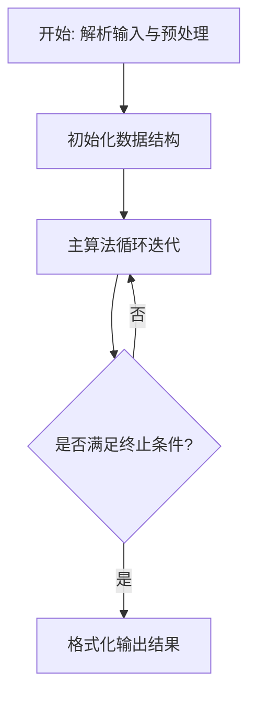
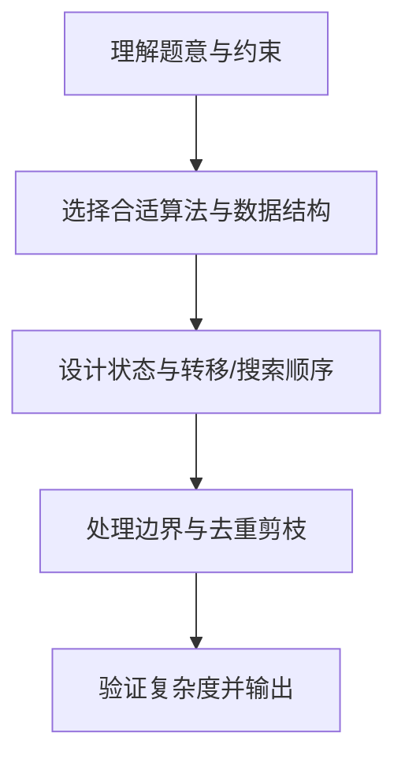

# L3-039 - 攀岩（30 分）

- **时间限制**: 4000 ms
- **内存限制**: 524288 KB
- **代码长度限制**: 16 KB

---

## 题目描述


九条可怜最近接触到了攀岩这项运动。作为一名运动量接近为零的家里蹲，相比于动手攀岩，可怜显然更加享受攀岩运动中动脑的部分，即对攀岩路线的规划。
为了只动脑，可怜设计了一个简易的攀岩机器人来帮她动手。这个机器人由一个核心（大小可以忽略不计）和三个长度至多为 $r$ 的可伸缩机械臂组成，如下图所示：


一面攀岩墙可以看成一个二维的无穷平面，上面有 $n$ 个不同位置的岩点 $p_1, \dots, p_n$。在攀岩开始时，机器人的两个机械臂需要分别抓住岩点 $p_1$ 和 $p_2$，而其核心和第三个机械臂可以在任意位置。攀岩的目标是让机器人有两支机械臂同时抓握住岩点 $p_n$。
在攀岩过程中，机器人需要保证**每时每刻**都有两支机械臂抓握住两个**不同**的岩点。在满足这点的情况下，机器人可以在机械臂长度允许的情况下进行如下移动：
1. 连续地将核心的位置从当前位置移动到任意位置。
2. 用第三条机械臂抓握住一个岩点（可以与某条其他机械臂抓住相同的岩点）。
3. 让一条机械臂松开其抓握的岩点。注意，只有当另外两条机械臂已经抓握住不同岩点时，才能进行这项操作。
**注：**我们假设岩点的大小是无穷小，不会影响机器人的移动，比如机械臂、核心轨迹都可以经过岩点。
下面是一个攀岩过程的例子，假设平面上有四个岩点，坐标分别是 $(0,0), (1,0),(0,1), (1,2)$，则下面展示了一个 $r=\sqrt 2$ 时，即机械臂长度至多为 $\sqrt 2$ 时的攀岩方案。


1. 初始时，可怜将机器人的核心放在 $(0.5, 0)$ 处，第三根手臂随意地放在 $(1,1)$ 处。
2. 机器人的第三机械臂抓握住岩点 $p_3$。
3. 机器人的第二机械臂松开，并移动到 $(1, 0.5)$ 处。
4. 机器人的核心移动至 $(1,1)$，此时第一机械臂的长度到达极限 $\sqrt 2$。
5. 机器人的第二机械臂抓握住岩点 $p_4$。
6. 机器人的第一机械臂松开，并抓握住岩点 $p_4$，完成攀岩目标。

显然，机器人的机械臂长度越短，对可怜的路径规划能力要求越高。但是这个机械臂的长度也不能太短，不然机器人可能无论如何都无法完成攀岩任务。比如在上述任务中，如果机械臂长度小于 $0.5$，那么机器人将无法同时抓握 $p_1$ 和 $p_2$，这意味着它连开始攀岩都无法做到，更别说完成攀岩任务了。
因此，为了在合理范围内尽可能地挑战自己的大脑，可怜希望你对于攀岩馆中的每一项攀岩任务，都帮她计算（在可能完成攀岩任务的前提下）机械臂的最短长度是多少。

### 输入格式:

第一行输入一个整数 $t$ $(t \leq 100)$，表示攀岩馆内攀岩任务的数量。
每个任务的第一行都是一个整数 $n$ $(3 \leq n \leq 1500)$，表示攀岩任务涉及的岩点数量。
接下来 $n$ 行，每行两个整数 $(x_i, y_i)$，表示第 $i$ 个岩点的坐标。输入保证 $0 \leq x_i, y_i \leq 10^6$ 且同一个攀岩任务中的岩点坐标两两不同。
输入保证满足 $n > 100$ 的数据不超过 $3$ 组。

### 输出格式:

对于每个攀岩任务输出一行一个浮点数，表示最短可能的机械臂长度。你的答案在绝对误差或者相对误差不超过 $10^{-6}$ 的情况下都会被视为正确。

### 输入样例:
```in
4
4
0 0
1 0
0 1
1 2
4
0 0
2 0
0 3
2 2
7
0 0
1 0
2 0
2 1
2 2
1 2
0 2
15
13 2
13 3
12 44
6 17
4 71
14 58
4 49
2 51
8 37
1 18
5 43
5 35
1 84
10 23
13 69
```

### 输出样例:
```out
0.99999999498
1.41421355524
1.00000000498
10.13227667717
```

## 示例

### 示例 1

**输入:**
```
4
4
0 0
1 0
0 1
1 2
4
0 0
2 0
0 3
2 2
7
0 0
1 0
2 0
2 1
2 2
1 2
0 2
15
13 2
13 3
12 44
6 17
4 71
14 58
4 49
2 51
8 37
1 18
5 43
5 35
1 84
10 23
13 69
```

**输出:**
```
0.99999999498
1.41421355524
1.00000000498
10.13227667717
```

### 解题思路

本题的核心在于从给定约束中找出满足条件的最优解或可行性判定。L3-039 攀岩 实现原理：以“任意两条手臂当前抓住的岩点对”为状态。结合输入规模与输出要求，需要兼顾正确性与时间复杂度。

实现上直接依据注释原理展开：L3-039 攀岩 实现原理：以“任意两条手臂当前抓住的岩点对”为状态。若三点能被半径 r 的 圆覆盖，第三臂即可抓住第三点并替换任一旧臂，所以该三点对应的三个状态两两 连通。对 r 二分，并用并查集判断初始对 (1,2) 能否连到含 n 的状态。 代码中通过排序、预处理与主循环的配合，将理论转化为可执行的迭代与分支判断，保证逻辑与题目定义的比较规则完全一致。

### 代码流程说明

1. 解析输入：按题目格式读取整数、字符串或图边，建立必要的数组/哈希/邻接结构并做初步排序或映射。
2. 初始化核心数据结构：根据算法选择置零计数器、并查集、距离数组或 DP 滚动数组，并设定边界初值。
3. 执行主算法循环：按排序/优先级/搜索顺序遍历状态，更新最优值、合并集合或扩展队列，并记录前驱/路径/体积等辅助信息。
4. 格式化输出：按题目要求的空格、换行与特殊无解字符串输出结果，必要时重建路径或统计聚合值。

### 代码实现

```lua
-- L3-039 攀岩
--
-- 实现原理：以“任意两条手臂当前抓住的岩点对”为状态。若三点能被半径 r 的
-- 圆覆盖，第三臂即可抓住第三点并替换任一旧臂，所以该三点对应的三个状态两两
-- 连通。对 r 二分，并用并查集判断初始对 (1,2) 能否连到含 n 的状态。

local T=io.read('*n')
local function radius2(a,b,c)
 local ab=(a.x-b.x)^2+(a.y-b.y)^2;local ac=(a.x-c.x)^2+(a.y-c.y)^2;local bc=(b.x-c.x)^2+(b.y-c.y)^2
 local mx=math.max(ab,ac,bc)
 if mx*2>=ab+ac+bc then return mx/4 end
 local cross=math.abs((b.x-a.x)*(c.y-a.y)-(b.y-a.y)*(c.x-a.x))
 return ab*ac*bc/(4*cross*cross)
end
while T>0 do
 T=T-1;local n=io.read('*n');local p={}
 for i=1,n do p[i]={x=io.read('*n'),y=io.read('*n')} end
 local function id(a,b) if a>b then a,b=b,a end return (a-1)*n+b end
 local function ok(r)
  local parent={};local function find(x) parent[x]=parent[x] or x;if parent[x]~=x then parent[x]=find(parent[x]) end;return parent[x] end
  local function uni(x,y) x,y=find(x),find(y);if x~=y then parent[x]=y end end
  local rr=r*r
  for a=1,n-2 do for b=a+1,n-1 do for c=b+1,n do
   if radius2(p[a],p[b],p[c])<=rr+1e-10 then uni(id(a,b),id(a,c));uni(id(a,b),id(b,c)) end
  end end end
  local s=find(id(1,2))
  for x=1,n-1 do if find(id(x,n))==s then return true end end
  return false
 end
 local lo,hi=0,1500000
 for _=1,55 do local mid=(lo+hi)/2;if ok(mid) then hi=mid else lo=mid end end
 print(string.format('%.10f',hi))
end
```

### 代码流程图



### 解题流程图


